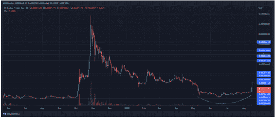
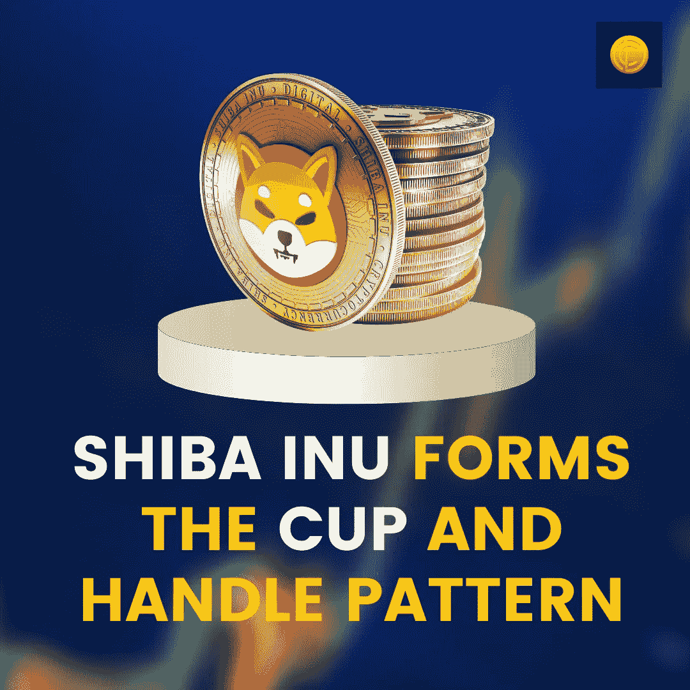

# 柴叶 INU 形成杯柄图案；未来会发生什么

> 原文：<https://medium.com/coinmonks/shiba-inu-forms-the-cup-and-handle-pattern-whats-in-store-for-the-future-e0a75f4c108b?source=collection_archive---------50----------------------->

尽管市场暂时降温，但一些势头又回到了几枚硬币上。过去几个小时，SHIBA 快速上涨，我们不可避免地看到看涨势头正在形成。作为投资者，你可能会问为什么？嗯，正是这些模式表明，我们确实在为未来的上涨做准备！可见的图案是什么？此刻是杯柄！

# 什么杯柄图案？

杯柄形态类似于图表上的杯柄形态，表明看涨势头正在形成。在杯子和把手图案中，图案的左侧交易量较低；然而，右侧的交易量更高。最初它表示市场的下降趋势，很快被上升趋势所取代。

# 柴犬币和杯柄图案是怎么回事？

目前，柴犬 INU 交易在 0.000015 美元的水平。如果令牌设法穿过杯子并处理形成，在这种情况下，它将推动到 0.000021 美元的价格水平。然而，要支撑这一水平，柴犬 INU 令牌必须突破 0.000016 美元的阻力位。如果多头设法越过该点，并跑赢空头，价格将向上述水平 0.000021 美元的方向发展。然而，如果阻力持续在 0.000016 美元的价格水平，我们很可能会看到价格回到 0.00009 美元。

# 柴犬代币在哪里买？

[柴犬](https://blog.coindhan.com/2022/04/25/shiba-inu-launches/)在一些顶级交易所上市，比如 [Coindhan](https://www.coindhan.com/) ，你可以在那里购买代币。

> 交易新手？尝试[加密交易机器人](/coinmonks/crypto-trading-bot-c2ffce8acb2a)或[复制交易](/coinmonks/top-10-crypto-copy-trading-platforms-for-beginners-d0c37c7d698c)