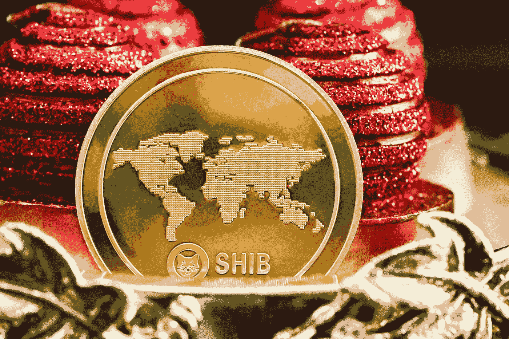

# 柴犬价格预测 2022 年 12 月–2025 年，11 月 29 日更新

> 原文：<https://medium.com/coinmonks/shiba-inu-price-prediction-december-2022-2025-update-29th-of-november-88f592f79ad5?source=collection_archive---------10----------------------->

Source photo [HD photo by Traxer (unsplash.com)](https://unsplash.com/photos/3MW56sduf_Q)

## 什么是柴犬(SHIB)？

柴犬(SHIB)是柴犬(SHIB)生态系统的原生和初始标志，在区块链以太坊运行。与之竞争的 Dogecoin 使用了一种类似比特币的技术，但不如比特币本身安全。代币可以更容易交易，因为它们是 ERC-20 代币。