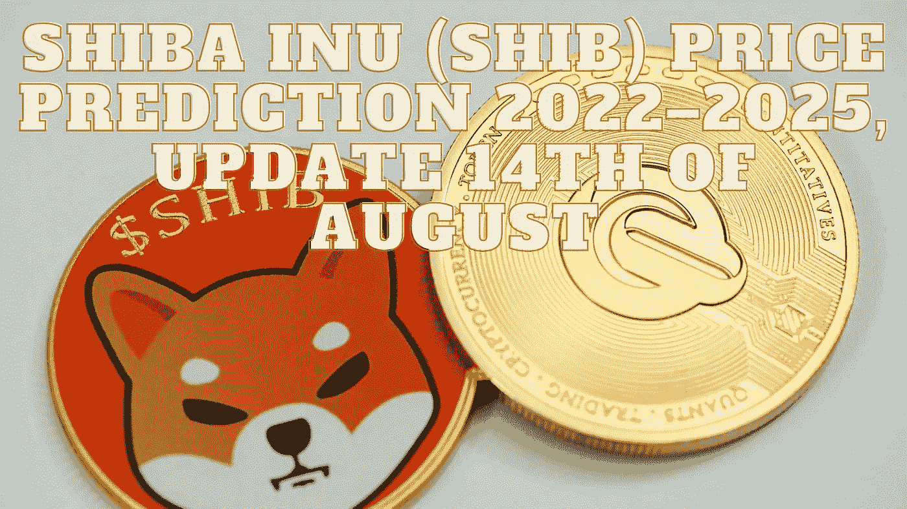

# 柴犬(SHIB)价格预测 2022–2025，8 月 14 日更新

> 原文：<https://medium.com/coinmonks/shiba-inu-shib-price-prediction-2022-2025-update-14th-of-august-948017c553b1?source=collection_archive---------2----------------------->

Source photo Unsplash.com

柴犬生态系统运行在以太坊区块链，它的本地和首次亮相的令牌被称为 SHIB。与 Dogecoin 相反，doge coin 使用类似比特币的技术。因为这些硬币是 ERC 20 元面值的，所以它们更容易交易。

这种迷因货币的最初目标只是娱乐，但现在它已经扩展到许多实际应用中…