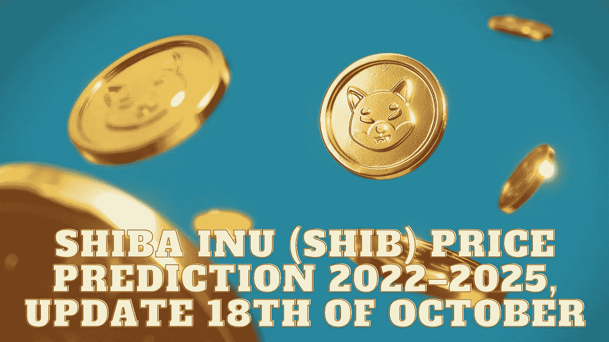

# 柴犬(SHIB)价格预测 2022–2025，10 月 18 日更新

> 原文：<https://medium.com/coinmonks/shiba-inu-shib-price-prediction-2022-2025-update-18th-of-october-8e92c5288eb7?source=collection_archive---------8----------------------->

Source photo Unspash.com

# 那么，什么是柴犬(SHIB)？

柴犬生态系统在以太坊区块链上运行，SHIB 是该生态系统的原生和初始令牌。与 Dogecoin 相反，doge coin 使用类似比特币的技术。因为它们是 ERC-20 代币，交易可以快速容易地完成。