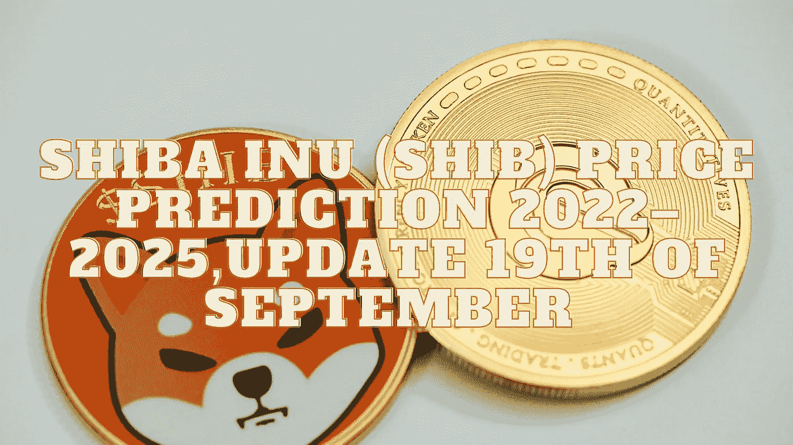

# 柴犬(SHIB)2022–2025 年价格预测，9 月 19 日更新

> 原文：<https://medium.com/coinmonks/shiba-inu-shib-price-prediction-2022-2025-update-19th-of-september-d876b3ffb7bf?source=collection_archive---------5----------------------->

Source photo Unsplash.com

# 什么是柴犬(SHIB)？

柴犬生态系统运行在以太坊区块链上，SHIB 是该生态系统的第一种本地加密货币。其主要竞争对手 Dogecoin 使用的系统与比特币非常相似。这种加密货币是一种 ERC-20 代币，这使得交易更加简单。