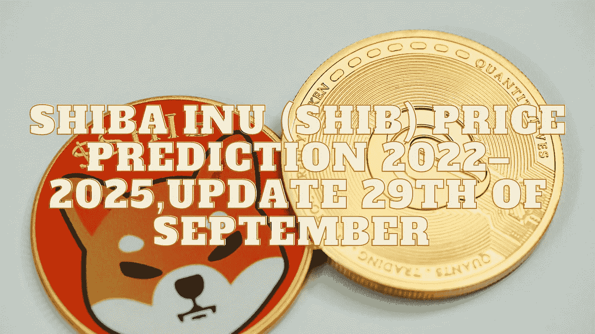

# 柴犬(SHIB)2022–2025 年价格预测，9 月 29 日更新

> 原文：<https://medium.com/coinmonks/shiba-inu-shib-price-prediction-2022-2025-update-29th-of-september-761b6614e4eb?source=collection_archive---------9----------------------->

Source photo Unsplash.com

# 什么是柴犬(SHIB)？

柴犬(SHIB)是在以太坊区块链运行的柴犬生态系统的原生和初始令牌。与比特币的主要竞争对手 Dogecoin 不同，doge coin 使用的系统与比特币非常相似。硬币是 ERC 20，使他们更普遍兼容。