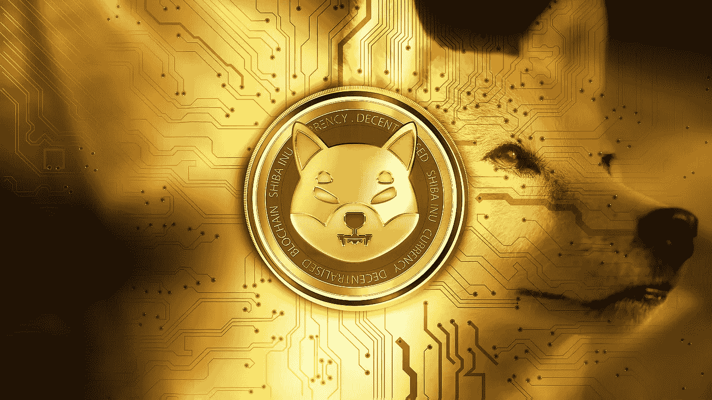

# 柴犬(SHIB)价格预测 2022–2025，11 月 2 日更新

> 原文：<https://medium.com/coinmonks/shiba-inu-shib-price-prediction-2022-2025-update-2nd-of-november-aeddbdd79c78?source=collection_archive---------11----------------------->

Source photo [Shiba Inu Cryptocurrency — Free image on Pixabay](https://pixabay.com/illustrations/shiba-shiba-inu-cryptocurrency-6763358/)

## 什么是柴犬(SHIB)？

柴犬(SHIB)是 SHI 生态系统的第一个也是唯一的标志，它运行在区块链以太坊。与 Dogecoin 相反，doge coin 使用的技术非常接近比特币。因为它们是 ERC-20 代币，交易可以快速容易地完成。