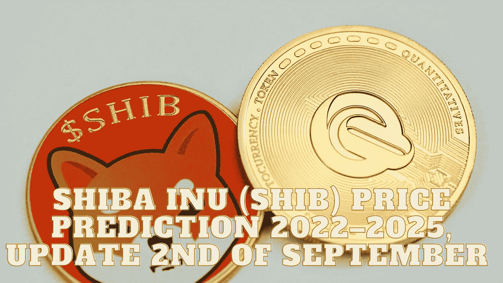

# 柴犬(SHIB)2022–2025 年价格预测，9 月 2 日更新

> 原文：<https://medium.com/coinmonks/shiba-inu-shib-price-prediction-2022-2025-update-2nd-of-september-eeb5fed2942e?source=collection_archive---------3----------------------->

Source photo Unsplash.com

# 什么是柴犬(SHIB)？

柴犬生态系统运行在以太坊区块链上，SHIB 是这个生态系统的第一个本地加密货币。与 Dogecoin 相反，doge coin 使用的技术非常接近比特币。这些 ERC-20 代币使支付和收款变得更加简单。