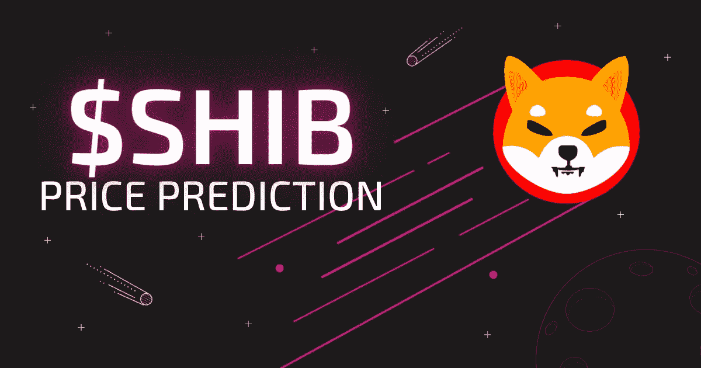
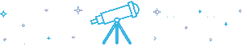

# 柴犬(SHIB)价格预测 2022–2050

> 原文：<https://medium.com/coinmonks/shiba-inu-shib-price-prediction-2022-2050-3f37ce475118?source=collection_archive---------10----------------------->

在加密货币方面，柴犬(SHIB)自成一类。它在社交媒体上拥有大量喜欢推广它的追随者，这是 2021 年最赚钱的投资之一。但是 SHIB 的价格预测是什么呢？这篇文章将教你关于柴犬货币你需要知道的一切，包括最受投资者欢迎的问题，如“SHIB 会达到 1 美分吗？”或者“现在买柴犬还来得及吗？”我们从不提供投资建议，但是，如果你认为 SHIB 价格预测很突出，你可以在 Swapzone 上把 ETH 从 T2 转换成 SHIB。

# 柴犬币是什么？

[柴犬](https://swapzone.io/blog/what-is-shiba-inu-and-how-to-exchange-btc-to-shib)是一个匿名开发者 Ryoshi 创造的加密迷因令牌。总的来说，Doge 迷因启发了柴犬的创作，就像之前 Dogecoin 一样。Shiba Inu 是一个建立在以太坊区块链上的智能合约平台，可以使用智能合约与去中心化的应用程序进行交互。

# 柴犬目前的市场状况

根据 CoinMarketCap 的数据，在撰写本文时，SHIB 的价格为 0.00001249 美元，24 小时交易量为 481，945，845 美元。此外，这枚硬币的价值在过去 24 小时内上涨了约 2.73%。此外，还有 549，063.28 亿 SHIB 在流通。

# 2021 年底柴犬价格预测:怎么样？

专家的技术分析预计柴犬将在 2021 年突破历史高点。虽然指标显示经济低迷即将到来，价格可能下跌，但 SHIB 预计将继续上涨。此外，分析师预计，在反转之前，该币将升至略高于 0.00004 美元的历史高点阻力位。

*($ SHIB 2021 年价格*[*【CoinMarketCap】*](https://coinmarketcap.com/currencies/shiba-inu/)

# SHIB 价格预测:柴犬未来价格

据一些专家称，柴犬可能正在为 10 月份的大幅上涨做准备。硬币的价格预计将大幅上涨，部分原因是推出了[新 SHIB 游戏、](https://www.gfinityesports.com/cryptocurrency/shiba-inu-game-release-date-gameplay-nft-burn/)柴犬永恒，以及整合了[柴房第二层解决方案](https://www.gfinityesports.com/cryptocurrency/shibarium-blockchain-shiba-inu-coin-shib-layer-2-release-date/)。目前，1 SHIB 约值 0.000011 美元，然而，价格可能会上涨到最高 0.000014 美元。预计整个月硬币的平均交易价格为 0.000013 美元。

# 2022 年柴犬价格预测

柴犬价格预计到 2022 年底为 0.00006477 美元。专家预计，到 2022 年中期，每只柴犬的价格将达到 0.00005763 美元。此外，分析师预测，SHIB 价格将在 2023 年上半年上涨至 0.00008420 美元，然后在下半年增加 0.00001714 美元，以 0.000010134 美元结束今年。

# 2022 年 11 月 SHIB 房价预测

[根据来自](https://swapzone.io/exchange/shiba-inu) [Trading Beasts](https://tradingbeasts.com/price-prediction/shiba-inu) 的数据，柴犬将在 11 月享受小幅上涨的价格。该硬币预计将在本月底达到 0.000019 美元的最高价，整个期间的平均交易价格为 0.000015 美元。

# 2022 年 12 月:柴犬价格预测

钱包投资公司[的分析师预测，Shib 价格将保持在与 11 月份相对相同的水平，平均交易价格约为 0.000016 美元。然而，这枚硬币预计在 12 月份会稍有起色，在今年的最后一个月可能价值 0.000024 美元。](https://walletinvestor.com/forecast/shiba-inu-prediction-data)

# 2023 年柴犬币价格预测

许多专家预测，柴犬的价格将在 2023 年全年上涨 343%，从 0.00054770 美元上涨到 0.00242405 美元。

# 2024 年柴犬价格预测

尽管 Shib token 目前呈现熊市趋势，但到 2024 年，Shiba Inu 的价值可能接近目前的四倍。根据 [DigitalCoinPrice](https://digitalcoinprice.com/forecast/shiba-inu/2024) 的消息，这枚硬币预计将在今年第一个月以高达 0.000035 美元的价格收盘，最终将在 5 月的某个时候稳定在 0.00004 美元。然而，它的一些收益可能会在今年年底前消失，因为预计硬币将在 2024 年收盘时卖不到 0.000039 美元。

# 2025 年柴犬价格预测

根据专家的预测，柴犬的价格将在 2025 年上涨 87%，从 0.00006454 美元涨到 0.00012071 美元。他们说，SHIB 将在 2024 年开始时为 0.00006454 美元，在今年上半年升至 0.00007616 美元，年底为 0.00008758 美元。

# 2026 年柴犬价格预测

AmbCrypto 的分析师仍然对 Shib 的未来充满希望，[预测](https://ambcrypto.com/predictions/shiba-inu-price-prediction-2026)该硬币可能在 2026 年触及 0.000098 美元的高点。预计硬币全年将享受边际价格上涨，从 2026 年 1 月开始，平均价格为 0.00007 美元，到 2026 年 12 月结束，平均价格为 0.00009 美元。尽管 DigitalCoinPrice 不太乐观，[预计今年大部分时间内，meme token 将会横盘整理。](https://digitalcoinprice.com/forecast/shiba-inu/2026)

# 2027 年柴犬价格预测

memecoin 的最终牛市行情是[预计](https://ambcrypto.com/predictions/shiba-inu-price-prediction-2027)将在今年继续，其价格预计将升至 0.00013 美元。硬币可能会在今年年初看到 0.000087 美元的低点，但它的价格将在接下来的几个月里反弹，以平均 0.00012 美元的价格收盘。

# 2028 年柴犬价格预测

据[分析师](https://ambcrypto.com/predictions/shiba-inu-price-prediction-2028)预测，2028 年，Shib 的牛市还将继续。今年年底，硬币的价格将上涨到 0.00017 美元，尽管在 9 月份上涨到 0.00015 美元之前，它将在几个月内以平均 0.00013 美元的价格交易。

# 2029 年柴犬价格预测

到 2029 年，预计 Shib 的价值将是两年前的两倍，预计将在 9 月份超过 0.0002 美元大关。memecoin 预计将在 12 月份达到 0.00023 美元的高点，但可能会以略低于 0.00021 美元的平均水平收盘。

# 2030 年柴犬价格预测

到 2030 年，柴犬的价格将上涨 26%，从 0.00012071 美元涨到 0.00015210 美元。专家预计，SHIB 将在 2030 年以 0.00012071 美元开始，在今年上半年攀升至 0.00012795 美元，年底为 0.00013515 美元。

# 2031 年柴犬价格预测

2031 年对 Shib 来说似乎是充满希望的一年，因为[分析师](https://ambcrypto.com/predictions/shiba-inu-price-prediction)预计该币今年将达到 0.00035 美元的高点，尽管在大多数情况下，该币今年的平均交易价格将为 0.00029 美元。

# 2040 年柴犬价格预测

2040 年，柴犬的价格预计为 0.001 美元。然而，根据我们的分析师，SHIB 价格可能会达到最高 0.01 美元，到 2040 年底的平均预测价格为 0.03 美元。

# 2050 年柴犬价格预测

柴犬很有可能在未来几年成为一种可接受的支付方式。因此，这种硬币可以成为一种具有长期潜在增长的真正的公用事业，到 2050 年最低价格为 0.1 美元，最高价格为 0.5 美元。

# 柴犬币价格预测 Reddit

鉴于目前的价格，加密货币柴犬未来的价格会是多少？首先，根据 Broctagon 首席执行官唐·郭的说法，柴犬不会达到 1 美元，他最近告诉 Express.co.uk，该公司的市值太小。然而，鉴于最近几周价格上涨了 200%，未来的价格预测可能是任何东西，包括 SHIB 达到 0.1 美元。

# 如何将 ETH 转化为 SHIB？

如果你有 SHIB 密码，并想用它换另一枚硬币，或者如果你想学习如何用密码购买柴犬硬币，你来对地方了。Swapzone 是一个神奇的 SHIB 交易所，提供实时掉期报价和折扣。下面介绍如何购买或[将 ETH 兑换成 SHIB 币](https://swapzone.io/exchange/eth/shibbsc):

1.  访问 [Swapzone](https://swapzone.io/) 网站。
2.  选择合适的线对(ETH 到 SHIB)。
3.  输入您想要兑换 SHIB 的 ETH 数量，聚合器将为您找到最佳报价。
4.  点击***‘交换’****按钮进入交换平台*
5.  *输入你想要寄送 SHIB 硬币的地址。*
6.  *把你的钱寄到你输入的地址。*
7.  *进入 ***“继续交易”*** ，如果你愿意，可以在你完成交易的网站上留下评论。*
8.  *允许处理存款和完成 SHIB 硬币交易所。*
9.  *一旦这个过程完成，你的硬币应该在你的钱包里。*

# *SHIB 价格预测常见问题*

# *SHIB 价格预测:SHIB 会涨到 1 美分吗？*

*柴犬在价格方面有很好的潜力达到新的高度。因此，根据专家和商业分析师，SHIB 的价值预计在未来会上升，并可能在几年内达到 0.1 美元的高点。*

# *SHIB 价格预测:柴犬是好的投资吗？*

*柴犬的价值预计将攀升，因为稀缺往往会推高价格。这就是为什么硬币是一种很好的投资，在价格还很低的时候买比在价值上升的时候买更好。*

# *SHIB 价格预测:现在买柴犬还来得及吗？*

*在密码市场上，永远不会有“为时已晚”的事情。随着市场的起起落落，市场总是会给某个首席运营官一个机会，让他有进一步获利的可能性。此外，SHIB 不打算停止。它的路线图包含了很多改进和项目。因此，SHIB 的房价可能会比我们 2021 年看到的还要高。*

# *柴犬币是真的吗？*

*尽管柴犬有着喜剧性的起源，但替代硬币已经证明了它是一种真正的加密货币。硬币已经发展成为数十亿美元的数字货币，市值 62.9 亿美元，市值排名 14。被称为“Dogecoin 杀手”的 Shib 在几个主要的全球交易所上市，包括比特币基地、币安和火币。它是一种非常真实的加密货币，具有非常真实的投资潜力。*

# *柴犬币有前途吗？*

*虽然几乎不可能说一枚硬币会长期成功，但几位领先的行业分析师的多次预测显示，这枚硬币在未来几年很可能会呈牛市趋势。然而，投资者必须记住，加密货币市场波动性很大，市场趋势随时可能发生变化。*

> *交易新手？试试[密码交易机器人](/coinmonks/crypto-trading-bot-c2ffce8acb2a)或者[复制交易](/coinmonks/top-10-crypto-copy-trading-platforms-for-beginners-d0c37c7d698c)*