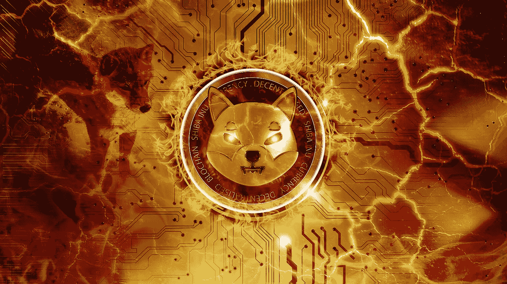

# 柴犬(SHIB)2023–2025 年价格预测，12 月 24 日更新

> 原文：<https://medium.com/coinmonks/shiba-inu-shib-price-prediction-2023-2025-update-24th-of-december-46be5b05023f?source=collection_archive---------4----------------------->

Source photo [Monedă Shiba Inu Criptomonedă — Fotografie gratuită pe Pixabay](https://pixabay.com/ro/photos/moned%c4%83-shiba-inu-criptomoned%c4%83-cripto-6766779/)

## 什么是柴犬(SHIB)？

柴犬生态系统在以太坊区块链上运行，SHIB 是该系统中第一个也是唯一一个使用的令牌。相比之下，Dogecoin 使用类似比特币的系统，但有更多愚蠢的笑话。这些 ERC-20 代币使支付和收款变得更加简单。