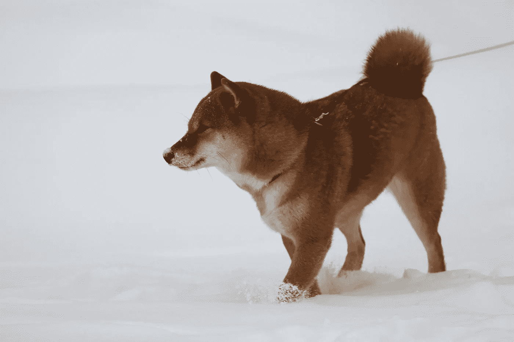

# 柴犬在 24 小时内飙升超过 12%

> 原文：<https://medium.com/coinmonks/shiba-inu-spurts-over-12-in-24-hours-5f35a876163d?source=collection_archive---------33----------------------->

柴犬(SHIB)价格继续保持与 Dogecoin 相同的趋势，但该资产难以维持其收益。

事实上，今天早些时候，该密码成功地在 24 小时内记录了 10.3%的价格波动，交易价格为 0.00001342 美元。

但是，根据 Coingecko 的最新跟踪，SHIB 进入了一个短期价格修正阶段，因为其盘中图表目前下跌了 3.3%。截至发稿时，其交易价格为 0.00001252 美元。

尽管如此，柴犬指数在过去七天里仍上涨了 22.3%，在过去 30 天里也上涨了 14%。

值得注意的是，crypto 最近价格上涨的时间与 Dogecoin 自 4 月份以来首次触及 0.15 美元的时间一致。

这进一步支持了论文的陈述，即 SHIB 是当今密码领域最热门的替代货币。

# 柴犬占据的重要位置

虽然 SHIB 有能力维持由埃隆·马斯克和多格科恩引发的价格飙升，但一些分析师认为，其最近的上涨不只是一次性的爆发，可以被视为看涨趋势的迹象。

事实上，柴犬保持在水面上，因为它停留在 0.0000118 美元的即时支撑位之上。

如果它能够保持这一趋势并继续上升，它很有可能开始重新测试 0.0000184 美元的阻力区，因为它的目标是达到 0.00002 美元的关口。

如果目前的表现是任何迹象，柴犬可能能够实现这一点，因为它在过去几天表现良好。

它不仅有一个价格泵，而且还设法增加其总市值，从 54.6 亿美元增加到 73.8 亿美元。

# 柴犬永恒:SHIB 的救赎之恩？

虽然 Dogecoin 指望它成为 Twitter(现由埃隆·马斯克(Elon Musk)所有)一些服务的可接受支付，以在未来几天引发更多看涨的行情，但 SHIB 正期待柴犬永恒也能这样做。

免费的移动交易卡游戏旨在扩大柴犬生态系统的覆盖范围，并最终增加 SHIB 币的效用和需求。

缺乏实用性一直是这种加密的致命缺陷之一，它最初是 Dogecoin 的副产品，因为其近 100 万亿的供应量使其高度膨胀。

帮助提高资产交易价格的其他措施包括大规模焚烧。最新发布的关于这项活动的更新显示，超过 2.68 亿 SHIBs 被烧毁(销毁)。

> 交易新手？试试[加密交易机器人](/coinmonks/crypto-trading-bot-c2ffce8acb2a)或者[复制交易](/coinmonks/top-10-crypto-copy-trading-platforms-for-beginners-d0c37c7d698c)