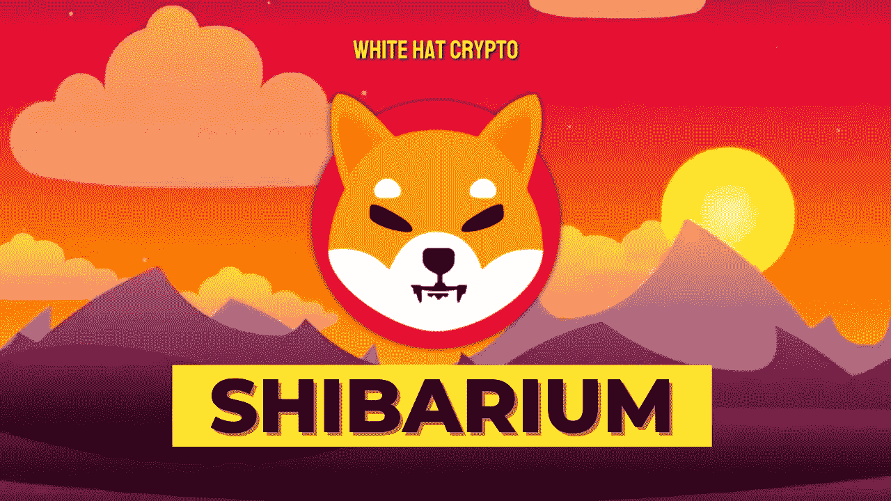

# 元宇宙博物馆就要到了，但这值得吗？！

> 原文：<https://medium.com/coinmonks/shibarium-metaverse-is-almost-here-but-is-it-worth-it-99c482192b8f?source=collection_archive---------8----------------------->

加密货币社区希望元宇宙的推出将 SHIB 令牌的价格提高到理想水平。但是会吗？！

根据柴犬社区的重要成员 Shytoshi Kusama 最近提供的线索，备受期待的著名加密货币柴犬的柴犬元宇宙即将向柴军加密社区披露。

草间弥生在 5 月 10 日发布的 SHIB 更新 5.10 包含了元宇宙即将登场的最新迹象。Shytoshi 在更新中表示，在创建 Shibarium 方面已经取得了重大进展。

他认为元宇宙将会在夏末或初秋季节推出，可能在八月到十月之间。Shytoshi 还宣布，Shibarium hackathon 将很快举行，以支持生态系统的社区主导的建设工作，不同的持续合作将推动 Shiba Inu 的财务。

直到现在，柴犬一直致力于建立元宇宙柴犬馆。4 月 13 日，柴犬向满足早期访问限制的 **$LEASH** 和 **$SHIBOSHI** 网络令牌持有者开放了其元宇宙虚拟地块的投标。土地的公开拍卖于 4 月 23 日开始，底价为每块 **0.2 先令**。

Shibarium 的虚拟土地可以在 Opensea 上购买。土地出售后，该项目为其元宇宙员工队伍增加了更多有经验的专业人员。

之前领导 Technicolor 沉浸式内容团队的玛茜·杰斯特罗和技能高超的创意技术专家谢里·库奥诺刚刚加入该公司，以提高其人才能力。

整个加密社区都在等待元宇宙博物馆上市。柴犬一直坚信柴犬有一天会跻身五大秘密生态系统之列。Shibarium 将提供一个美好的氛围，社区可以蓬勃发展和参与。

社区还期望预期的功能和进步将增加 SHIB 硬币的价值。根据 CoinMarketCap 的数据，1 SHIB 现在大约值 0.00001652 美元。

Shibarium 和其他即将推出的柴犬项目的发布会有助于$SHIB 代币达到社区的 1 分马克目标吗？

这个问题的答案是一个谜，取决于柴犬未来的意图。为了取得巨大的成果和巨大的受欢迎程度，令牌应该专注于支持真实世界的应用程序。因为事实证明，嗡嗡声会消失，但必要性会持续

这篇文章中提供的内容不是赞助的，据我所知是正确的。这篇文章不是金融建议，我们不对针对这篇文章采取的任何行动负责！

请随时查看我们的社交平台，了解每日加密更新，或通过以下渠道联系我们:

[YouTube](https://www.youtube.com/channel/UCjfinzatswbVaRd89zn5kJQ/featured)

[推特](https://twitter.com/whitehatcrypto)

[Instagram](https://instagram.com/white.hatcrypto?igshid=YmMyMTA2M2Y=)

[Gmail](http://cryptowhitehat@gmail.com/)

信息来源:CoinMarket Cap，Web3wire

> *加入 Coinmonks* [*电报频道*](https://t.me/coincodecap) *和* [*Youtube 频道*](https://www.youtube.com/c/coinmonks/videos) *了解加密交易和投资*

# 另外，阅读

*   [3 商业评论](/coinmonks/3commas-review-an-excellent-crypto-trading-bot-2020-1313a58bec92) | [Pionex 评论](https://coincodecap.com/pionex-review-exchange-with-crypto-trading-bot) | [Coinrule 评论](/coinmonks/coinrule-review-2021-a-beginner-friendly-crypto-trading-bot-daf0504848ba)
*   [莱杰 vs n rave](/coinmonks/ledger-vs-ngrave-zero-7e40f0c1d694)|[莱杰 nano s vs x](/coinmonks/ledger-nano-s-vs-x-battery-hardware-price-storage-59a6663fe3b0) | [币安评论](/coinmonks/binance-review-ee10d3bf3b6e)
*   [加密交易机器人](/coinmonks/crypto-trading-bot-c2ffce8acb2a) | [Bingbon 评论](https://coincodecap.com/bingbon-review)
*   [Bybit Exchange 评论](/coinmonks/bybit-exchange-review-dbd570019b71) | [Bityard 评论](https://coincodecap.com/bityard-reivew) | [Jet-Bot 评论](https://coincodecap.com/jet-bot-review)
*   [3 commas vs crypto hopper](/coinmonks/3commas-vs-pionex-vs-cryptohopper-best-crypto-bot-6a98d2baa203)|[赚取加密利息](/coinmonks/earn-crypto-interest-b10b810fdda3)