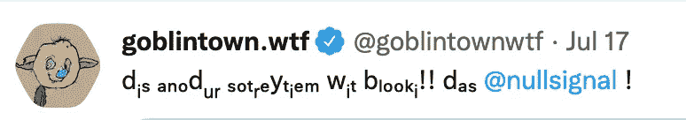
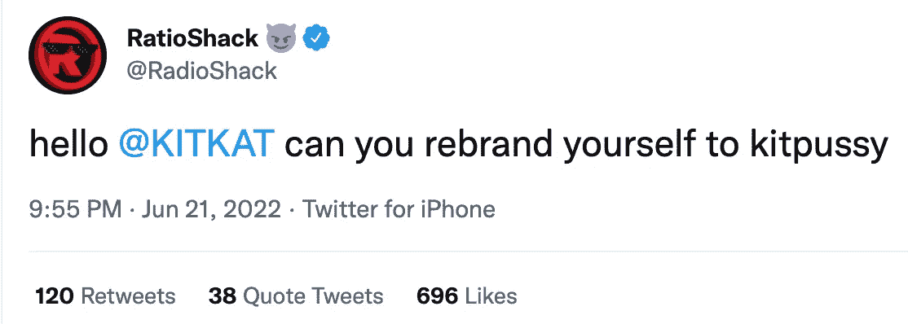

# Shitposting 101:网络 3 讲故事大师班

> 原文：<https://medium.com/coinmonks/shitposting-101-a-web3-storytelling-masterclass-3c2d6e12609f?source=collection_archive---------4----------------------->

RadioShack Twitter 是 Web3 中最好的社交媒体账户。

是的。那个无线电黑客。2015 年破产的百年电子公司。

此后，它们被一家投资公司收购，并转变成了一只 [Web3 DEX](https://radioshack.org/) (因为它们当然有)。

**他们是如何推广他们的 DEX 的？**

成为 Web3 中最好的 shitposting 帐户。这可不是开玩笑的。人们喜欢嘲笑“shitposting”或制造荒谬的模因。

但是那些人不明白人们想要什么。

> Shitposting 是 Web3 项目所能提供的最好的“工具”之一。

迷因决定选举。他们左右公众舆论。是的，对你们这些营销呆子来说，他们推动“参与”

看看 RadioShack 上个月发布的一些最荒谬、最搞笑的推文:

支气管镜检查非常认真。

看看这些数字:8 万个赞，11.6 万个赞，1.7 万次转发，等等。

参与人数本身并不意味着什么——它们只有在转化为销售额时才是重要的。在这种情况下:

有人在使用 RadioShack DEX 吗？

算是吧。

RadioShack 的 DEX(托管在雪崩区块链上)在过去几天(截至 2022 年 7 月 22 日撰写本文时)的平均日成交量约为 10 万美元至 15 万美元。根据 CoinGecko 的说法，这足以在所有指标中排名第 120 位。

自 5 月份成立以来，其每日交易量从 870 万美元到 12，000 美元不等。

对于一家已经沦为笑点的公司来说，这些都是令人震惊的积极结果。

“等等，”当你开车经过一家旧电器商店时，你说，“那是他妈的 *RadioShack 吗？我不知道那些东西还存在。”*

我的观点是，无论 RadioShack 在网上卖什么，人们都会买。为什么？因为它们的内容是:

*   意外的
*   粗俗得可笑，却不侮辱人
*   真他妈搞笑

这些人也不会在这里信口开河。RadioShack 采用了一种独特的 playbook 来提高参与度和吸引新用户。

你可以偷它…

# 泰·洛佩兹出场

你可能不记得这个人了。21 世纪初，他在 YouTube 上红极一时。他会站在车库里发垃圾视频广告，吹嘘自己有多少辆兰博基尼，读过多少本书。

没错，这家伙会出售如何阅读更多书籍的课程，他的关键观点是**你不应该读书**。你应该只是读读书摘要，然后把书放在你的书架上。

这家伙是互联网营销大师巅峰的模仿。

“Here I am in my garage, shitposting my way to being a millionaire.”

但是如果他不出名的话。

别忘了，任何宣传都是好的宣传。没有人比泰·洛佩兹更清楚这一点。

快进到 2015 年，Radio Shack 申请第 11 章破产。它们被一家无线公司以 2500 万美元收购。

2017 年，新东家再次申请破产。

2020 年，由 Tai Lopez 领导的一家投资公司以未披露的金额收购了 RadioShack 的财产。

事情是这样的。Tai 并没有进来一下子把事情从零变得一发不可收拾。有一个缓慢的燃烧。

# 进入Á贝尔丘波尔

今年四月，Á·贝尔·楚波尔成为了 RadioShack 的 CMO。

Does this guy even own a Lambo + 250 books he hasn’t read???

这是发布 RadioShack 推特账号的家伙。Á·贝尔有过一些有趣的营销经验，但没有什么比泰·洛佩兹更值得一提。

在Á·贝尔加入之前，这就是 RadioShack 发布的那种软弱无力的公司怪癖。这是 2021 年 9 月的一条推文:

这是 RadioShack 在 2021 年 8 月发布的另一条推文:

比较一下温迪那条蹩脚的推文和这条，这条发于 2022 年 7 月 5 日，晚上 10:35:

区别？以前的推文很无聊。

Á·贝尔说，“如果你看看任何企业(社交媒体)账户，它们都很无聊。”

他说得对。Web3 里这么多人都在玩害怕。你知道我们面前有多好的机会吗？

在 Web3 中我们可以做任何我们想做的事情。房间里没有大人。

*   没有人力资源部门需要回答。
*   最受欢迎的区块链比特币是由一个不存在的家伙创造的。
*   以太坊是第二受欢迎的区块链，由一名 20 岁的 autist 创作。

然而我们在这里。重复我们在 Web2 中说过的那些蹩脚的、中性的、客观的企业社交媒体废话。试图在完全无害和无趣的情况下“推动参与”。

去你的订婚农场。

自从Á·贝尔加入以来，RadioShack 的追随者增加了一倍(增加了+170，000)，并获得了数百万次的印象。全靠发关于喷射和振动器的微博。

# 品牌故事与团队故事

这里的一个教训是品牌故事和团队故事之间的区别。

**什么是品牌故事？**

品牌故事是指公众看到的关于你的 Web3 品牌的一切:

*   社交媒体帖子
*   NFT 地板价格
*   网站(全球资讯网的主机站)
*   路标
*   不调和
*   游戏知识
*   等等。

**什么是团队故事？**

团队故事指的是在你的 Web3 品牌背后发生的事情:

*   团队
*   起源故事
*   风险投资基金
*   以前的项目
*   等等。

RadioShack 有一个精湛的品牌故事。他们的推特是如此的淫秽和吸引人，以至于我们真的不在乎他们团队故事可能的粗略，包括与备受诋毁的泰·洛佩兹的联系。

他们没有保守阿泰的秘密，但他们也没有把他推出红地毯。它工作了。

为什么品牌故事和团队故事之间的区别如此重要？

# 进入戈布林敦。他妈的…

在漆黑的冬天，戈布林镇是唯一的亮点。

他们是以太坊上的免费造币厂。是 10，000 个长相丑陋的妖精在撒尿、拉屎、挖鼻孔。

在 NFT 所有项目都陷入困境的时候，戈布林顿斯进来破坏了一切。

他们是市场的完美体现。纯粹的虚无主义。没有路线图。没有团队。免费薄荷。没有任何计划。

只是一个用 goblinspeak 说话的推特账号

You got any idea what this means?

如果你没看到，这个项目就开始了。文章都写了。推特上充斥着妖精分叉。楼面价高达 5.5 ETH。(记住:这是免费的薄荷糖。)

一些人说 GoblinTowns 没有用途，没有价值，mooning 项目是 NFTs 结束的标志。

那是胡说。

> 没有人意识到张贴粪便是最终的用途。娱乐才是终极价值。

就像 RadioShack 一样，GoblinTowns 两者兼而有之。

即使是最微小的错误也对他们有利。匿名团队在 Twitter 上开设了一个直播空间，他们只用 goblinspeak 说话，一遍又一遍地喊着“猴子汉堡”和“老鼠德根斯”之类的话。

它应该已经扼杀了这个项目。

相反，他们增加了 5 万名推特粉丝。

This will make you cringe so hard your skeleton pops out of your body.

但后来他们搞砸了。

6 月 14 日，戈布林顿团队自杀了。

在接下来的几天里，地板价格从 5.5 ETH 下降到 2.5 ETH。

为什么？是因为这个团队有拉地毯的历史吗？他们都是恋童癖者或被定罪的性侵犯者吗？

绝对不行。事实上，其背后的团队——真理实验室(Truth Labs)有着高质量项目的历史。

那么为什么要蘸呢？

一些人将其归因于市场的变化无常。"无法预测这个市场会如何反应。"

不对。

> 由于 GoblinTowns 团队披露了团队故事，搞砸了品牌故事，所以这个项目受到了影响。

这是一个不可思议的项目，有一个惊人的故事——“愚蠢的免费造币厂摧毁市场”——用他们自己的语言，他们自己的声音，和独特的艺术。

然后我们发现它是由一群普通人经营的？

不要敲他们。但是通过暴露自己，他们可能认为他们可以保证这个项目是真实的。

**但是他们所做的一切只是粉碎了幻想。**

就像发现圣诞老人不是真的一样。或者魔术师告诉你他们的秘密。我已经知道这是一个骗局，但是你不能让我再想象一会儿吗？

我的观点是:

品牌故事(公众看到的)和团队故事(幕后发生的)都需要被利用来获得最大的有效性。

# 狗屎张贴战术手册

以下是 RadioShack 用来获得参与度的粗略公式。您可以在自己的 Web3 项目中使用它:

1.**发一条早上好的推文**(也许有独特的转折)。这不必是什么惊天动地的事情——只要跟你的观众打个招呼，用一张图片或者通过某种方式调出另一个账户来说就行了。

2.几个小时后，**发布一条推文，为这一天设定主题**。例如，在 6 月下旬，RadioShack 与一个名为 Coffee Break 的 YouTuber 长期不和，他制作了一个关于 RadioShack 所有者泰·洛佩兹(Tai Lopez)的负面视频。因此，6 月 22 日，他们在推特上写道:

这促使他们发起了一场为期数天的运动，为他们时间表上的所有“娘娘腔”购买一套振动电池。这就引出了下一个问题:

**3。没有什么是政治**。是的，账户在胡说八道。但是他们从不开枪，除非有人先朝他们开枪。它们永远不会演变成愚蠢的政治讨论。一切都遵循喜剧的黄金法则:

> 如果一个笑话比冒犯性的更有趣，你就可以逃脱任何惩罚。

**4。开枪吧**。RadioShack 总是在推特上发布最荒谬的名人和品牌:

有时他们会得到回应:

这些推文让文章被写出来，它们很有趣，它们推动了新观众的参与。

5.**挑选一个角色**。RadioShack 背后的角色是一个疯狂的性实习生。戈布林顿背后的角色是一个痴迷撒尿的妖精。我们真的相信这些角色吗？不会。但它们创造了一个有趣的品牌故事，让你更容易创造内容，也更容易让你的观众陷入幻觉。

6.**倚成仇人**。RadioShack 被嘲笑为一家已经倒闭的连锁商店，人们只是在那里购买电池。他们会躲起来吗？不。他们对批评的回应是，“当然，我们卖电池——给你妈妈的阴道。”戈布林顿被嘲笑为没有用途的德根项目。他们的回应是贴上妖精们在仇恨者身上撒尿的照片，并吹嘘他们没有路线图的事实。

我将引用 RadioShack 推特账户背后的 CMOÁ·贝尔的话:

> “在社交媒体上，如果你是一个品牌，你不会有所成就，除非你愿意冒险，做一些其他品牌过去从未做过的事情。”

我的朋友们，这就是狗屁 101。

***

如果你想和我一起工作，我为 Web3 项目写内容、文章、游戏知识等等。在 greg@greg-larson.com 给我发邮件，在推特上关注我。

> 交易新手？尝试[加密交易机器人](/coinmonks/crypto-trading-bot-c2ffce8acb2a)或[复制交易](/coinmonks/top-10-crypto-copy-trading-platforms-for-beginners-d0c37c7d698c)