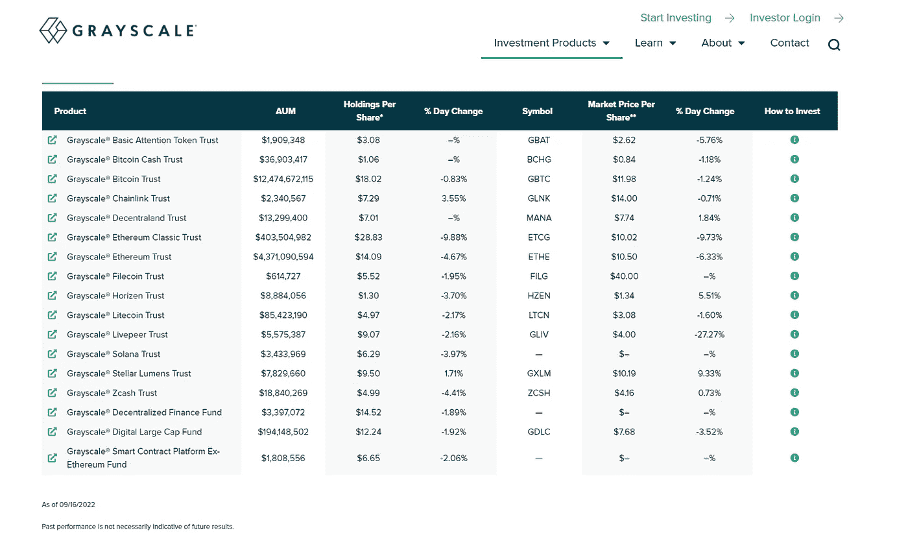

# 即将到来的市场崩溃的购物车

> 原文：<https://medium.com/coinmonks/shopping-cart-for-the-upcoming-market-meltdown-8f8182e4879c?source=collection_archive---------31----------------------->

如果你有一些资金，你可以在未来的 2 年里把它们存起来。这篇文章是给你的。

让我们看看我们的水晶球，好吗？:)

我:你为什么认为会有市场崩盘？

CB:注意美联储正在做什么。如果他们继续提高联邦基金利率以对抗通货膨胀，市场崩溃是不可避免的。如果联邦基金利率在年底前再增加 2%，你可以预计标准普尔 500 会再下降 15%-20%。在更糟糕的情况下，如果它引发黑天鹅事件、全球保证金追缴或债务危机，我们可能会经历更深的突然下跌，这将在整个实体经济中产生多米诺骨牌效应。

我:如果真的发生了，我们该怎么办？

伯恩斯坦:市场上会有很多恐惧。当 S&P 下跌 20%时，该指数将在 3100 点左右。这肯定会感觉像是世界末日。不管通胀叙事如何，美联储都将被迫采取行动。否则它可能会跌破 2900，希望我们不会经历这种情况。在这个可怕的市场中，除了 crypto 下跌更多，比特币下跌 40-50%也就不足为奇了。这将使 BTC 约 1 万至 1.2 万英镑。替代硬币又下降了 50%-90%。这就是为什么你需要预测，准备好资金和购物车。永远记住，你只投资你能承受损失的钱。换句话说，如果你失去了一切，它不会改变你的生活方式。

下面是标准普尔 500 的周线图，供你参考。如果美联储继续加息，2900-3200 看起来是个容易的目标。

我:那么我们应该在购物车里放些什么呢？

伯恩斯坦:在市场崩溃的时候，会有太多的机会。SPY(指数基金)，美国国债，BTC，黄金/GLD。所有这些都不错，但如果你想让自己的回报最大化，那么你需要投资风险更高的产品，比如 BTC 和另类投资。如果你有美国贸易帐户，你可以开始研究灰度产品。他们为加密资产提供投资信托，目前他们的 BTC 信托比资产净值低 33%。它的意思是，在 BTC 大约 20K 的时候购买 GBTC(灰度比特币信托)相当于在 13.4K 购买 BTC(33%的折扣)。

我:这怎么可能？为什么有人会折价出售 GBTC？

CB:在牛市中，GBTC 价格比其资产净值有 30%的溢价，因此在熊市中，其价格的跌幅可能超过其资产净值。这只是人类的心理。那才是你能最大化回报的地方。记住，灰度为他们的信任收取年费。GBTC 有 2%的年费，而其他一些灰度产品，它有更高的年费(2.5%)，你需要做的研究。但尽管如此，你并不打算长期持有，最多是大约 2 年。所以你要为未来两年持有 GBTC 支付 4%的资产净值费用。

正如你从下图中看到的。GDLC 较其资产净值有 37%的折让。而以太坊信托则有 25%的折扣。

灰度产品可能无法覆盖市场上所有可用的替代硬币，但对于不想保存和使用加密钱包的人来说，这是一个很好的选择。

我:购买 GBTC 而不是 BTC 本身会有什么问题或坏处？

伯恩斯坦:嗯，任何事情都有风险。购买 GBTC 意味着你有交易对手风险，灰度作为一个组织肯定有你无法控制的风险。相比之下，购买 BTC 并保留自己的 BTC 钱包，你可以管理/控制风险。但对于 30-40%的折扣，这当然非常有吸引力。想象一下，如果 BTC 降至 12K 左右，而 GBTC 仍有 33%的折扣。这就像在 8K 买下 BTC 一样。是不是太好了，不能被忽视？

我:顺便问一下，为什么你认为我们最多只需要持有 2 年？

伯恩斯坦:因为 2 年与下一个 BTC 减半周期一致。如果在崩溃之后，市场在接下来的 2 年里没有恢复，我认为它就不值得再保留了。这可能是密码技术的终结。虽然这种情况是完全不可能的，但市场是不可预测的，对于一个可以增长 100 倍的产品来说，它只意味着它仍然是早期的，因为它是早期的，它可能不会存活或永远持续下去。

一如既往，祝你好运，保持冷静。不要过度投资！市场不可预测。

> 交易新手？试试[加密交易机器人](/coinmonks/crypto-trading-bot-c2ffce8acb2a)或者[复制交易](/coinmonks/top-10-crypto-copy-trading-platforms-for-beginners-d0c37c7d698c)