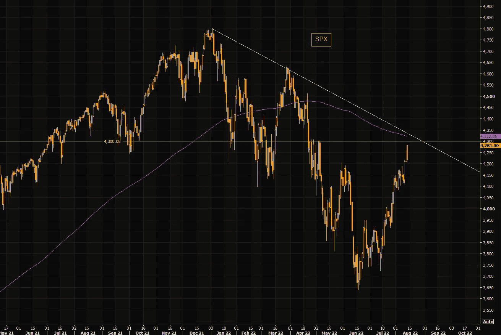
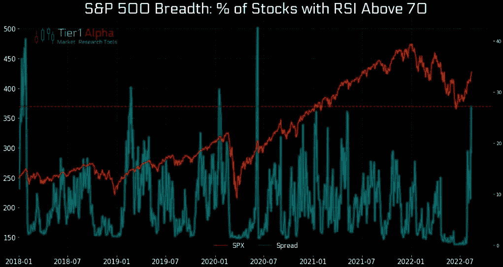
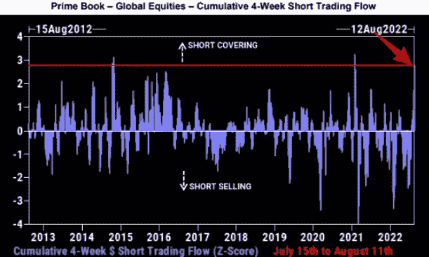
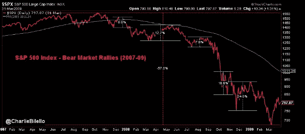
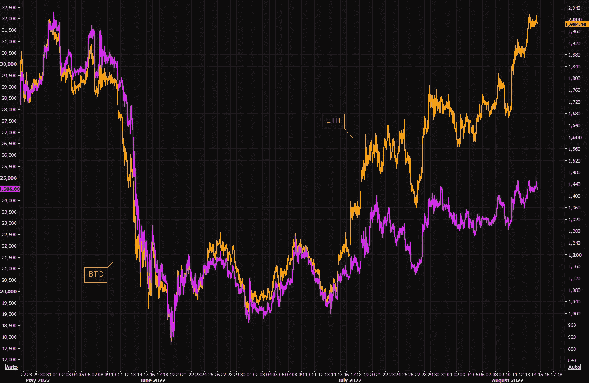
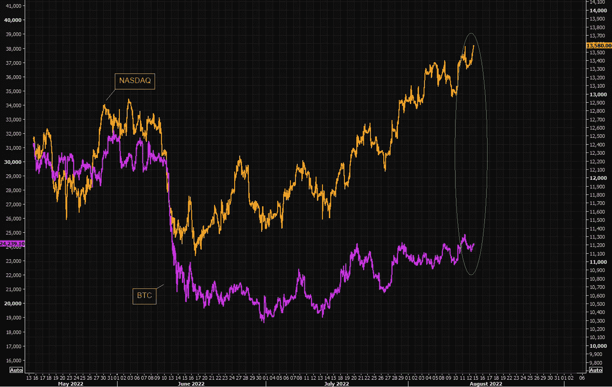
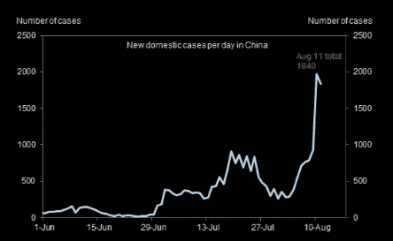

# 卖空者被屠杀，比特币与科技股背离，中国回归

> 原文：<https://medium.com/coinmonks/short-sellers-slaughtered-bitcoin-vs-tech-divergence-return-of-china-covid-38f0336d4455?source=collection_archive---------23----------------------->

嘿，我是基兰！市场又将迎来新的一周，以下是需要注意的关键事件，以及来自投资银行的最有趣的宏观研究。我希望能在本周的[贸易节目](http://www.traderseed.io/)中与你交谈，一如既往，如果你有任何问题，请在下面给我留言。

# 每周观察列表

本周三，我们将获得美国零售销售的最新数据，以及几家主要零售商的盈利结果。美国消费者的实力将成为本周的焦点，周四我们还将看到美国 7 月份的成屋销售数据，此前 6 月份连续第五个月下降至两年来的最低水平。

同样在本周，美联储将于周三公布 7 月会议纪要。和以往一样，这份报告将会被仔细分析，以寻找利率可能走向的线索。交易员目前对不那么鹰派的美联储进行了定价，联邦基金期货显示，官员们在 9 月底开会时加息 50 个基点的可能性更大，而不是像他们在上两次会议上那样加息 75 个基点。

# 宏观视角

**风险反弹仍在继续。**这个市场仍然严重依赖当前的风险反弹。我们正处于挤压的过度阶段。4300/4350 是值得关注的大级别。200 天移动平均线略有上升，以及长期的负面趋势。为什么不把最后一条短裤放在担架上抬出去…

**超买财源滚滚。RSI 超过 70 的股票百分比已经上升。然而，我们之前看到过稍微更极端的读数…**

**10 年来第三大空头回补反弹。根据高盛的数据，这次反弹已经成为过去十年中第三大对冲基金空头回补事件。卖空者遭到屠杀。**

熊市反弹很常见。请记住，在之前的熊市背景下，当前的风险反弹非常正常。图表显示全球金融危机期间标准普尔 500 指数上涨。它们可以持续几个月，远远超出基本逻辑所暗示的范围。如果我们要降价，短裤必须全部被挤出。

BTC 明显落后..从最近的低点算起，BTC 已经落后了 ETH +100%的涨幅。大机构还没有准备好追逐 ETH，他们仍然谈论 BTC 作为密码交易。他们会很快感受到 BTC·FOMO 吗？

**比特币不再追踪科技..还记得 BTC 和 tech 齐头并进的时候吗？那些日子已经一去不复返了，当然 BTC 不是高科技，但考虑到“一切”的最新紧缩，BTC 的相对衰落令人费解。**

中国又来了。由于海南省局部爆发，过去一周每日新增国内病例增加。一个值得密切关注的未来。

我希望你觉得这很有趣，很有用。一如既往，我只是一个电子邮件，所以只要回复此邮件，如果你有任何反馈或问题。

祝你一周愉快！
基兰
www.traderseed.io

**你能通过贸易战吗？**证明你的交易技巧，赚取高额回报。起价 75 美元的节目！！点击这里查看新节目 [**！**](http://www.traderseed.io/)

> 交易新手？尝试[加密交易机器人](/coinmonks/crypto-trading-bot-c2ffce8acb2a)或[复制交易](/coinmonks/top-10-crypto-copy-trading-platforms-for-beginners-d0c37c7d698c)