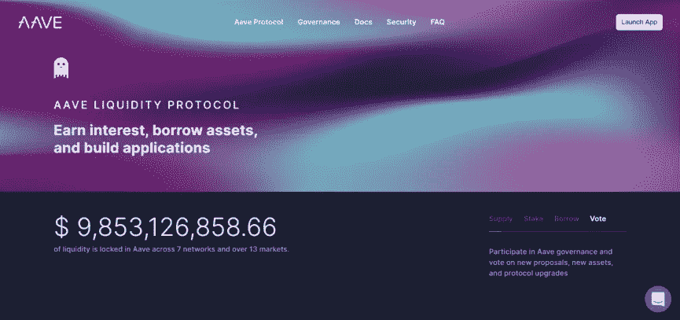
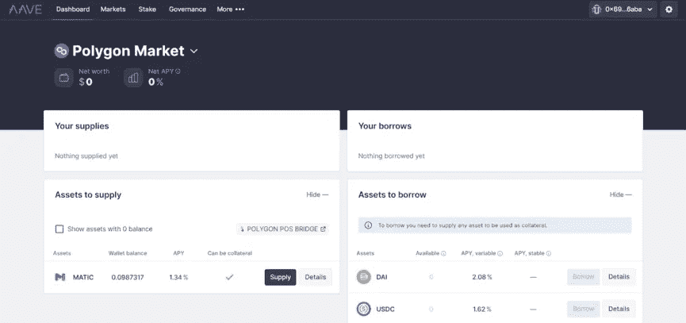
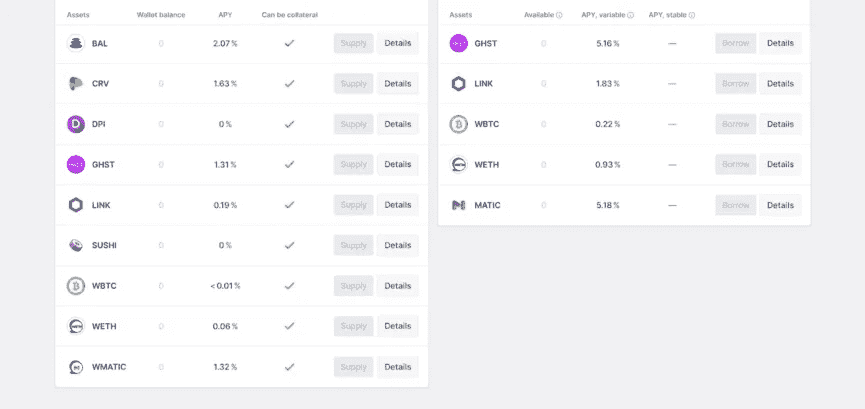
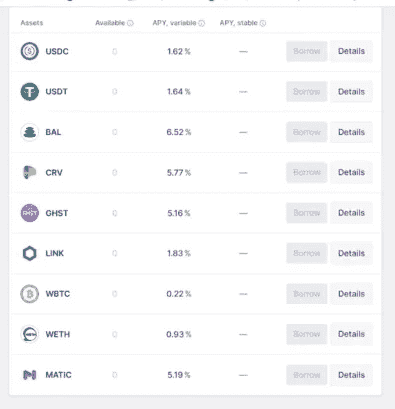
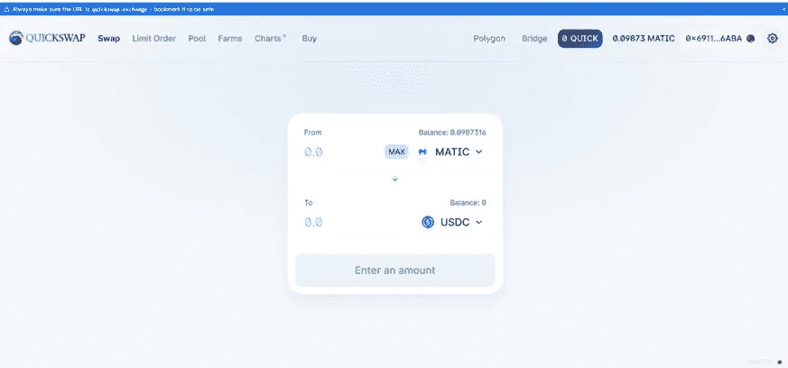

# 使用 Aave 做空市场

> 原文：<https://medium.com/coinmonks/shorting-the-market-using-aave-553a054e57f7?source=collection_archive---------17----------------------->

许多投资者错过了熊市期间的收益，因为人们认为在下跌趋势中更难交易。交易上涨趋势很简单:买一枚硬币，hodl，然后获利。交易下跌趋势也很简单。本文概述了投资者如何利用普遍的市场情绪，并使用流行的借贷协议 Aave 做空市场。

**DeFi 借贷协议**

贷款是 TradFi(传统金融)实体最基本的功能之一，并迅速成为 DeFi(分散金融)中最重要的增长领域之一。中间人已经被移除，取而代之的是超额抵押。DeFi 贷款协议是开放的，没有权限的；因此，任何有密码作为抵押的人都有资格获得资金。

> 交易新手？试试[密码交易机器人](/coinmonks/crypto-trading-bot-c2ffce8acb2a)或者[复制交易](/coinmonks/top-10-crypto-copy-trading-platforms-for-beginners-d0c37c7d698c)

它们最初的设计目的是创建一个全球资本市场，将寻求对闲置资金产生兴趣的人和希望获得资金进行生产性投资的人连接起来。这些协议很快被重新用于交易杠杆。投资者可以抵押一项稳定的资产，以此资产为抵押贷款，从而获得更大的市场敞口。

抵押一项资产总是比出售资产更有优势，这也是富人经常使用的一种技巧。资产持续增值，并被用于进一步积累资产。

**Aave 上的短路**

**1。进入**[**Aave**](https://aave.com/)**启动 app**

**2。连接非保管钱包**

**3。选择要抵押的资产**

最好的抵押资产是 WBTC。是最稳定的资产，也是最会升值的资产。WBTC 只是一个以太坊令牌，可以在 1:1 的基础上交换给 BTC，允许参与者在与以太坊的 DeFi 生态系统互动的同时拥有比特币。

**4。借你要做空的令牌，比如 MATIC**

以每枚代币 0.47 美元的价格借入 500 枚 Matic 代币，贷款总额为 235.70 美元。永远不要超过 50%的贷款价值比，这意味着你的抵押品永远是你贷款价值的两倍。这避免了市场波动时的清算风险。

**5。在** [**快速交换**](https://quickswap.exchange/#/swap) 上立即将借来的代币换成 USDC

用 500 Matic 换 235 美元 USDC

**6。抵押 USDC 于** [**Aave**](https://aave.com/) **提振贷款健康**

**7。等待借入代币的价格下跌**

在本例中，在接下来的几周内，Matic 跌至每枚 0.25 美元。

**8。与 USDC 在** [**快速交换**](https://quickswap.exchange/#/swap) **上回购借来的代币并偿还借款**

以每枚 0.25 美元的价格计算，500 Matic 将花费 125 美元。偿还贷款后，投资者将获得 110 美元的利润。

**9。恭喜做空市场**

> 加入 Coinmonks [电报频道](https://t.me/coincodecap)和 [Youtube 频道](https://www.youtube.com/c/coinmonks/videos)了解加密交易和投资

# 另外，阅读

*   [block fi vs Celsius](/coinmonks/blockfi-vs-celsius-vs-hodlnaut-8a1cc8c26630)|[Hodlnaut 评审](/coinmonks/hodlnaut-review-best-way-to-hodl-is-to-earn-interest-on-your-bitcoin-6658a8c19edf) | [KuCoin 评审](https://coincodecap.com/kucoin-review)
*   [Bitsgap 审查](/coinmonks/bitsgap-review-a-crypto-trading-bot-that-makes-easy-money-a5d88a336df2) | [Quadency 审查](/coinmonks/quadency-review-a-crypto-trading-automation-platform-3068eaa374e1) | [Bitbns 审查](/coinmonks/bitbns-review-38256a07e161)
*   [密码本交易平台](/coinmonks/top-10-crypto-copy-trading-platforms-for-beginners-d0c37c7d698c) | [Coinmama 审核](/coinmonks/coinmama-review-ace5641bde6e)
*   [印度加密交易所](/coinmonks/bitcoin-exchange-in-india-7f1fe79715c9) | [比特币储蓄账户](/coinmonks/bitcoin-savings-account-e65b13f92451)
*   [OKEx vs KuCoin](https://coincodecap.com/okex-kucoin) | [摄氏替代品](https://coincodecap.com/celsius-alternatives) | [如何购买 VeChain](https://coincodecap.com/buy-vechain)
*   [币安期货交易](https://coincodecap.com/binance-futures-trading)|[3 commas vs Mudrex vs eToro](https://coincodecap.com/mudrex-3commas-etoro)