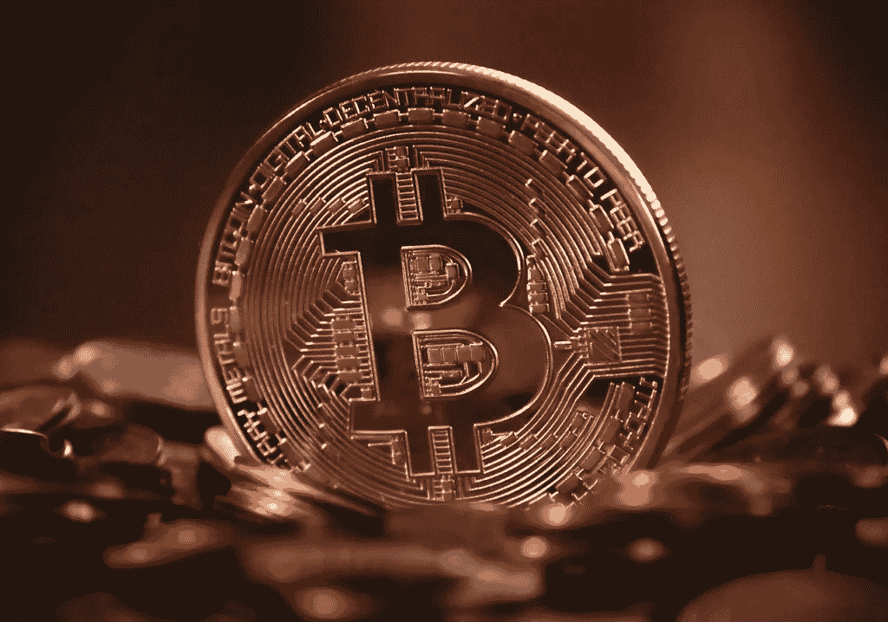

# 加密货币应该大写吗？

> 原文：<https://medium.com/coinmonks/should-cryptocurrency-be-capitalized-caceef0b454b?source=collection_archive---------65----------------------->

你一定听说过股市投资中的市值。市值是股票市场投资者的一个重要方面。但当涉及到加密投资时，这个概念就完全不同了。**加密货币资本化没有统一的争夺。**

Should Cryptocurrency Be Capitalized?

股票市值是指公司股票的总价值或股份数量。它帮助投资者创造和维持一个平衡的投资组合。据专家称，规则是不同的，也不适用于加密投资者。

> 从顶级交易者那里复制交易机器人。免费试用。

# 什么是加密货币市值？

**加密货币市值**是指在市场上流通的加密货币的总价值。股票市值的计算方法是发行在外的股票乘以股价。这个概念与加密货币的市值有很大不同，后者是通过将流通的硬币数量乘以加密货币的价格来计算的。

考虑一个比特币的**市值的例子，其计算方法是将存在的硬币乘以特定时间比特币的价格。自 2022 年 3 月以来，比特币的价格一直在有规律地降低。随着比特币价格的变化，市值也随之变化。**

在过去的几个月里，比特币的价格一直在波动

*   45000 美元 x 18.8 万美元= 8460 亿美元
*   5 万美元 x 18.8 万美元= 9400 亿美元
*   55000 美元 x 18.8 万美元= 1.034 万亿美元

[点击此处](https://wazirx.com/invite/jkwe73z9)向印度最佳经纪人开立加密钱包账户

# 加密市值对投资者意味着什么

股票市场中的市场资本分为小型股、中型股或大型股。投资者可以出于多种原因决定将他们的投资分成许多组，这使得了解市值变得至关重要。市值通常用来指该组织的价值，这可以反映在它对该公司投资的风险强度上。大盘股相对于中小盘股是有风险的。

加密货币的概念没有股票市场那么古老。这意味着像大盘股或中盘股这样的分类很难形成。

专家还指出，投资者必须坚持比特币或以太坊，加密组合的总投资不应超过 5%。这意味着决定投资决策对市值的要求降低了。

如果希望了解特定令牌的潜力或范围，了解加密货币的市值可能会很有趣，但它不应该是投资决策中的一个重要因素。

**阅读更多**

[HDFC 有限公司 2025 年、2030 年、2035 年股价目标](https://updatedgeek.com/hdfc-ltd-share-price-target/)

[(技术分析)Bajaj 金融股价目标 2023 年、2025 年、2030 年、2035 年](https://updatedgeek.com/bajaj-finance-share-price-and-target/)

[(技术分析)Muthoot Finance 股价目标 2023 年、2025 年、2030 年、2035 年](https://updatedgeek.com/muthoot-finance-share-price-target/)

[(技术分析)电力金融公司 2023、2025、2030、2035、2040 年股价目标](https://updatedgeek.com/power-finance-corporation-share-price-target/)

# 如何使用加密的加权市值策略

加权市值策略可以协助投资者，即使投资比特币和以太坊的人很少。加权市值策略是指根据市值对每项资产进行比例投资。

例如，如果一项授权获得了比特币和以太坊的总市值，那么就需要划分每个个人密码在总市值中所占的百分比，这将导致比特币占 71%，以太坊占 29%。

同样的方法也适用于确定对两种最大的加密货币的投资。比如 100 美元应该作为 71 美元投资比特币，29 美元投资以太坊。

根据专家的说法，投资者应该关注比特币、以太坊等重要的加密技术，而不是其他替代货币。目标是将大量资金投入较安全的加密货币，少量资金投入风险较高的加密货币。

# 常见问题

**1。加密货币大写吗？**

是的，加密货币是大写的

**2。什么是 Dogecoin 大写？**

127 亿

**3。加密是资本收益还是收入？**

加密是一种资本收益。

**4。加密是资产还是金钱？**

加密是一种数字资产

**免责声明**:如果你想投资股市，在做出购买决定之前，你应该咨询你的理财顾问。你应该评估风险，研究公司细节。

**相关搜索**

[2023 年一定要继续投资股市吗？](https://updatedgeek.com/keep-investing-in-the-stock-market/)

[(价格图表)2022 年 11 月你应该购买的 3 种最佳加密货币](https://updatedgeek.com/best-cryptocurrency-to-buy-november/)

[(技术分析)苹果公司 2023 年至 2030 年股价目标](https://updatedgeek.com/apple-inc-share-price-target/)

[为什么信用卡或借记卡有有效期？](https://updatedgeek.com/why-credit-or-debit-cards-have-expiry-date/)

**关注更多更新**

*在 LinkedIn 上关注*[*Raveen Chawla*](https://www.linkedin.com/in/raveen-chawla-02b3017b)

**相关搜索，点击* [*文章*](https://updatedgeek.com/) *，点击* [*网络故事*](https://updatedgeek.com/web-story-sitemap.xml)*

> *交易新手？尝试[加密交易机器人](/coinmonks/crypto-trading-bot-c2ffce8acb2a)或[复制交易](/coinmonks/top-10-crypto-copy-trading-platforms-for-beginners-d0c37c7d698c)*

*   *[CoinLoan 审核](https://coincodecap.com/coinloan-review) | [YouHodler 审核](/coinmonks/youhodler-4-easy-ways-to-make-money-98969b9689f2) | [BlockFi 审核](https://coincodecap.com/blockfi-review)*
*   *[XT.COM 评论](https://coincodecap.com/profittradingapp-for-binance)币安评论 |*
*   *[SmithBot 评论](https://coincodecap.com/smithbot-review) | [4 款最佳免费开源交易机器人](https://coincodecap.com/free-open-source-trading-bots)*
*   *[比特币基地僵尸程序](/coinmonks/coinbase-bots-ac6359e897f3) | [AscendEX 审查](/coinmonks/ascendex-review-53e829cf75fa) | [OKEx 交易僵尸程序](/coinmonks/okex-trading-bots-234920f61e60)*