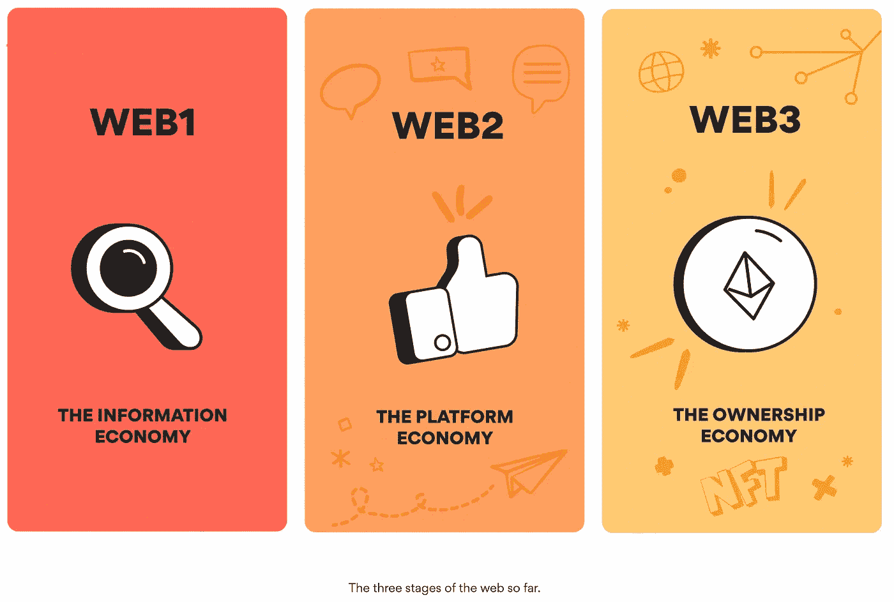
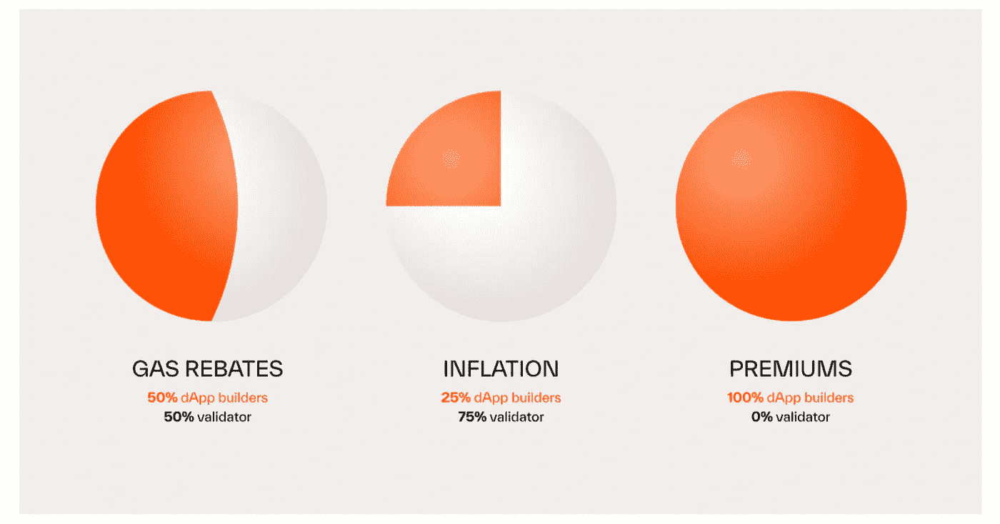

# 开发者应该转向 Web3 吗？

> 原文：<https://medium.com/coinmonks/should-developers-move-to-web3-26b1a4008e68?source=collection_archive---------36----------------------->

你是一个希望提升自己职业生涯的开发人员吗？

你是一个希望增加收入的开发者吗？

你是自由职业者吗？

你是一个已经从事 Web 2.0 的开发人员，并且希望学习新的技能并转向 Web 3.0 吗？

如果你的答案是肯定的，那么我相信作为一个好奇的开发者，你在最近一定会遇到以太坊、宇宙、朱诺、索拉纳和范托姆·区块链。如今有数百种区块链可供选择。每个链都有自己的目的、优点和缺点。

> 以这些链的开发者的观点来看，我们看到大部分都有一个标准的工作机制。例如，以太坊、Solana 或 Juno 等协议侧重于奖励验证者/挖掘者。协议收取的这些气费大多用于奖励运行节点和验证交易的个人。

你想象过一个由验证器运行但没有 dApp 的链吗？这个链对它的用户有多大用处？这是显而易见的，当然，这些链条没有多大用处。

在[宇宙生态系统](https://cosmos.network/)中，我们第一次有了[牌坊](https://archway.io/)。区块链新牌坊有独特的奖励机制。倾向于开发商。更多详情请参考 archway 官方网站。

如果你是一个开发者，Archway 是你成为一个社区的一部分的最佳选择，开发者可以通过推出新的 dApp 来赚钱。

> 交易新手？尝试[加密交易机器人](/coinmonks/crypto-trading-bot-c2ffce8acb2a)或[复制交易](/coinmonks/top-10-crypto-copy-trading-platforms-for-beginners-d0c37c7d698c)