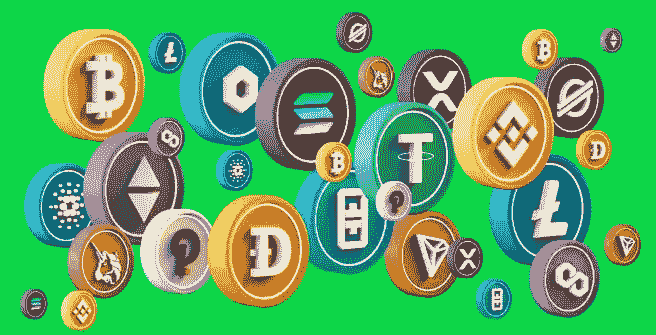

# 我应该投资比特币还是 Altcoins？(建议)

> 原文：<https://medium.com/coinmonks/should-i-invest-in-bitcoin-or-altcoins-advice-57e0ba42d127?source=collection_archive---------34----------------------->

## 我们又在讨论，哪种加密货币和什么加密货币给我们的投资带来的收益最大，(比特币或替代币)。

一开始就应该知道有一个学派，一个把加密货币识别分类为，比特币等，其他的意思是 Altcoins 的学派。

所以你有它，比特币和替代币。

> 从顶级交易者那里复制交易机器人。免费试用。

比特币作为唯一和原始的加密货币，开始了这一切，其他加密货币只是跟随比特币奠定的趋势和技术，因此出现了 Altcoins(替代硬币)这个术语。

在加密货币领域，我们在 [Coinmarketcap](https://coinmarketcap.com/) 上每页列出大约 100 种硬币，分类如下:

CoinMarketCap and Top 10 cryptocurrencies

上图显示了排名前 10 的硬币。

8963 coins on display on Conmarketcap.

截至本文撰写之时，CoinMarketcap 平台上已有 8963 枚硬币可供交易和投资。

**新的加密货币**

New Currencies on CoinMarketCap

对于这些(新的加密货币)类别，它们仍然属于替代硬币的类别，请记住，我们有两类硬币，比特币和其他，通常在网站的列表中有几周和几天的历史，事实上，新的硬币在上面的截图中列出，我们有一天，两天和五天的历史。

**山寨币**

Altcoins logos

对于 Altcoins 来说，他们的项目和执行在短期、中期和长期内提供了什么价值。这就是为什么投资者必须认真阅读和理解这些项目的白皮书。

他们提供了什么真正的贡献。

他们正在解决什么问题。

现在是时候强调比特币和以太坊的实力以及对加密货币生态系统的贡献了。

Bitcoin logo

比特币本身催生了加密货币行业，所以它的概念很清楚，**去中心化**和反垄断，来自现有的银行和金融系统，这些系统是集中的，只支持社会的顶层。

**以太坊的巨大成功**

以太坊在加密货币排名中位居第二。

也是一种去中心化的区块链技术构思了智能合约程序，其市值和资本化仅次于比特币。以太坊也成为了其他替代硬币的入口。因此，其他替代硬币正在以太坊概念的基础上建立他们的技术。

**什么是山寨币**

一些替代硬币也使用分散的区块链技术。任何不是比特币的加密货币或加密相关资产都被称为替代硬币(替代硬币/替代加密货币)。

代用币的例子可以通过它们的标志看到和识别，在排名中，让我们选出第 2 到第 10 个代用币。我们有以太坊(eth)，系绳(USDT)，币安(BNB)，美元币(USDC)，币安美元(BUSD)，XRP(XRP)，Dogecoin(DOGE)，Cardano(ADA)，Polygon(MATIC)。

**比特币/ALTCOIN 用例。**

在这里，我们将简要聚焦前三个硬币。

1.比特币的诞生是为了让用户能够以去中心化的方式以数字化的方式发送和接收货币。

2.以太坊用于通过智能合同程序创建安全的数字技术手段，用于支付和创建数字项目，如 NFT(不可替换的令牌)，不能像货币一样分割或拆分的令牌是不可替换的。

你可以拥有 1 以太币的一部分，比如说 0.01 以太币，剩下 0.99 供其他人购买，因此这就是数字货币可替代(可分割)的原因，但你不能拥有 0.01 的数字艺术品，这要么是你拥有艺术品，要么不是它的一部分。

3.Tether 也是一种数字货币，用于盯住美元法定货币。它们也被称为稳定硬币。

**应该投资比特币还是山寨币**

Bitcoin and altcoins

我们目前正在处理投资什么币的问题(比特币 vs Altcoin)。

在去中心化和加密货币的世界中，比特币(btc)从概念到现实开始，然后智能以太坊(Eth)与比特币的后台工作分支，以填充一个称为智能合约的概念，这是所有其他加密货币(替代币)衍生出自己的基础、增长和存在的地方。

作为投资者，你想知道的问题是什么？

我现在应该投资什么硬币？

它们是短期、中期还是长期收益？

它们的用例是什么？它们是可持续的吗？

在做决定之前，你可能会遇到很多问题。

像 Dogecoin 和 Shiba Inu 这样分别被称为 MemeCoin 和 Shitcoin 的硬币都属于替代硬币，这取决于投资者对任何特定硬币或资产的投资回报(ROI)进行尽职调查。

许多投资者对他们追求加密货币或项目的原因可能会多愁善感。

有严格的比特币制造者，他们除了比特币之外不持有其他硬币，并且认为其他硬币(即替代硬币)是浪费时间和资源。

其他投资者追求他们的钱的价值，硬币会升值还是贬值，如果会，在牛市或熊市中我会获得多少百分比的收益。

众所周知，埃隆·马斯克(Elon musk)一直是 Dogecoin 的坚定支持者，也因对比特币发表负面言论而闻名，这些言论导致比特币暴跌，并在某个时间点上影响了加密货币行业，这一策略虽然令人不满，但却帮助他和他的合伙人悄悄地为自己积累/收购了比特币。

像这样的例子表明，加密货币将继续存在。

加密货币将有助于金融和整个经济的去中心化，成为增长和革命的一部分符合我们的最佳利益。虽然这不是一个财务顾问。

查看加密货币红/绿色图表

BTC in the red

上面有红色的比特币，这是在过去的 7 天里，它可能仍然在每周和每月的绿色，因此发挥你的尽职调查。

BUSD in the green

上面有绿色的币安美元，这是在过去的 7 天里，它仍然可能在每周和每月的绿色或红色，因此发挥你的尽职调查。

虽然这张截图是在熊市期间拍摄的，但这可能是因为 BUSD 是一枚稳定的硬币。

**你用的是什么策略(比特币 VS ALTCOIN**

根据你的策略，你要确定你是处于牛市还是熊市。

在写这篇文章的时候，我们正处于熊市。有时比特币会优于替代币，有时替代币会优于比特币，这种交替的美妙之处在于，因为我们有成千上万的硬币，所以你对替代币的选择不会受到限制。

这不是一个财务建议，但坚持前 100 名硬币，因为他们是有原因的，他们已经做了尽职调查，并位于前 100 名，因为他们已经覆盖的基础工作，主要是他们的项目的基本面，他们正在解决一个问题。

**总结:投资比特币或替代币**

一般来说，比特币和替代币相互促进，这就像是一种共生关系，取决于当时的原因和新闻，如果比特币升值，替代币也会升值，如果比特币贬值并失去价值，替代币也可能贬值，尽管有个别替代币不跟随 btc 趋势但仍然升值的罕见情况，但像操纵者人为推动市场这样的因素也可能是一个原因，这也正在成为一种趋势，所以发挥你的尽职调查并记住市场对每个人开放。

投资者应该能够直接进行基本面分析，还应该能够理解其他市场之间的市场间关系，商品的微观和宏观经济学，如加密经济学，市场周期和消费者行为以及与这些市场相关的新闻，因为它们也可能影响你的投资增长。

欢迎来到去中心化和加密货币的世界。

如果你喜欢这篇文章，并且还想继续看下去，请关注 https://twitter.com/thisnaDev[的我，别忘了为这篇文章鼓掌。](https://twitter.com/thisnaDev)

# 关于作者

Aliyu Baba 是一名技术和加密货币爱好者，也是一名 Web3 和区块链教育家和内容作家。

> 加入 Coinmonks [电报频道](https://t.me/coincodecap)和 [Youtube 频道](https://www.youtube.com/c/coinmonks/videos)了解加密交易和投资

# 另外，阅读

*   [OKEx vs KuCoin](https://coincodecap.com/okex-kucoin) | [摄氏替代品](https://coincodecap.com/celsius-alternatives) | [如何购买 VeChain](https://coincodecap.com/buy-vechain)
*   [币安期货交易](https://coincodecap.com/binance-futures-trading)|[3 comas vs Mudrex vs eToro](https://coincodecap.com/mudrex-3commas-etoro)
*   [如何购买 Monero](https://coincodecap.com/buy-monero) | [IDEX 评论](https://coincodecap.com/idex-review) | [BitKan 交易机器人](https://coincodecap.com/bitkan-trading-bot)
*   [CoinDCX 评论](/coinmonks/coindcx-review-8444db3621a2) | [加密保证金交易交易所](https://coincodecap.com/crypto-margin-trading-exchanges)
*   [红狗赌场评论](https://coincodecap.com/red-dog-casino-review) | [Swyftx 评论](https://coincodecap.com/swyftx-review) | [CoinGate 评论](https://coincodecap.com/coingate-review)