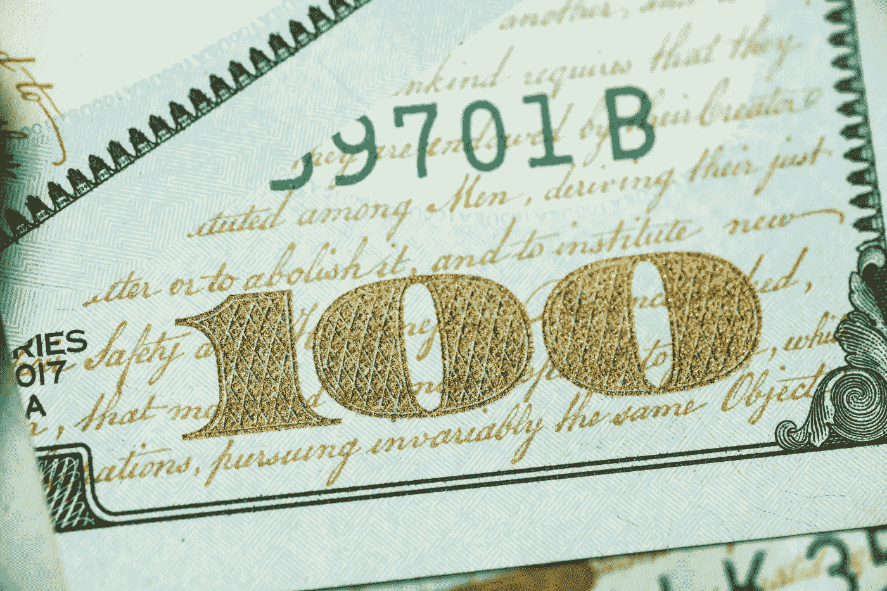

# 美国应该有央行数字货币吗？

> 原文：<https://medium.com/coinmonks/should-the-u-s-have-a-central-bank-digital-currency-103f153c8b0?source=collection_archive---------37----------------------->

最近有很多关于央行数字货币(CBDC)的讨论。许多国家正在考虑采用它们来改善经济，提高交易效率。但是这有什么利弊呢？在这篇博文中，我们将讨论央行数字货币的利与弊。

在我们探讨 CBDC 的利弊之前，理解中央银行数字货币和去中心化加密货币(如比特币)之间的区别至关重要。

## CBDC 对分散加密货币

美元数字美元是由中央银行发行和支持的美元的数字版本。是高度集权！一种去中心化的加密货币，如比特币，不受中央银行或政府的支持。

取而代之的是，它依赖于一个计算机网络来验证交易和维护余额记录。分散的加密货币通常与匿名和非法活动有关，因为它们很难追踪。

因此，央行一直不愿发行数字货币，担心它们可能被用于犯罪活动。然而，一些专家认为，由央行发行的数字货币可以通过使跟踪和追踪交易变得更容易来帮助减少犯罪。

## CBDC 的亲

中央银行数字货币(CBDCs)近年来越来越受欢迎，成为实现支付现代化和提高效率的一种方式。CBDCs 是一个国家法定货币的数字表示，一般公众可以在日常交易中使用。

与传统的法定货币相比，CBDCs 有几个优势。首先，CBDCs 的处理速度比现金快得多，这意味着付款可以更快、更有效。

其次，与现金相比，CBD 不易被伪造和欺诈，这使得它们使用起来更安全。此外，对企业而言，CBDCs 有助于降低交易成本，提高跨境支付效率。此外，通过向没有银行账户的人提供银行服务，基于商品的发展中国家可以帮助促进金融包容性。

最后，大额可兑换纸币可以很容易地分成更小的面额，这使得小额购买更加方便。总的来说，基于商品的发展中国家提供了许多潜在的好处，可以使它们成为现有金融体系的有益补充。

## CBDC 的骗局

然而，央行数字货币也有一些潜在的缺点。其中之一是它可能会给央行太多的权力。如果央行控制了货币供应，它可能会以不利于公民的方式操纵经济。另一个担忧是数字货币可能被黑客攻击或窃取。

CBDC 也给隐私带来了风险。如果数字货币与一个人的身份相关联，它可以被用来跟踪和监控个人的金融活动。这可能会对个人隐私和公民自由产生深远的影响，这应该是任何使用 CBDC 的公民的一个重大关切。

## CBDC 是一个有趣的发展

央行数字货币是金融界一项令人兴奋的发展，根据发行国的不同，它可能有各种各样的利弊。迄今为止，对央行数字货币的反应不一，一些国家将其视为改善经济的一种方式。相比之下，其他人对实施这些措施更加犹豫不决。

随着技术的不断发展，观察不同国家如何决定推进这种新型货币将是一件有趣的事情。你认为你的国家应该发行自己的央行数字货币吗？请在下面的评论中告诉我！

如果您的组织在撰写加密货币或区块链技术方面需要帮助，请联系我，我很乐意提供帮助！在这里了解我的服务。

> 交易新手？试试[密码交易机器人](/coinmonks/crypto-trading-bot-c2ffce8acb2a)或者[复制交易](/coinmonks/top-10-crypto-copy-trading-platforms-for-beginners-d0c37c7d698c)