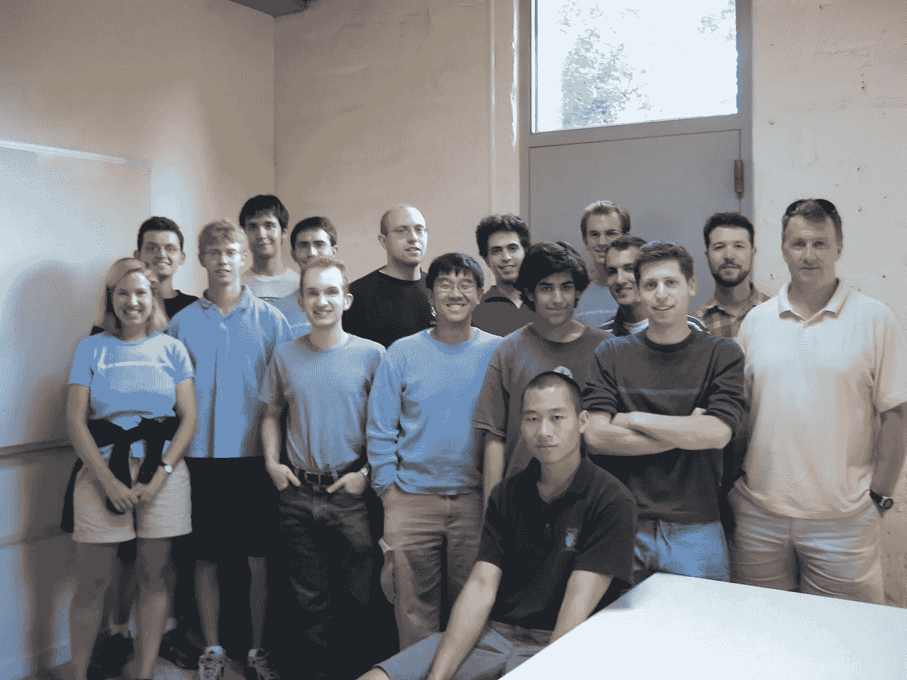
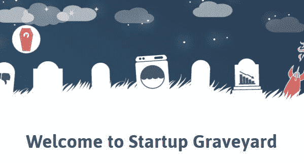

# 我们应该投资第一次创业的人吗？

> 原文：<https://medium.com/coinmonks/should-we-invest-in-first-time-founders-eb7af32bc78c?source=collection_archive---------53----------------------->

The very first batch of YC founders went on to make startup history.

刚刚听一个世界顶级风投说，他们不投资任何第一次创业的人。

初次创业者。

它们比你结婚那天的偏头痛还可怕。

他们几乎没有运营公司的实际经验，更不用说是一家本应接管世界的初创公司了。

他们是典型的大学辍学生或应届毕业生。

他们几乎没有纪律，因为他们没有经历过任何火灾，也没有经历过任何危机。

他们眼馋，想用他们的手持小打火机把海洋烧开。

他们应该被引导到最近的创业墓地，让自己猛然醒悟。

Heard of [https://startupgraveyard.io/](https://startupgraveyard.io/)?

想安全行事吗？

只投资重复创业者。

连续创业者。

有某种退出或战斗经验的创始人。

即使是那些失败了但失败得很惨的人，也比第一次创业的人更好。

他们经历过战火，他们在创办公司的严谨性方面受到了更多的教育，他们现在更敏锐地意识到投资者在寻找什么，并且比第一次创业的人有更高的成功概率。

但是这些都是坏事吗？

让第一次创业的人冒这么大的风险有意义吗？

这要看情况。

Is early startup investing akin to high-stakes gambling?

想从他们仅有的少量投资中赚钱的天使们倾向于避开他们。

拥有缓冲资金和潜在更大资金储备的大型基金也会避开它们，因为失败的风险太令人倒胃口了。

也许朋友，家人和傻瓜会给你一些钱，只是因为他们喜欢你或讨厌你到不再打扰他们。

也许政府拨款和自举可能是更好的选择。

这就是为什么你从你的第一个投资者那里收到的第一张支票是有史以来最甜蜜的。

因为那是在你一无所有，他们没有理由给你一分钱的时候，相信你的人开出的支票。

那么，我们为什么要在初次创业者身上浪费时间呢？

Sam Altman, OpenAI CEO, believes that investing in early stage founders is crucial for the ecosystem.

我们很担心，因为创业是未来。

它们是改善的承诺，象征着希望的灯塔，是将来会长成参天大树的橡子。

创业是明天的乐观概率。

如果我们停止投资创业公司，就不会有更好的明天。

如果我们停止帮助首次创业者成长，未来将不会乐观。

所以，如果你能负担得起，并且遇到一个好的，就给第一次创业的人一个机会。

-

我们应该投资第一次创业的人吗？

-

# startups # business # startupx # growth # success # social media # culture # web 3 # eth # BTC # crypto # first time founders # founders # founders # faith # seed # acorn # risk # investors # startup usens

> *交易新手？试试* [*密码交易机器人*](/coinmonks/crypto-trading-bot-c2ffce8acb2a) *或* [*复制交易*](/coinmonks/top-10-crypto-copy-trading-platforms-for-beginners-d0c37c7d698c)
> 
> *分散密码持有量，了解一下* [*币安的替代品*](https://coincodecap.com/binance-alternatives)
> 
> *加入 Coinmonks* [*电报频道*](https://t.me/coincodecap) *和* [*Youtube 频道*](https://www.youtube.com/c/coinmonks/videos) *获取每日* [*加密新闻*](http://coincodecap.com/)

# 另外，阅读

*   [复制交易](/coinmonks/top-10-crypto-copy-trading-platforms-for-beginners-d0c37c7d698c) | [加密税务软件](/coinmonks/crypto-tax-software-ed4b4810e338)
*   [网格交易](https://coincodecap.com/grid-trading) | [加密硬件钱包](/coinmonks/the-best-cryptocurrency-hardware-wallets-of-2020-e28b1c124069)
*   [密码电报信号](/coinmonks/top-3-telegram-channels-for-crypto-traders-in-2021-8385f4411ff4) | [密码交易机器人](/coinmonks/crypto-trading-bot-c2ffce8acb2a)
*   [最佳加密交易所](/coinmonks/crypto-exchange-dd2f9d6f3769) | [印度最佳加密交易所](/coinmonks/bitcoin-exchange-in-india-7f1fe79715c9)
*   [开发人员的最佳加密 API](/coinmonks/best-crypto-apis-for-developers-5efe3a597a9f)
*   最佳[密码借贷平台](/coinmonks/top-5-crypto-lending-platforms-in-2020-that-you-need-to-know-a1b675cec3fa)
*   [免费加密信号](/coinmonks/free-crypto-signals-48b25e61a8da) | [加密交易机器人](/coinmonks/crypto-trading-bot-c2ffce8acb2a)
*   [杠杆代币的终极指南](/coinmonks/leveraged-token-3f5257808b22)