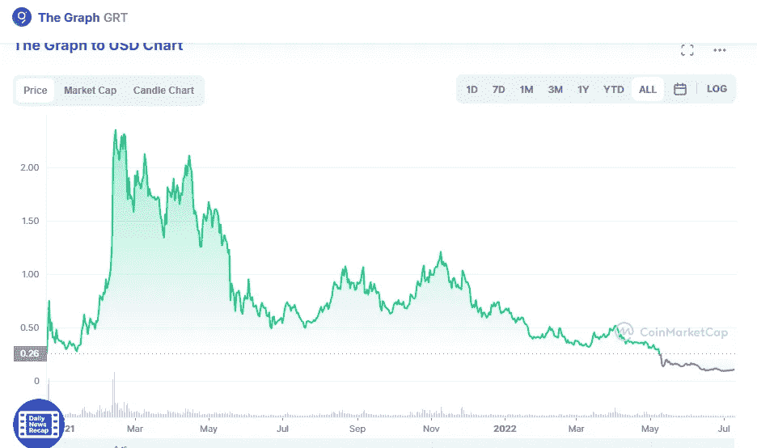

# 你应该买图表吗？

> 原文：<https://medium.com/coinmonks/should-you-buy-graph-grt-985d64743916?source=collection_archive---------14----------------------->

Source photo [The Graph price today, GRT to USD live, marketcap and chart | CoinMarketCap](https://coinmarketcap.com/currencies/the-graph/)

这是一种分散式协议，通过对区块链数据进行编目以方便访问，允许从区块链轻松快速地访问数据。

通过多个区块链对数据进行分类的能力是 Graph 的独特功能之一。这使得该平台对于那些有兴趣在各种区块链上创建应用程序的开发人员来说非常有价值。