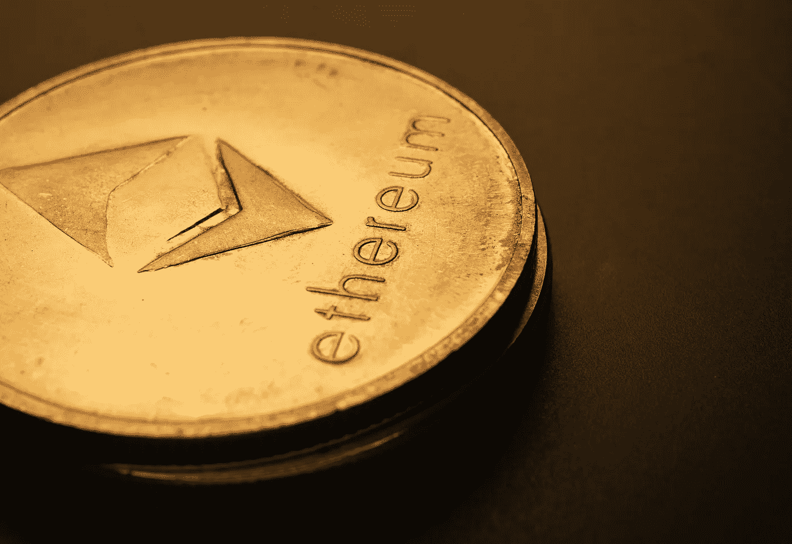

# 你应该买还是卖 cbETH？

> 原文：<https://medium.com/coinmonks/should-you-buy-or-sell-cbeth-4ab4fb026ba7?source=collection_archive---------2----------------------->

## 比特币基地已经创建了 cbETH，这是一个为合并做准备的新包装密码。但是什么是 cbETH，它是如何工作的？

Photo by Jievani: [https://www.pexels.com/photo/silver-round-lid-on-black-surface-8175415/](https://www.pexels.com/photo/silver-round-lid-on-black-surface-8175415/)

cbETH 是一种包装加密，它是一种表示在数字智能合约中被“包装”或“锁定”的另一种加密的加密。