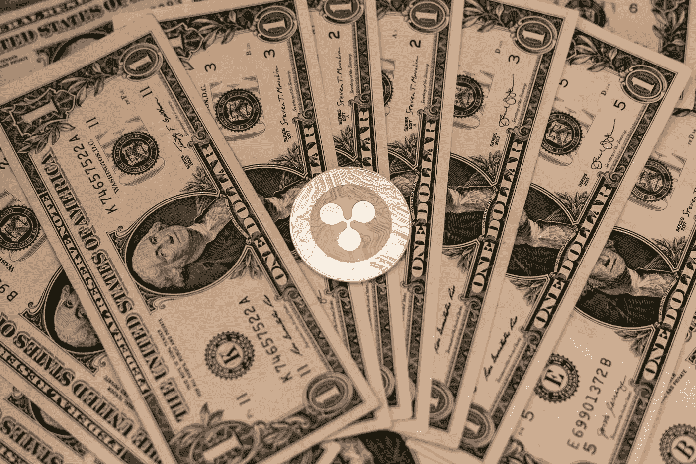

# 你应该买瑞波(XRP)吗？

> 原文：<https://medium.com/coinmonks/should-you-buy-ripple-xrp-dc6252ba6d51?source=collection_archive---------20----------------------->

Source photo Unsplash.com

曾几何时，很多人认为 Ripple 会是比特币的终极竞争对手。美国证券交易委员会随后对其创造者提起诉讼，要求将第八大最有价值的加密项目认定为证券，并指控该团队向美国人出售无担保和未经许可的证券。—由于这些和其他原因，如 2018-2020 年的 crypto winter，其价值从 2018 年的 3.8 美元的高点下降到平均 0.3 美元…