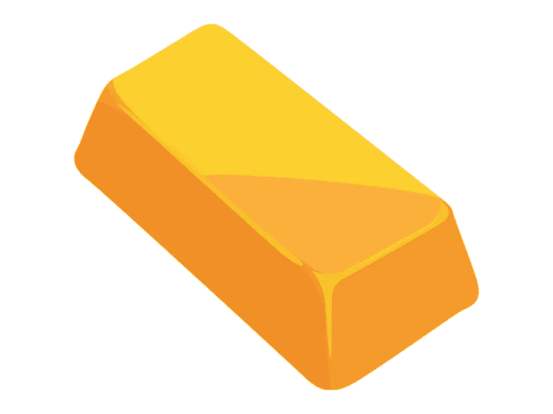

# 应该投资贵金属吗？

> 原文：<https://medium.com/coinmonks/should-you-invest-in-precious-metals-a1ee7dff4d28?source=collection_archive---------19----------------------->

投资意味着:

购买硬币和金条。前者相对于后者的一个明显优势是没有增值税，即 20%的增值税。你可以在有中央银行贵金属经营许可证的银行购买。硬币分为纪念币(在重要的历史日期之际铸造，发行量为 100 枚至 25000 枚，这也是其价格高于面值的原因)和投资币(铸造的数量为几十、几十万枚，没有收藏价值，但比较容易卖出)。锭有计量形式(重量从一克到一公斤)和标准形式(从 11.3 到 13.3 公斤)；

IMA——非个人的金属账户。在这种情况下，我们购买的不是金属本身，而是它的价格。简单来说，账户中包含的不是 1000 美元，而是该金额对应的门捷列夫周期系中某个或另一个成员的克数；

购买矿业公司的证券。这可能是最棘手的方法，也是更好的方法，依靠一个可信任的经纪人。

每个人自己决定选择哪条路，但我对此有自己的看法。

**购买实物黄金是最无利可图的选择**

在这种情况下，由于需要支付增值税和高额佣金，投资者立即处于几乎 30%的劣势。即使是最轻微的损坏也会使金条贬值 15-20 %,这意味着买家将不得不花钱租用一个保险箱。客观的金属账户是一个更有利的选择，因为没有增值税，黄金保存在银行金库里。还有一个陷阱——这些账户不参与存款保险计划。因此，公民更喜欢最大、最可靠的银行，它们有机会提高佣金。因此，明智的做法是花时间研究所有的报价，然后再做最后的决定。

同样值得考虑的是存储成本、高买卖差价、金属认证和低流动性。

如果投资基金的金额达到 100 或 2000 美元，那么理想的选择是使用硬币或“金属账户”，这种账户几乎可以在任何银行开立。如果你有更多可观的钱，你可以考虑购买金条，购买金条最近已经免征增值税。交换选项的讨论金额为 30-40 万美元。通过新加坡交易所购买黄金，你甚至不用支付保管费，在其他交易所，这部分费用由投资者承担。

**银**

民间传说白银比黄金贵肯定是误导，但也有一定道理。因为，尽管它是金属四重奏中最便宜的，每盎司大约 19 美元，但对它的长期需求超过了供应。但这仍不足以让金属价格开始强劲上涨。然而，一些分析师认为，储量将在未来几十年耗尽，除非发现新的大型矿床，并以同样的速度继续开采，那时将是白银的黄金时代。

白银之所以能获得众多潜在投资者的青睐，正是因为它的低成本。自从白银从 2011 年创下的每盎司 50 美元的高点跌至 2015 年的 14 美元以来，它一直在缓慢上涨，但你必须等待足够长的时间，甚至要相信你的孩子，才能从中获利。

白银的涨跌是众所周知的。在亚述和巴比伦，它被提升到神圣金属的地位，被宣布为月亮的象征，在中世纪，银及其化合物受到炼金术士的高度尊重。但是，在 13 世纪中叶，银成为制作器皿的传统材料。

**黄金**

黄金很受投资者欢迎。这样做的理由很充分。历史上，它一直是货币安全的一种衡量标准，但最重要的是，它不与任何国家的经济挂钩。尽管自 1971 年以来，由于金本位制的废除，黄金不再是各国货币的安全保障，但它仍然在金融界及其他领域发挥着极其重要的作用。这就是为什么通过购买这种金属，我们可以说，我们从恐惧清单中划掉了通货膨胀这样一个可怕的词:自二十世纪末以来，政府能够无限制地发行钞票，由于这一点，货币的价值正在积极下降。例如，自 2000 年以来，最强劲的货币单位美元相对于黄金下跌了近 5 倍。在困难时期，经济受到刺激，特别是通过“印钞机”，过去的 20 年非常艰难。

看看市场的成交量就知道了:2018 年，各国央行购买了 651 吨黄金，私人投资者购买了 1100 吨，实业家购买了 2200 多吨。对贵金属的需求不仅由寻求对冲风险的金融家提供，也由珠宝商提供，这使得这种资产比更奇特的资本保护选项具有极大的优势。

黄色资产是金融船的避风港。对金属的需求使其价格上涨，这一趋势反过来又会增强买家的信心。然而，尽管永恒等价物的价值稳步上升，但它冲击新价格顶部的情况并不均衡:在过去五年中，200 美元范围内的上下跳跃每年都会发生几次。最史诗般的上涨发生在 2008 年 3 月的经济危机期间，当时金价超过了每盎司 1000 美元。

如果目标是在特定时期内从中获利，这种投资就不合适，因为那样的话报价可能会出现回调，现在的报价是每盎司 1759 美元。然而，许多分析家预测这种金属将会有一个辉煌的未来。

一些人决定偏爱这种金属，试图通过购买珠宝来一举两得。但这不是最明智的决定。首先，金条是 999，珠宝使用 585 纯度的合金，即纯金属的一半。由于它的艺术性，产品的价格变得高于名义价格。

**钯**

Palladium 是 it 投资受欢迎程度最高的公司之一。

直到 21 世纪初，每盎司钯的价格要便宜得多，报价也几乎持平，但在过去的 20 年里，我们看到了相当大的起伏。钯最倒霉的年份是 2003 年和 2008 年，当时它跌破了每盎司 200 美元。它现在是名单上最贵的金属，今年达到了每盎司 2157 美元的历史新高。

钯的价格直接取决于股票市场的危机，因为大约 80%的钯涉及汽车行业，而汽车行业与经济状况紧密相连。这种金属被用于汽油发动机汽车的催化转换器:工业需求的增长和金属价格的上涨。

**白金**

投资铂金可能会引发最多的问题。

在过去的十年里，铂金经历了最奢侈的涨跌。铂金在 2008 年达到历史新高，达到每盎司 2200 美元，成为当时我们排行榜上最贵的金属。同年，金价暴跌至 800 美元，直到 2011 年才回升，达到 1800 美元的价格，然后在 2015 年再次触及 800 美元区间的底部，达到今天的价值，当时一盎司将价值 940 美元。因此，尽管其价值仍然相当高，但其投资吸引力低于其他产品。

成本与许多因素有关，因此对经济状况的变化非常敏感。例如，铂广泛用于柴油汽车的催化转换器。上个世纪末，柴油汽车在欧洲销量激增——这种交通工具的环保宣传取得了很好的效果。但在 2015 年出现了一个丑闻:人们发现大众汽车使用了一种特殊的系统，大大低估了废气中有害物质的含量。欧洲人把目光转向了汽油发动机。

> 交易新手？试试[加密交易机器人](/coinmonks/crypto-trading-bot-c2ffce8acb2a)或者[复制交易](/coinmonks/top-10-crypto-copy-trading-platforms-for-beginners-d0c37c7d698c)