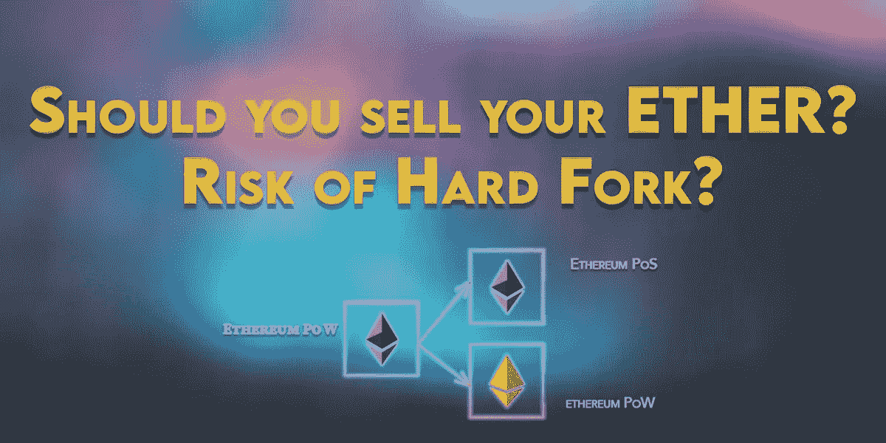

# 你应该卖乙醚吗？硬叉风险？

> 原文：<https://medium.com/coinmonks/should-you-sell-your-ether-risk-of-hard-fork-f7586da8b5f1?source=collection_archive---------6----------------------->

## 加密新闻，加密货币

## 本文分析了在潜在以太坊硬分叉事件中会发生什么。

加密社区在以太坊的更新上出现了分歧，我们可能会有两个版本的以太坊，现有的一个将保持工作证明，而新的一个…