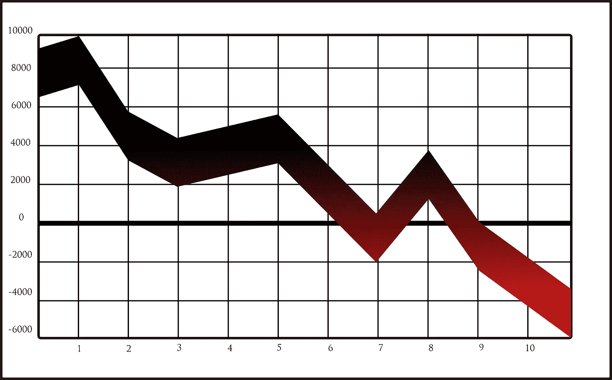

# 你应该担心你的加密投资吗？

> 原文：<https://medium.com/coinmonks/should-you-worry-about-your-crypto-investments-3563502bc591?source=collection_archive---------21----------------------->

Source photo [Graph Chart Stock — Free vector graphic on Pixabay](https://pixabay.com/vectors/graph-chart-stock-down-crash-36929/)

如果你现在对自己持有的加密货币感到焦虑，你并不孤单。

FTX 的灭亡是一个最好的例证，说明了为什么这不仅仅是你获得哪些加密货币的问题，而是你把它们放在哪里的问题。如果你担心你的密码的安全性，最好把它们放在钱包里而不是放在交易所里。如果有问题…