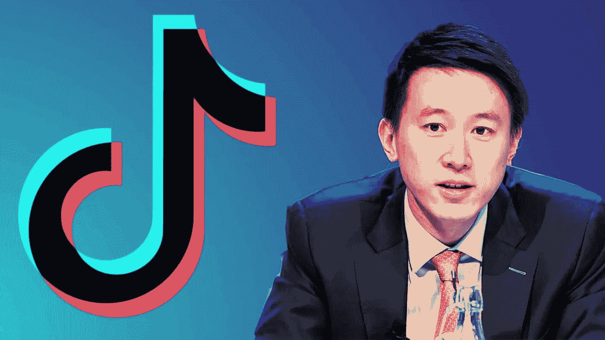
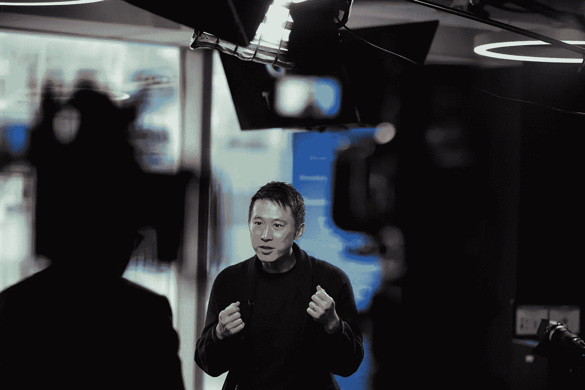
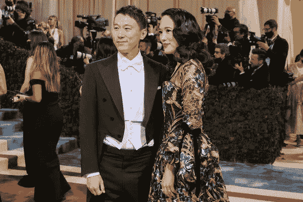

# 手子嚼就像一根专业制作的东方牛鞭，精准而智慧。

> 原文：<https://medium.com/coinmonks/shouzi-chew-is-like-a-professionally-made-oriental-bullwhip-of-precision-and-intellect-cbc8bf9f40b8?source=collection_archive---------13----------------------->

So proud to know that a Singaporean is crushing it as the CEO of one of the fastest growing social media companies out there- TikTok.

抖音现在有超过 10 亿用户，美国是其大多数活跃用户居住的地方。

一个鲜为人知的新加坡人正在经营这家价值 500 亿美元的公司。

不久前，当周寿子被提升为抖音的首席执行官时，我写过他的文章。

他是一个迷人的人物，不仅因为他的背景和职业发展，还因为他是一个新加坡人，领导着世界上最大的社交媒体公司之一。

他受过高等教育，毕业于哈佛商学院，曾任小米首席财务官。

在看了大卫·鲁宾斯坦对他的采访后，我想他被选中领导抖音的原因已经很清楚了。

他很敏锐，在面试时非常投入。

他有一种建立在你身上的沉着冷静和稳定的魅力。

泰然自若。

就像一匹训练有素的赛马即将开始行动。

Tiktok’s CEO comes across as Poised, calm and affirmative.

他给人的印象是热情但不过分狂热。

他口齿伶俐，用词谨慎。

看看他是如何向外行解释 Tiktok 算法的。

看看他如何小心翼翼地处理有关监管和川普推动出售 Tiktok 的问题。

当然，他可能事先被问了一些问题，并有一些时间准备。

谁不会呢？

任何优秀的受访者在接受采访前都会做足功课。

他穿着简单，像一个优衣库的人，简单的牛仔裤和鞋子。

创业公司创始人盛传多？

Mr. Chew attended the Met Gala in New York City in May with his wife, Vivian Kao.

令人沮丧的是，他似乎不直接回答问题，尤其是那些真正棘手的问题。

但绝对比大多数领导强。

他真正理解了产品，并亲自使用。

他说他有一个拥有 18.5 万粉丝的抖音账户？

你好。

这是令人惊讶和有趣的。

不确定，但是我在抖音上找不到。

也许我只是用错了。

我记得有一条推文说，几乎没有一个 Twitter 董事会成员登录 Twitter 已经很多年了。

寿子亲自使用自己的产品，值得称赞。

故事的士气？

加入风投并去 HBS 真的很有帮助。

他在 HBS 的风投经历和朋友让他更容易建立人脉，并让他能够与大人物密切合作，这有助于他未来的职业发展。

好吧，也许我也应该去报个哈佛的工商管理硕士学位，不要再幻想靠倒贴 NFT 和交易密码赚几百万了。

-

你知道抖音的首席执行官是新加坡人吗？

-

# startups # business # startupx # growth # success # social media # culture # entrepreneur # strategy # eth #比特币#加密货币# shouzichew # tiktok #字节跳动#facebook #davidrubenstein #ceo

> 交易新手？试试[加密交易机器人](/coinmonks/crypto-trading-bot-c2ffce8acb2a)或者[复制交易](/coinmonks/top-10-crypto-copy-trading-platforms-for-beginners-d0c37c7d698c)