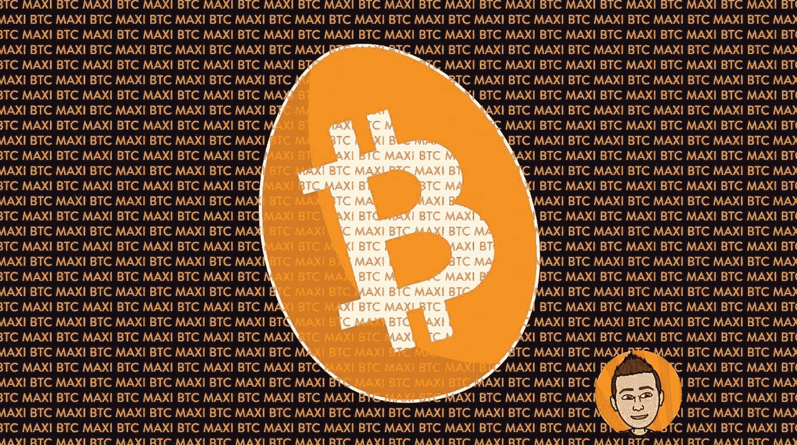

# 有迹象表明，你可能会成为比特币最大化主义者

> 原文：<https://medium.com/coinmonks/signs-that-maybe-youre-becoming-a-bitcoin-maximalist-b1c986ced56c?source=collection_archive---------4----------------------->

世界现在是一个非常分裂的地方，很少有空间像加密货币市场那样分裂。在人们热衷的产品中，竞争品牌之间总是存在竞争。我想到的几个例子是苹果 vs 微软，甚至是苹果 iOS vs 安卓，任天堂 vs 世嘉，百事可乐 vs 可口可乐，不胜枚举。但是某些人之间的竞争…