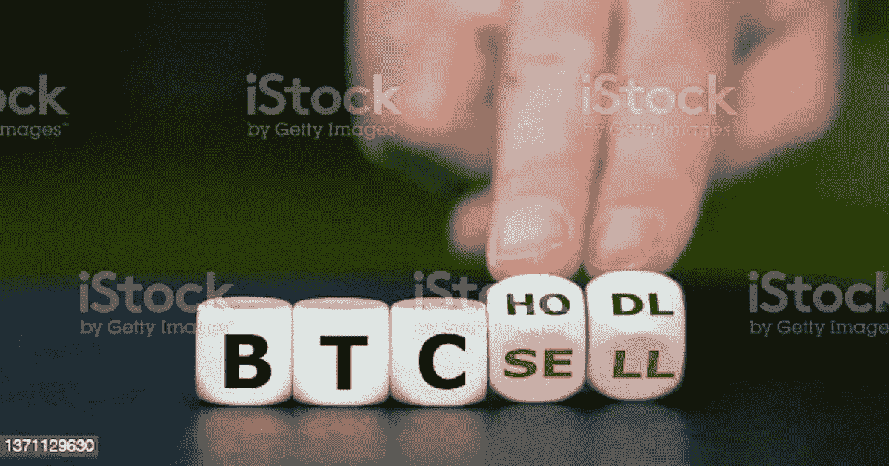

# 作为初学者你必须知道的简化的 Web3 术语

> 原文：<https://medium.com/coinmonks/simplified-web3-terminologies-you-must-know-as-a-beginner-50c90d5db6bb?source=collection_archive---------17----------------------->

虽然我很擅长写作，但当我开始写区块链时，我在寄存器方面有困难。如果你不知道的话，注册就像是一套专门针对某个特定行业或领域的术语。在 web3 中，你应该已经注意到了很多“行话”,尽管你真的很想进入 web3 领域，但这件事似乎让你感到害怕。但是要开心；一旦你到达这个询问点，你就跨过了下一次起飞的门槛！

学习专业术语有助于你更好地表达自己，尤其是作为一名网络作家。例如，你不应该说，“索拉纳的价格非常低，”而更容易理解的是“索尔目前处于熊市。”

在我在区块链进行研究和写作的过程中，我遇到了太多的流行语，以至于我不得不在词汇表中查找。如果你和我一样想更熟悉 web3 中的术语，我会把它们列在这里。

准备好了吗？我们走吧！

# 空投

这是一种营销策略，涉及加密项目在满足参与要求后将它们的本机令牌直接发送到用户的钱包，旨在实现大规模采用和认知。提供象征性空投以促进社区参与。

# 桥

这作为一个链接，使跨几个区块链的交互成为可能，最终使网络之间的数据、金钱和其他类型的信息的交换成为可能。

# 燃烧的

这是矿工从流通中永久移除加密硬币的方法。为了防止未来的交易，他们将硬币发送到特定的地址，这些地址的私钥是不可追踪的。燃气费是在以太坊区块链完成交易或合同的费用。

# 冷钱包

这是一个用于存储数字资产的离线钱包，由于它没有连接到互联网，因此不太可能受到攻击。这些钱包也可能被称为硬件钱包或离线钱包。

# 热门钱包

这是存储数字资产的互联网位置。它更容易受到黑客的攻击，因为它可以很容易地在移动设备上访问。

# 猿在

这意味着在完全了解资产或投资一家 NFT 初创公司之前，不做太多或任何调查，就贸然大举投资一个代币。这个想法是支持上市后不久，享受潜在的巨大收益，而买方没有执行任何尽职调查。

# 最低价格

这是收藏中获得 NFT 作品的最低价格。

# 叉

这是对区块链模型或程序的修改，使两个程序能够共享相同的过去历史。硬分叉是对网络进行的协议更改，可以验证区块链中以前无效的块和事务。软分叉是对区块链技术软件协议的改进，它使以前有效的交易无效。

# 挑战

分散金融(DeFi)是一个术语，用于描述基于区块链的完全分散的金融系统，不受任何中央机构(如银行、政府机构或金融管理公司)的控制。

# 崎岖的

这个词的意思是被 web3 项目创建者欺骗或诈骗。

# 非同质化通证

NFT 是一种不可替代的数字资产，具有不可替代的独特功能。与可替换令牌不同，非功能性令牌在它们之间是不可转换的。

# 秘密党员

完全加密货币是一种受加密技术保护的数字货币，很难伪造或重复消费。加密货币通过区块链技术的分散网络运行。

# 比特币

加密货币的终极和最广泛使用的形式，于 2009 年推出。比特币将所有交易记录在一个透明、公开的账本中。网络在用户之间直接发生，不需要中介。

# 以太坊

这是一个使用智能合约的开源网络。以太是以太坊网络的加密货币。以太是仅次于比特币的下一个最广泛使用的加密货币。以太坊与比特币略有不同，它的长期目标包括将区块链技术用于各种应用。一般来说，比特币和以太坊基于工作证明协议运行，但以太坊的目标是在下个月之前切换到股权证明协议。

# 区块链

这是一个公共数据库，分布在计算机网络中的大量机器上。正是区块链技术推动了比特币和以太坊等加密货币系统的运行。

# 数据访问对象(Data Access Object)

去中心化自治组织 DAO 是一个由成员运营的开源公司。它是一个社区领导的、象征性的、分散的组织，没有中央权威。DAO 用基于区块链的原则取代了传统组织的传统层级流程，并专注于特定的项目或目标。

# DApp

分散应用，DApp，是建立在区块链上的软件。DApps 按照智能合同的条件独立运行。他们有一个用户界面，就像你手机上的任何其他应用程序一样。

# 抵押品

这可以用来作为贷款的担保，也可以采取有形资产的形式，如房地产。抵押贷款是传统银行业务中抵押品的典型例子。

# 智能合同

这些是保存在区块链上的数字协议，当满足特定标准时会自动执行。在没有经纪人或律师参与的情况下，智能合同能够实现可靠的交易。这些交易都是可追踪和不可撤销的。

# 分散式交换机

这是基于区块链网络的对等加密交换。DEX 完全由其用户和智能合约管理，而不是中间人或集中式组织。

# 稳定币

这是一个具有基于另一项资产的值的令牌。像美元这样的法定货币通常支持这些硬币。然而，它们也可以得到贵金属等实物资产的支持，甚至是比特币等其他加密货币。

# 代币

这是一项活跃的区块链上的既定数字资产。它表示区块链上的可交易资产，并使持有者能够将其用于金融或商业目的。

# 分片

这是一种通过将网络节点分成更小的组(碎片)来提高网络可扩展性的方法。然后，网络可以通过这些碎片达成协议，不再需要节点单独执行事务。

# 铸造

在区块链上发布您的令牌的唯一副本，从而将其转换为可购买的 NFT 的行为。

# 工作证明

这是一个共识模型，其中矿工必须解决复杂的数学难题，以验证交换和铸币块。当矿工完成一个挑战，他们被授予创建一个新区块的许可，并获得区块奖励和交易费。

# 利害关系证明

这是一种基于共识的方法，每个验证者对该过程的贡献与他们在被交换硬币中的股份大小直接相关。

# 资产流动性

术语“流动性”描述了一种产品在某个市场上买卖或交易的速度。

# 阿尔特科恩

“另类硬币”的简称，指的是除比特币和以太坊之外的加密货币。

# 熊市

这是市场上价格持续下跌的一段时间。

# 牛市

价格正在上涨或预期会上涨的金融市场。

# 立桩标界

锁定链上的数字资产的过程，通常是为了换取某种回报(例如，利息、代币收益等)。).

# 电影《阿凡达》

化身是虚拟现实(VR)、视频游戏、互联网或其他环境中的人或其他实体的数字图像。

# 常见的缩写，如:

*   ***NGMI***——“做不到”，常用来形容一个预计不会实现重大价值的代币或活动。
*   **WGMI——“我们会成功的”——是 NGMI 的反义词。**
*   *——指在购买和存储比特币和其他加密货币方面的持有。*
*   ****FOMO***——完全——害怕错过就是担心错过机会。*
*   ****NFA***——非财务建议是一种免责声明，告知潜在投资者 cryptos 和 NFT 项目的风险。*
*   ****P2P***——“点对点”是一个让两个人互相交流的平台，不需要中间人。*
*   **——这是一个由单词“Build”组成的短语，表示创造和改善区块链生态系统的过程。**

# **结论**

**希望这对你有很大帮助。现在，去参加下一次 web3 写作/口语比赛吧，因为你刚刚学到了这些新的专业术语。有了这些和一点 web3 的热情，你将不再为清晰的表达而挣扎。**

***原发布于*[*https://gloriaokeke . hashnode . dev*](https://gloriaokeke.hashnode.dev/simplified-web3-terminologies-you-must-know-as-a-beginner)*。***

> **交易新手？尝试[加密交易机器人](/coinmonks/crypto-trading-bot-c2ffce8acb2a)或[复制交易](/coinmonks/top-10-crypto-copy-trading-platforms-for-beginners-d0c37c7d698c)**