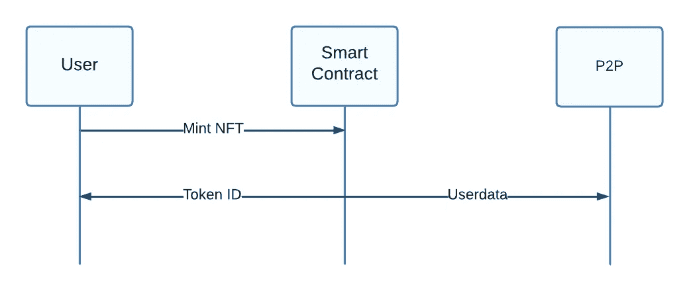
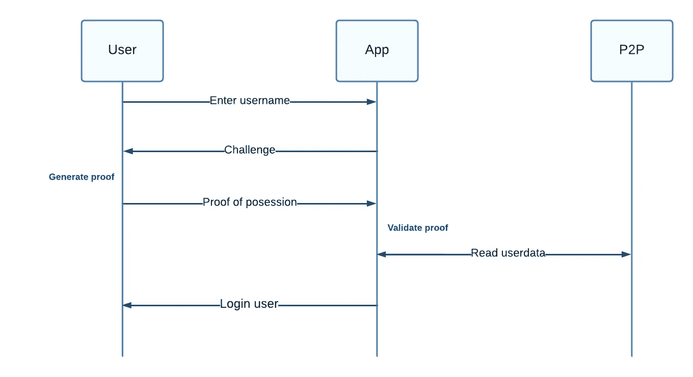
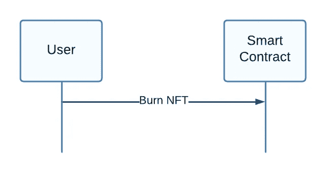

# 通过 NFTs 进行单点登录

> 原文：<https://medium.com/coinmonks/single-sign-on-via-nfts-b03a743d80b5?source=collection_archive---------14----------------------->

非功能性测试是一个相对较新的现象，近年来越来越受欢迎。尤其是 NFT 的艺术收藏，如无聊猿游艇俱乐部，售价高达数百万美元，但目前 NFT 的许多项目并没有太多真实的使用案例。但是，如果您可以利用 NFTs 的属性来解决传统应用程序和区块链应用程序中都存在的标识和认证问题，那会怎么样呢？随着区块链技术的成熟和加密货币项目寻求身份解决方案，他们只剩下集中式识别系统或假名解决方案。密码疲劳是一个很长时间的问题。用户必须为他们使用的每个服务拥有一个帐户，这导致大多数用户在多个服务中使用相同的密码。如果这些服务中只有一个遭到黑客攻击，所有账户都可能受到影响。在本文中，我想提出一个使用 NFTs 进行身份验证的单点登录的加密协议，该协议尽可能地分散。

Photo by [Andrey Metelev](https://unsplash.com/@metelevan?utm_source=medium&utm_medium=referral) on [Unsplash](https://unsplash.com?utm_source=medium&utm_medium=referral)

要创建一个新账户，用户只需与智能合约互动，将他的 NFT 植入区块链。

> 交易新手？试试[密码交易机器人](/coinmonks/crypto-trading-bot-c2ffce8acb2a)或者[复制交易](/coinmonks/top-10-crypto-copy-trading-platforms-for-beginners-d0c37c7d698c)

如果用户想要登录到实现 SSO 服务的应用程序，他输入他的用户名，然后从应用程序得到一个询问。该质询与 NFT 的 tokenID 一起用于在可信执行环境(TEE)中创建拥有 NFT 的证明。用户向应用程序发送证明后，应用程序必须验证证明。如果成功，应用程序可以从 NFTs 元数据中读取用户数据，并让用户登录。要终止现有帐户，用户只需将 NFT 发送到一个没有人可以访问的烧录地址，就可以将其烧录，从而永久失去 NFT。

通过将元数据托管在像 [IPFS](https://ipfs.io/) 这样的对等网络上，该协议可以进一步去中心化，以防止对用户数据的未经授权的更改。

Sign up protocol draft

Login protocol draft

Termination protocol draft

> 加入 Coinmonks [电报频道](https://t.me/coincodecap)和 [Youtube 频道](https://www.youtube.com/c/coinmonks/videos)了解加密交易和投资

# 另外，阅读

*   [Bookmap 点评](https://coincodecap.com/bookmap-review-2021-best-trading-software) | [美国 5 大最佳加密交易所](https://coincodecap.com/crypto-exchange-usa)
*   [密码交易机器人](/coinmonks/crypto-trading-bot-c2ffce8acb2a) | [造币评论](https://coincodecap.com/coingate-review)
*   最佳加密[硬件钱包](/coinmonks/hardware-wallets-dfa1211730c6) | [Bitbns 评论](/coinmonks/bitbns-review-38256a07e161)
*   [新加坡十大最佳加密交易所](https://coincodecap.com/crypto-exchange-in-singapore) | [购买 AXS](https://coincodecap.com/buy-axs-token)
*   [红狗赌场评论](https://coincodecap.com/red-dog-casino-review) | [Swyftx 评论](https://coincodecap.com/swyftx-review)