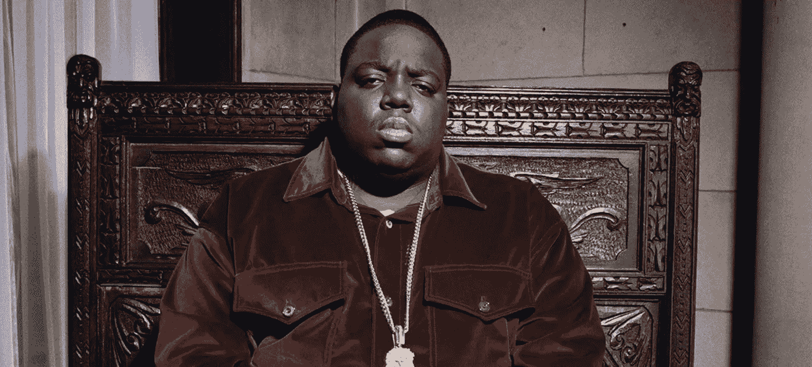

# 天空的极限:音乐 NFT 收集，让您的功能死亡

> 原文：<https://medium.com/coinmonks/skys-the-limit-the-music-nft-collection-that-allows-you-to-feature-the-dead-32f64793e479?source=collection_archive---------30----------------------->

多亏了 NFT，臭名昭著的 B.I.G .将会在新的音乐中出现，尽管它已经在 20 多年前被埋葬了。

在不可替代的代币出现之前，人们通常通过对已故艺术家作品的再创作来纪念他们。对于音乐艺术家来说，旧曲目可以被数字化，使他们更容易获得更大的粉丝群。

NFT 死后的收藏已经有一段时间了。它们完全是围绕受欢迎人物的生活创作的，这些人物的生活作品被认为影响了许多人。在这方面，一些最受欢迎的 NFT 遗作系列包括 [Chakraverse](https://chakra.beyondlife.club/) (纪念斯坦·李)[地下](https://nftevening.com/jazz-legend-thelonious-monk-works-with-javier-arres-to-drop-nfts/)(纪念塞隆尼斯·蒙克)和[不朽系列](https://makersplace.com/2pac/drops/the-immortal/) n(纪念图派克·夏库尔)。

# 声名狼藉先生·NFT 首次亮相

这是 NFT 死后在区块链推出的另一个系列，它以盛大的风格首次亮相，讲述了声名狼藉先生的生活和音乐。这个新的 NFT 系列被标记为“天空的极限:声名狼藉先生·NFT 系列”。

从概念上来说，NFT 的做法与我们在其他系列中看到的略有不同。这一次，它将是 NFT 3D 艺术和独家访问一些臭名昭著的“音乐收藏”的结合。所有持有人都可以在他们的个人资料图片上使用该艺术作品作为图像，他们也将被纳入“天空的极限”特别集体。

通过这种包含，持有者将获得 Biggie 的 Fulton Streets Freestyle 音频曲调的完全访问权限，他们可以通过添加他们的尺寸和风格来创建歌曲混合。所有希望继续这一部分的艺术家将被要求获得负责创建和管理 NFTs 的集体和克里斯托弗·华莱士遗产的完全许可。

# 区块链的生命租赁

比格死后的 NFT 收藏旨在将他的理想铭刻在全世界粉丝的心中。这些话得到了 NFT 平台首席运营官 Josh James 的回应，该系列在这里发布。用他的话说，

“使用 NFT 技术，Biggie 的遗产和他对音乐和文化的巨大影响将永远留在区块链上，以此为荣，并与世界各地的粉丝和未来几代人分享”。

同样，Biggie 的母亲 Violetta Wallace 也表达了她对 NFT 下降的热情，她说“…我们很高兴与之一的[合作，以及他们的专业知识来纪念我的儿子 Christopher，这是第一次正式的 NFT 下降，让他的粉丝有机会参与并尊重他们对他和他的音乐的爱。”](https://www.oneof.com/)

# 最后的想法

无论采取何种形式，艺术都不会消亡。只要这位艺术家拥有粉丝群，粉丝们就会不断寻找创造性的方法，让已故艺术家的作品继续流传下去。随着 Biggie 对区块链的介绍，我们对永生的定义将永远改变。

> 交易新手？试试[密码交易机器人](/coinmonks/crypto-trading-bot-c2ffce8acb2a)或者[复制交易](/coinmonks/top-10-crypto-copy-trading-platforms-for-beginners-d0c37c7d698c)