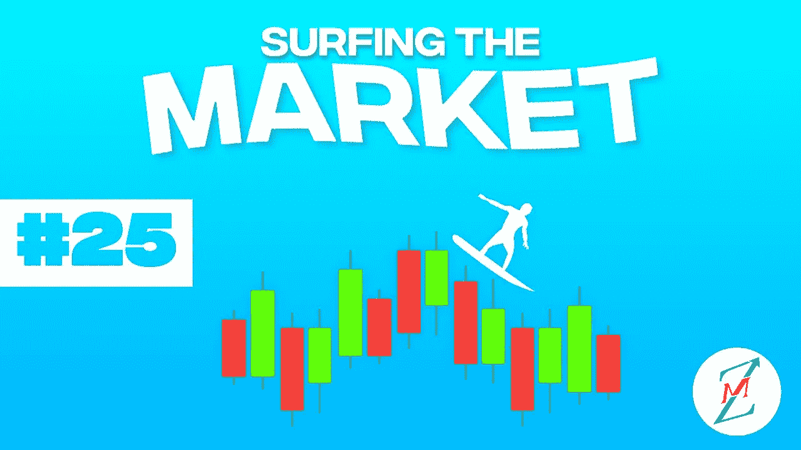
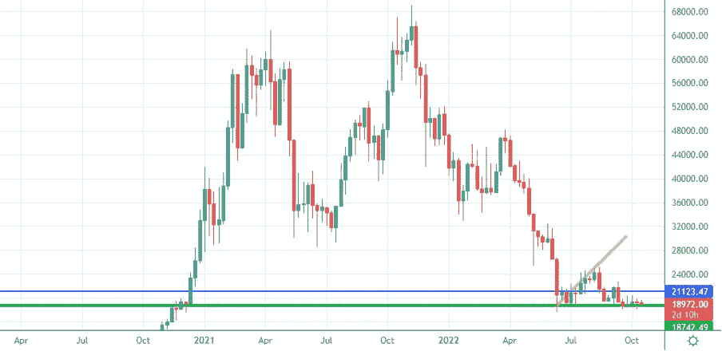
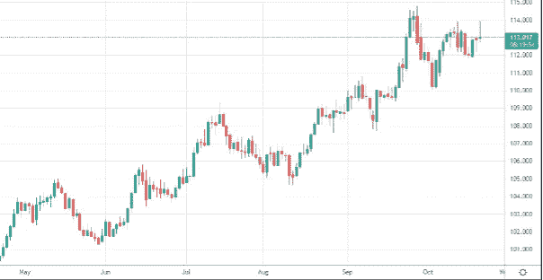
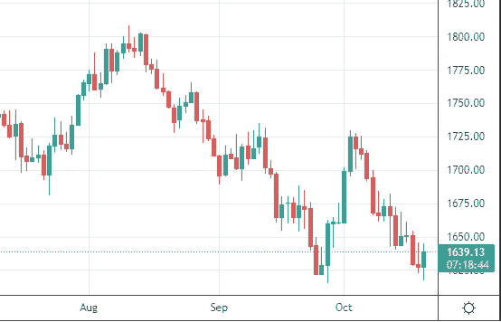
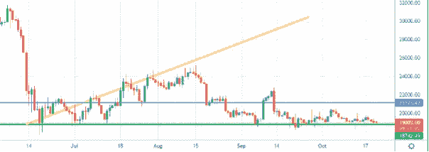
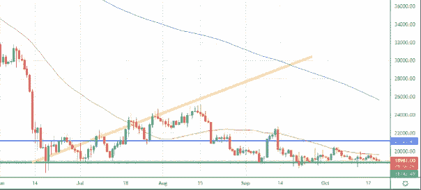
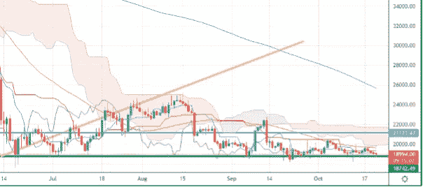

# 沉睡的比特币市场和 5.1 亿美元的到期期权

> 原文：<https://medium.com/coinmonks/sleepy-bitcoin-market-and-510m-of-expiring-options-f8453df0acc8?source=collection_archive---------26----------------------->

我们将进入什么样的市场阶段一直是我们上次约会的开场白问题。我们要听牛市还是熊市？我们会看到牛市还是熊市？
欢迎来到“市场冲浪”,我们已经进行了第 25 次约会，我希望通过这些简单的技术分析，我们已经在某些方面帮助了你，甚至只是评估不同的市场观点。

**先从我们平时的每周视角**说起吧

Weekly Chart — Source: Tradingview

价格仍在绿色支撑上，但本周几乎没有任何变动。
今天价格再次敲上绿色支撑。我们敲那里的时间越多，它崩溃的概率就越高，在那个时刻，我会开始再次寻找看涨趋势，因为可能有一个巨大的空头陷阱。不管怎样，这些只是我的想法，我会继续在这里分享我的想法。

> 如前所述，在我个人看来，如果出现重大的坏消息，如巨大的电力危机，移动网络危机或俄罗斯的天然气限制，比特币的价格只能下降到 15000 美元。

Screenshot on a D-TimeFrame of the Dollar Currency Index

美元强势指数仍在测试最大值，今天出现了牛市，这使得比特币(以及黄金)的价格暂时下跌。

Screenshot on a D-TimeFrame of Gold ($/oz)

## 从日常角度来看，我期望什么？

Daily Chart — Source: Tradingview

在期权到期和美国市场下次开市(下周一)之前，我几乎什么都不期待。市场疲软是因为目前的世界总体形势还没有传递出新的希望信息。

Daily Chart — Source: Tradingview

日线 TF 上 50MA 是阻力，现在 50MA 和绿色支撑之间的区间正在缩小。未来几天，我们可能会进入一个潜在的新趋势，我们都希望看涨，但目前还不确定。

Daily Chart — Source: Tradingview

市云团也缩小了范围，覆盖了 50 毫安的区域。

## 有什么特别要观察的？

50MA 和市卷云正在缩小范围，在未来几天可能会发生强烈的冲击。我仍然保守看涨，但我会等待确认。让我知道你对这个新的每周约会的看法，以及你希望更多地考虑(或甚至解释)哪些指标。
敬请关注，当我的内容出来时，一定要关注。

## 促销建议

**还有一件事**:如果你真的不关心技术分析，或者你不喜欢花时间在市场上，一定要去看看[zig nali](https://zignaly.com/app/signup/?invite=mikezillo)平台，这是币安的一个官方经纪合作伙伴，管理着巨大的交易量。他们提供很好的利润分享交易服务，你可以模仿其他专业交易者，与他们分享利润！一定要给个眼神！
如果您有兴趣提前获得我们合作伙伴指标发布的通知，请在此留下评论，以便我们了解您是否有兴趣！

> **我写的任何内容都不能代表任何形式的财务建议。所以，在采取任何行动之前，先做好自己的研究。**

> 交易新手？尝试[加密交易机器人](/coinmonks/crypto-trading-bot-c2ffce8acb2a)或[复制交易](/coinmonks/top-10-crypto-copy-trading-platforms-for-beginners-d0c37c7d698c)