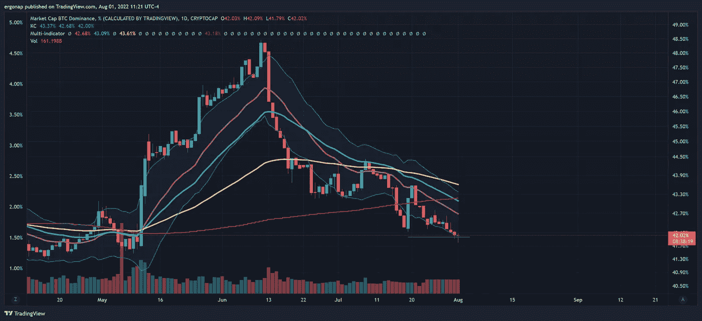

# 加息后的困倦早间分析

> 原文：<https://medium.com/coinmonks/sleepy-morning-analysis-post-rate-hike-c358182e24e7?source=collection_archive---------11----------------------->

## 每月加密货币市场/比特币分析—8 月(8/1)

新的一个月了！除了不，它不是。新的一个月从上周五开始，当时期货到期，加息后，我们上涨而不是下跌。我们从[有点](/coinmonks/its-alright-to-be-worried-today-f68c247c1eab) [看跌](/coinmonks/what-do-you-expect-number-goes-down-3fc933515e04)(链接到我之前的两篇分析文章)到 FOMC 的决定，然后[在](/coinmonks/we-broke-up-the-channel-8c675b1235cd)(另一篇分析文章)结束欺骗人们之后上涨，尽管 FOMC 的结果明确看跌(加息 75 个基点，并表示将有更多必要的量化紧缩继续)。

那么，人们为什么看多呢？他们绝望，他们害怕，没有什么是新的。

从 BTC 的角度来看，目前我们只是勉强安全，不会再次下跌。但这并不能说明全部情况。4 小时图显示我们有点向上走，我们有一点看涨，但绝不是超级看涨。这是👶宝宝顶多看涨。这根本不是“挑什么，数字就上去”的土地。成交量不大，自 27 日以来随着 longs 的下跌，现在开始有所回升。不代表他们不能再涨了，但目前看来是这样。

hugging the 4h 34EMA (1d 5.6EMA, IE fib) is not exactly a wonderful endorsement. [https://www.tradingview.com/x/28gx7YtT/](https://www.tradingview.com/x/28gx7YtT/)

BTC long/short ratio shows longs dropped off and are slowly, slowly rising here. Or shorts are slowly exiting. Either way, up.

什么对我们不利？首先，间谍在 406 创造了一个新的缺口。他们今天也做了一个，很快就填满了。这里的意义是 4h spy 在 200MA vs BTC，在它上面。如果 Spy 像这样向上移动，crypto 可能会反过来受益，但这需要这一组分析中的下一步。

as always, bullishness is not easy and dangerous. It’s easy to see on this chart why we’re so stagnant here, isn’t it? [https://www.tradingview.com/x/WUXtrRFL/](https://www.tradingview.com/x/WUXtrRFL/)

如果我们在 SPY 上查看这个 4h 200ma，我们会对所有东西都看涨，直到它修正。鉴于未来一两个月内没有 FOMC 会议(因此除非紧急会议以某种方式发生，否则危险较小)，这可能是未来一两个月。显而易见的担忧应该**而不是**是通货膨胀/货币贬值，这是人们愚蠢的废话，我将在另一篇文章中处理。关注点**应该是俄罗斯和乌克兰的战争，中国试图接管香港，以及[西欧大部分地区的大火越烧越旺](https://arstechnica.com/science/2022/07/europe-has-descended-into-the-age-of-fire/)。是的，我们有全球性的问题。所有这些“美国有通货膨胀”都是一派胡言。比特币没有解决这个问题。**

那么，还剩下什么？对于加密来说，这是比特币的统治地位——即:比特币的市值与其他一切。这有点像 VIX 对于股票市场的意义，但更接近于“什么会涨/跌得更多？”。如果价格上涨，波动率指数上升，这将是坚果！如果价格上涨而波动率指数没有上涨，汉堡什么都不会有。如果比特币的价格上涨，比特币的主导地位上升，比特币就是王道。如果价格上涨，比特币统治地位下降，alt 市场为王。因此，这又回到了我们所看到的大规模 alt 反弹。

going down seems a clear trend for now, but that’s not the first time. [https://www.tradingview.com/x/0itINfpT/](https://www.tradingview.com/x/0itINfpT/)

我认为这种低价下跌会给市场带来两种可能性。要么*:***这是反弹*** 的开始，考虑到我们已经在市场中触底一段时间，这并不是完全不合逻辑的。我的意思是，在某些时候，投机资产通常会上涨。*

**

*this is 2021’s moon rally, as it were. hopeful bulls and retail say fuck yes! [https://www.tradingview.com/x/R6UVnQVq/](https://www.tradingview.com/x/R6UVnQVq/)*

*或者我们有 B:我们正处于熊市的早中期。这是一个潜在的明显问题。*

**

*this was 2018 post crash, see the big BTC.D fake top? Well bitcoin fucking crashed like the [MH17](https://en.wikipedia.org/wiki/Malaysia_Airlines_Flight_17) in Malaysia blown up by Russia, after that.*

*让我们覆盖 BTC，只是为了突出这是多么糟糕，如果我们从这里下去。记住，衰退/宏观衰退不会因为我们在熊市中反弹而神奇地结束。真正的问题是，这是比特币从 18k 美元跌至 4k 美元的时候。想象一下，在这里再做一次这样的抛售？我不想这么说，但这还是有可能的。我会为人们感到难过，但这里真的很危险。*

**

*This is that same BTC.D rally and crash, during which we went from ATH down to $3700\. See the rally to $9k in the middle of bear when btc.d went up and down around april/may, and then we continued to drop? yeah.*

*所以总的来说，如果我们挖掘 2 周的 200 毫安，2 周的比特币图表可能是最接近某种答案的。问题是，如果我们这样做，我认为人们会真切地感觉到市场已经结束。现在人们不相信是可以理解的，因为看看那些狗屎！即使我们在第 2 周触及 28k 美元，我们仍然看跌。因此，目前的任何情况充其量都是熊市短期反弹。*

**

*support at $12k.[https://www.tradingview.com/x/t0Zokufh/](https://www.tradingview.com/x/t0Zokufh/)*