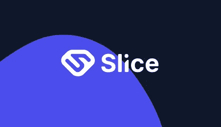

# 切片——广告的未来

> 原文：<https://medium.com/coinmonks/slice-the-future-of-advertising-a55a2f355679?source=collection_archive---------13----------------------->

我要分享的下一个网站/程序是相当新的，我认为它将改变广告工作的方式。

众所周知，广告世界需要彻底改造——从伦理到用户体验。用户越来越受够了侵入性和不相关的广告，这不仅使他们的隐私处于危险之中，而且耗尽了他们的数据许可，结果导致高额的电话费。广告一直是互联网服务的主要收入来源之一，但它也导致了大量的用户沮丧。没有比脸书的剑桥分析丑闻更好的例子了。这家社交网络被指控在未经广告商同意的情况下与他们分享用户的个人信息。这是对已经受损的互联网广告声誉以及总体数字隐私的沉重打击。幸运的是，有几个项目旨在正面解决这一问题，方法是引入新的方式在网站和移动应用上放置广告，同时确保支付以加密货币进行，这样用户就可以控制自己的数据，不必担心被入侵或滥用。这就是我接下来要谈的项目。

# AddSlice:一个新的广告平台，付费给人们加密观看广告

[Slice](https://addslice.com/?crew=VFFbJ) 是一个承诺颠覆传统数字广告模式的广告平台。它专注于为广告商和出版商提供一个公平透明的环境，这与我们在数字世界中所习惯的环境相去甚远。

[切片平台](https://addslice.com/?crew=VFFbJ)让你看广告赚钱。你可以从 PayPal 或比特币(闪电网络)中提取一部分，很快他们将允许你直接提取到你的银行账户中。不要在这一点上引用我的话，但似乎这将是这样的情况。当你进入支付页面时，你会看到两个模糊的支付选项，上面写着 Visa。这是我认为你将被允许直接提取到你的银行账户，或者你将能够得到一个数字签证卡。

# Slice 是如何工作的？

如我所说， [Slice](https://addslice.com/?crew=VFFbJ) 旨在颠覆传统的数字广告模式，解决其主要问题。广告商将能够在网络中投放广告，出版商将能够选择他们希望在自己的网站或移动应用程序上显示的广告。这为广告商和观众创造了一种新的广告方式。

如果你想为你的网站或你使用的盈利网站做广告，你可以利用这个平台接触到很多人。据我所知，价格比你们正常的广告公司要便宜。

如果你是 [Slice](https://addslice.com/?crew=VFFbJ) 的观众，那么你可以像平常一样使用你的浏览器并开始赢取切片。广告将在你使用的所有网站上发布，根据你看到的广告数量，你将获得一定数量的分成。你可以把这些切片变成贝宝钱，比特币，很快还有其他方式。你不需要点击任何广告或做任何事情，除了像平常一样使用你的浏览器。在网上冲浪时，你会像平时一样看到广告，但你会从观看广告中获得少量收入。广告终于开始为我们服务了。

# 使用切片的优势

[切片广告网络](https://addslice.com/?crew=VFFbJ)将在出版商、广告商和用户之间分配。这是一个很好的方式，既可以让你的项目面向公众，像平常一样使用浏览器赚钱，也可以在玩 twitch 的时候用 slice 做广告。我相信这个项目有改变广告工作方式的可能性。你将开始从浏览器上看到的广告中赚钱，而不是免费看到所有这些广告。这对广告主和观众来说是双赢的。

[切](https://addslice.com/?crew=VFFbJ)也有很棒的推荐系统。这不是最高的报酬，但它最终会根据你的推荐数量而增加。一旦你的推荐人使用该网站 30 天，你制作 1000 片，你的推荐人将获得 100。

# 使用切片的缺点

[切片平台](https://addslice.com/?crew=VFFbJ)还在开发中。除了他们的 LinkedIn 账户，没有关于项目背后团队的信息，也没有关于他们的顾问或合作伙伴的信息。只有项目背后的公司及其地址的信息。我相信他们不想分享他们的信息是有原因的，但这仍然让我担心。这是唯一的缺点，我可以找到这个项目是好的。我相信这个项目将会是一个很好的方式，让你从每天已经在做的事情中获得一份不错的额外收入。Slice 网站说，在测试期间，你每个月大约可以赚 3 到 5 美元，然后当项目完全启动时，你每个月大约可以赚 10 到 15 美元。

我希望每个人都喜欢我的文章。请喜欢和关注，以帮助我的网页成长。请在评论中告诉我你的想法。我经常使用 YouTube，所以我想我应该尝试一下，到目前为止我已经赚了不少钱。我说的体面是指大约 2 美元。这可能看起来不多，但随着时间的推移，这增加了。我觉得这个平台值得安装。你怎么想呢?

查看我的网站，我最喜欢的赚钱网站，我所有的文章，我最新的视频等等！

[哈蒂小屋](https://www.hattysshack.org/)

[上的原创文章 read.cash](https://read.cash/@HattyHats/slice-the-future-of-advertising-43c6d43e)

> 交易新手？试试[密码交易机器人](/coinmonks/crypto-trading-bot-c2ffce8acb2a)或[复制交易](/coinmonks/top-10-crypto-copy-trading-platforms-for-beginners-d0c37c7d698c)