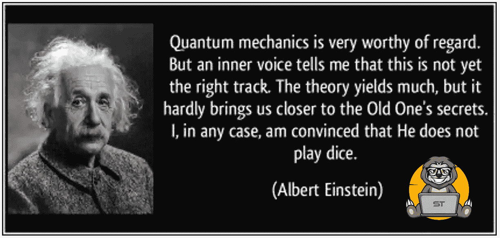

# SlothTrading 也不玩骰子

> 原文：<https://medium.com/coinmonks/slothtrading-doesnt-play-dice-either-5c717bef20ed?source=collection_archive---------12----------------------->

在[slot trading](https://slothtrading.com)中，我们也不喜欢玩弄数据，但我们喜欢获得在给定时间间隔后某个值将出现的统计概率，因为我们不想将自己与爱因斯坦先生进行比较，我们甚至不想知道它的确切值，我们只对该值是高于还是低于当前值感兴趣。

**我们得到了什么？**

如果我们知道某个证券在时间 t1 相对于初始时间 t0 的相对位置，概率等于 52%，我们可以确定，如果我们在 520 开了 1000 个头寸，我们就已经获利了。

**这是投资的圣杯吗？**

不，显然不是。风险总是存在的，48%的失败头寸中获得的损失高于成功头寸中获得的利润。只有当我们认为波动不过度时，才进入市场，这种影响才能最小化。

我们如何才能达到这种成功概率？

借助人工智能和卷积神经网络。在对不同类型的资产进行分析后，我们开发了一个部分满足需求的通用模型。我们观察到，每种证券的正确概率取决于为训练网络提供的值，而这些值又取决于证券本身固有的数据(资产类型、地理依赖性等)。).这些事实引导我们创造了一个 rnn 农场，它们具有相同的遗传基础，但具有不同的表观遗传模式。

**结果如何？**

目前，在 200 只股票的交易量上，我们实现了 55%的预测准确率，在过去 12 周内获得了 88%的利润。

**项目技术说明**

整个项目是用 GNU 应用程序完成的:

*   MySQL 8.0.27 DB。
*   Python 3.10.5
*   张量流 2.9.1
*   阿帕奇 2.4.51

网络服务器和数据库都托管在 AWS 上，所以欢迎捐赠。

所有这些数据都可以在我们的[slot trading](https://slothtrading.com)网站上进行分析。

*我们的* [*网站*](https://slothtrading.com/) *，所有的数据都是免费发布的。*

*关注我们上* [*推特*](https://twitter.com/SlothTradingCom) *。*

*捐赠* [*给我们*](https://ko-fi.com/slothtrading) *继续开发这个项目，我们将不胜感激:)。*

> 加入 Coinmonks [电报频道](https://t.me/coincodecap)和 [Youtube 频道](https://www.youtube.com/c/coinmonks/videos)了解加密交易和投资

# 另外，阅读

*   [印度最佳 P2P 加密交易所](https://coincodecap.com/p2p-crypto-exchanges-in-india) | [柴犬钱包](https://coincodecap.com/baby-shiba-inu-wallets)
*   [8 大加密附属计划](https://coincodecap.com/crypto-affiliate-programs) | [eToro vs 比特币基地](https://coincodecap.com/etoro-vs-coinbase)
*   [最佳以太坊钱包](https://coincodecap.com/best-ethereum-wallets) | [电报上的加密货币机器人](https://coincodecap.com/telegram-crypto-bots)
*   [交易杠杆代币的最佳交易所](https://coincodecap.com/leveraged-token-exchanges)
*   [如何给 MetaMask 钱包添加 Arbitrum？](https://coincodecap.com/how-to-add-arbitrum-to-metamask-wallet)