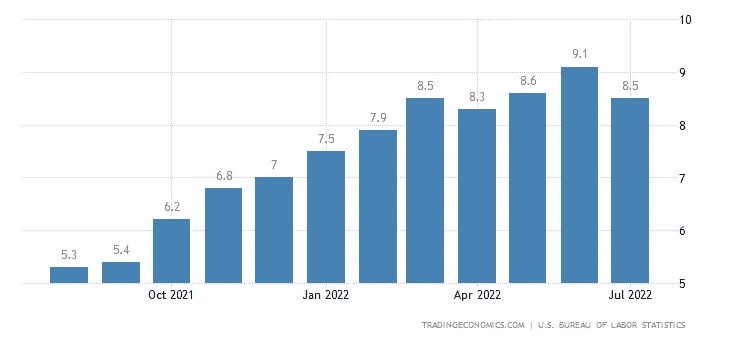

# 美国增长和通胀放缓可能标志着潜在的全球经济低迷

> 原文：<https://medium.com/coinmonks/slowing-u-s-growth-inflation-could-mark-global-downturn-790fd4a961e3?source=collection_archive---------27----------------------->

## 全球动荡中美元面临担忧

(Railway strikes loom as NMB fails to work out contract)

日益增长的经济压力包括:猖獗的通货膨胀、供应链中断和东方商品短缺，这些因素结合在一起，为全球经济创造了一个暗淡的金融前景。

## 由于经济的不确定性，投资者涌向现金

DXY，即美元指数，显然支持这一举动，因为大多数投资者在全球市场增长放缓时涌向美元。自 2021 年 5 月以来，DXY 已上涨 24 个基点。

1973 年，在 10 国集团的压力迫使美国放弃金本位制后，我们可以看到类似的行动。这是由几次美元挤兑引发的，因为外国市场上流通的美元太多，造成了估值过高。高估导致恐慌接踵而至，因为美元多于黄金。最终，两年后是市场压力最终导致了自由浮动的美元，这使得美元脱离了与金本位挂钩的固定汇率。这就是众所周知的布雷顿森林协议。

一个常见的误解是，尼克松在 1971 年让美国脱离了金本位制，尽管他是主要的催化剂，但史密森尼协定最终失败了，最有可能的原因是他的独裁式口授。

## 失业与量化紧缩的间歇相匹配

归因于 70 年代的经济状况的另一个惊人的相似之处是，由于对通货膨胀的担忧，量化紧缩(QT)可能导致失业率上升。

虽然推动力略有不同，但结果几乎是同义的。在 20 世纪 70 年代的尼克松冲击中，就业率几乎翻了一番。这是由于 20 世纪 60 年代越南战争后通货膨胀指数增长。

Unemployment Rate Spike Proceeding QT after Nixon Shock

这一次，美国没有肆无忌惮的战争机器支出来指责猖獗的通货膨胀。这次通货膨胀的主要原因是美国在病毒爆发期间几乎将国家赤字翻了一番。新冠肺炎疫情的危机导致了创纪录的通货膨胀，据报道，这是暂时的，现在已经造成了全球财政困境。

美联储能动用的杠杆有限。他们可以像量化宽松时期(QE)那样增加债券购买，将资金重新引入市场。其后果通常更具政治性，因为右倾党派对不断增加的赤字嗤之以鼻。总体而言，这通常对央行是个好兆头，并鼓励第三级贷款，因为银行资产负债表显示资产多于负债。

然而，更宽松的贷款政策是一把双刃剑，它让更多的美元进入流通，同时也让美元贬值。这是通货膨胀的主要问题，太多的美元追逐太少的商品。在资产充裕、美元与增长成正比的时代，这没什么问题，但在全球经济试图从疫情的停滞中重新启动时，这就不太好了。

**点击此处阅读更多关于美联储对通胀的反应:** [**鹰派美联储会议显示潜在的加密脱钩迹象**](/coinmonks/derivatives-market-provides-glimpse-into-early-crypto-adoption-c23c625ec69c)

## 当前的通货膨胀趋势

与 9 月 13 日公布的 CPI 数据无关，大多数专家推测美联储将再次加息 75 个基点。期货已经将明年 3 月(2023 年)的预期涨幅定价为 3.75%至 4.00%。这是 40 年来的最高值。

即使潜在的消费物价指数在 8%左右，由于对俄罗斯的制裁，能源价格继续飙升。欧洲是受影响最严重的地区之一，德国和奥地利以及其他依赖进口俄罗斯石油的国家实行石油配给制。这也可以通过 DXY 的增加得到证实，因为投资者为了准备初期的低迷而离开外汇。

奇怪的是，在俄罗斯吞并前乌克兰的克里米亚之际，对俄罗斯的石油制裁也引发了对 DXY 的同样价格波动。结果，美国将俄罗斯从八国集团中除名，回到了 1996 年的七国集团。

## 未来展望

随着预期的加息，市场充满了不确定性。美联储目前最关心的是抑制疯狂的通货膨胀。如果他们的目标是将通胀率降至 2%，这是美联储的增长目标，那么就业前景和贷款将被搁置一旁。

就业增长不太可能是经济中唯一受到影响的部分。QT 将扼杀传统上由投资主导的经济增长。拜登总统已经很难保持政府项目的运行，并将面临民调数字下降，并可能承担高失业率、利率上升以及能源价格上涨的责任。

拜登总统的碳中和政策，不仅分流了美国管道中的进口石油——这是一语双关，但也很难说是碳中和。美国离石油独立还差得很远。抑制增长不仅仅是党派问题，也是经济问题。阿拉斯加不再进口石油，我们现在可以奢侈地依赖进口石油或从中西部北部的页岩中开采石油。

## 历史会重演吗？

如果我们遵循尼克松冲击的同样的通胀压力，我们可能会看到另一个 6 年的失业率上升，利率上升以抑制所述压力，以及由于滞胀而黯淡的股票市场。

随着投资者对已经不堪重负的政治法定体系失去信心，许多人可能会在传统金融银行体系之外寻找替代资产类别。被界定为新奇的加密货币在央行领域之外运作，因此独立于它们实施的监管机制。这种情况正在慢慢改变，数字货币现在减轻了主权政府争夺资源的政治和党派之争。

尽管股市下跌，债券曲线反转，加密货币的主要标志比特币仍被证明是看涨的。由于市场犹豫不决，DXY 经历了同样的价格波动，比特币也是如此。这可能标志着投资者的态度发生转变，不再追逐不负责任的信托央行体系所带来的名义回报。央行青睐机构公司和对冲基金，而数字货币为新兴市场提供了公平的竞争环境。那些曾经相信世界储备货币的人，现在可能会在数字中立的金融世界中寻找机会。

免责声明:我不是财务顾问。以上提供的信息是出于教育目的，不应该被视为财务建议。

> 交易新手？试试[加密交易机器人](/coinmonks/crypto-trading-bot-c2ffce8acb2a)或者[复制交易](/coinmonks/top-10-crypto-copy-trading-platforms-for-beginners-d0c37c7d698c)