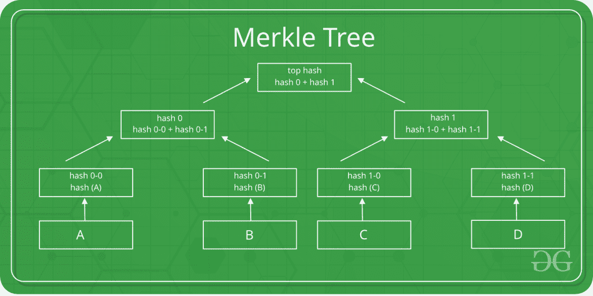
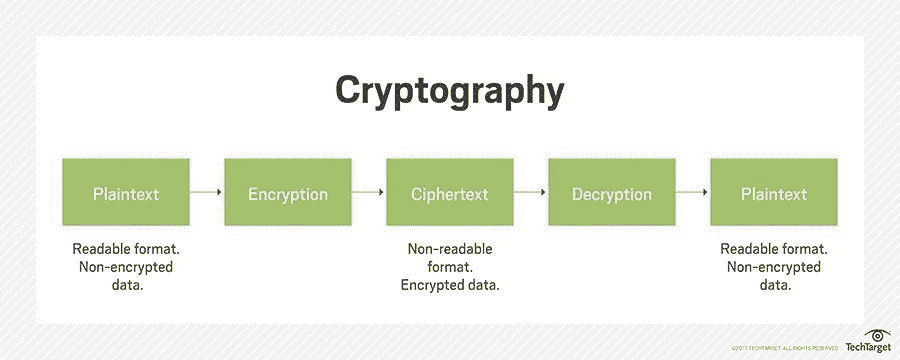
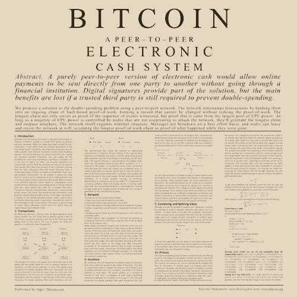
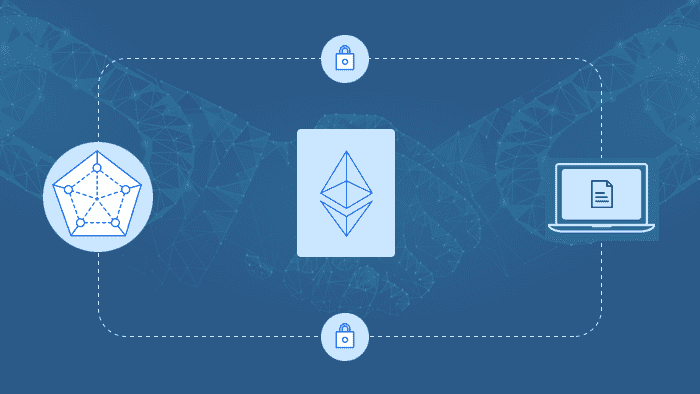
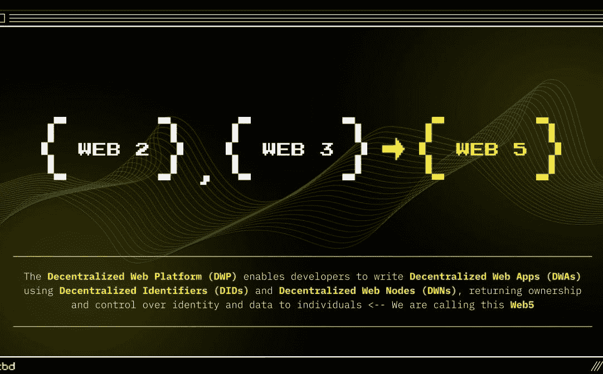

# 区块链的小历史

> 原文：<https://medium.com/coinmonks/small-history-of-a-blockchain-4e8d76cd3acf?source=collection_archive---------28----------------------->

多亏了研究人员 Stuart Haber & W.They，区块链革命始于 1991 年。他们希望建立一个系统，使带有时间戳的数字文档无法被篡改。因此，在 1991 年，他们开发了一种解决方案，通过加密保护区块链来给数据打上时间戳。
1992 年，Merkle tree 被纳入设计中，通过允许在单个区块中收集多个文档，使区块链更加高效。

1996 年，Anderson 写了不能删除任何更新的分散存储，这使得数据库设计更加透明。
1998 年，加密技术被引入，使数据更加安全，没有人能够读取。部署加密技术的原因是为了建立一个非常安全的生态系统。

2002 年至 2005 年间，Mazieres & Shasha 通过分散信托引入了第一个区块链的概念。Szabo 是第一个没有任何共识的简化区块链概念的创造者。
没有为该图像
提供替代文本，最终，在 2008 年**，中本聪构思了第一个分散式区块链
2009 年**9 月 1 日，第一个 btc genesis 模块诞生，从而开启了分散式存储系统的新时代。****

********

****在 **2013** ， **Vitalik Buterin** 了解了区块链的真正潜力，并引入了智能合同的概念。Vitalik 同时发布白皮书和#ETH。2015 年，第一个 ETH 区块诞生了。在同一时期，私人区块链的概念被引入。****

********

****Hyperledger 是 2015 年推出的第一款私人区块链。
在**2017–2018**年，区块链 3.0 的时代开始了，一种新的利益证明& Cardano 共识机制被引入市场。****

********

****而这就是区块链时代的小故事。现在我们正在进入一个新的时代，Web 5.0。杰克·多西的 TBD 正在比特币上建立一个名为 Web 5.0 的去中心化网络。Web 3.0 包括区块链技术和令牌化，以分散互联网，而 Web 5.0 被设想为一个基于身份的系统，仅使用一个区块链，即比特币。****

********

****让我们看看这个新时代将如何彻底改变区块链的生态系统。****

****你喜欢这篇文章吗？别忘了关注我，获取下一篇文章的通知。****

> ****交易新手？试试[加密交易机器人](/coinmonks/crypto-trading-bot-c2ffce8acb2a)或者[复制交易](/coinmonks/top-10-crypto-copy-trading-platforms-for-beginners-d0c37c7d698c)****