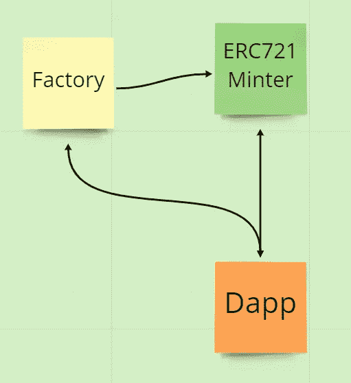
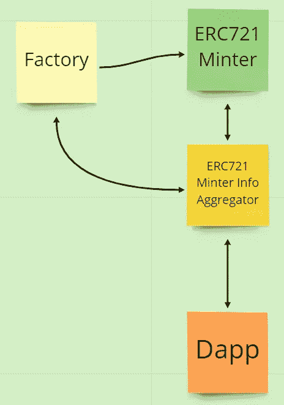

# 智能合同聚合器

> 原文：<https://medium.com/coinmonks/smart-contract-aggregators-e8454dfe8189?source=collection_archive---------13----------------------->

将一体原则与分散的生态系统相结合。

这里我们有一个工厂合同，将部署多个 ERC721 minter 合同。这将意味着我们的 dapp 将不得不与工厂合同&交互，然后还将与每个 minter 合同单独交互。

让我们看看如何减少 dapp 需要拨打的电话数量。

这里我们部署了一个聚合器，我们的 Dapp 可以调用它来聚合来自 minter 的所有信息&聚合与 minter 的交互。

那么举几个例子怎么样？

[1 英寸 V3 DEX 聚合路由器](https://bscscan.com/address/0x11111112542d85b3ef69ae05771c2dccff4faa26#code)

[Uniswap V3 Quoter](https://etherscan.io/address/0xb27308f9f90d607463bb33ea1bebb41c27ce5ab6#code)

如果你觉得这很有趣，为什么不看看这个呢！
[https://medium.com/p/28a8bb064e86](/p/28a8bb064e86)

坚实发展研究小组—[https://discord.gg/KzbcGmrnfN](https://discord.gg/KzbcGmrnfN)

-多边形联盟—[https://www.polygonalliance.com/](https://www.polygonalliance.com/)

-多边形联盟不和—[https://discord.gg/kJKPCGQu66](https://discord.gg/kJKPCGQu66)

你喜欢这篇文章吗？想请我喝杯咖啡吗？
Polygon/Eth/Bsc—0x4a 581 E0 EAF 6b 71d 05905 e8e 6014 DC 0277 a1 b 10 ad

> *交易新手？试试* [*密码交易机器人*](/coinmonks/crypto-trading-bot-c2ffce8acb2a) *或* [*复制交易*](/coinmonks/top-10-crypto-copy-trading-platforms-for-beginners-d0c37c7d698c) *上* [*最好的密码交易*](/coinmonks/crypto-exchange-dd2f9d6f3769)

> 加入 Coinmonks [电报频道](https://t.me/coincodecap)和 [Youtube 频道](https://www.youtube.com/c/coinmonks/videos)获取每日[加密新闻](http://coincodecap.com/)

# 另外，阅读

*   [免费加密信号](/coinmonks/free-crypto-signals-48b25e61a8da) | [加密交易机器人](/coinmonks/crypto-trading-bot-c2ffce8acb2a)
*   [杠杆代币](/coinmonks/leveraged-token-3f5257808b22)终极指南
*   [16 款最佳折叠电动自行车](/coinmonks/top-17-folding-electric-bikes-5e296f0918cb)
*   [28 款最佳电动自行车点评](/coinmonks/the-28-best-electric-bikes-review-and-buying-guide-in-2023-7bb3146cb403)
*   前三名[币安期货交易机器人](/coinmonks/top-3-binance-futures-trading-bots-e6031f84b3f9)