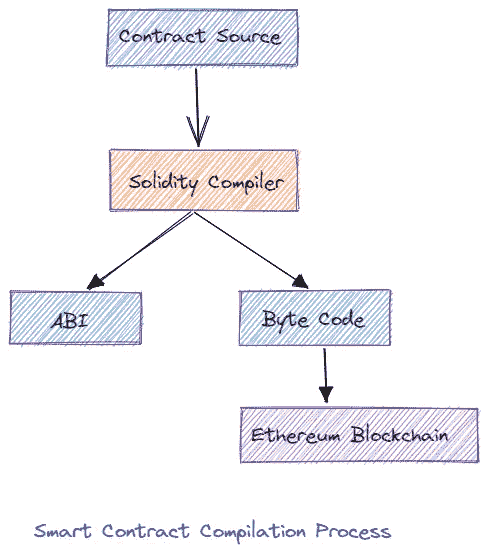

# 智能合同及其编制过程

> 原文：<https://medium.com/coinmonks/smart-contract-and-its-compilation-process-34868abccb69?source=collection_archive---------15----------------------->


# 智能合约！

在开始智能合同之前，我希望你们都知道简单合同。对吗？

# 什么是合同？

合同是一种书面或口头协议，尤指关于雇佣、销售或租赁的协议，旨在通过法律强制执行。简而言之，它是一张纸，其中双方签订了一份合同，包括相互同意，并可依法强制执行。

像这样，我们可以借助一种编码语言(大多是 solidity)来做一个契约，这叫智能契约。或者我们可以说，智能合同是一种自动执行的合同，买卖双方之间的协议条款被直接写入代码行。它只是一个运行在以太坊区块链的程序。它是代码(它的功能)和数据(它的状态)的集合，驻留在以太坊区块链上的一个特定地址。

哦，好的，萨罗吉。这是一个很棒的功能。但是等等，怎么写呢？

# 如何写一份巧妙的合同？

众所周知，要编写一份智能合同，我们需要一种编码语言。为此，我们需要一个 IDE 来编写我们的智能契约。到目前为止，Remix IDE 是我们可以用来编写它们的最受欢迎的工具。它是一个开源的 IDE。在 Remix 的帮助下，我们可以开发、部署、管理我们的智能合同。

稳健是写智能合同最流行的语言。在 Remix 中，不仅在 Solidity 中，而且在 Vyper 中，我们可以编写智能合同。

*有趣吧？是的，Saroj:)你能展示一下智能合同是什么样子的吗？*

在这里，我编写了一个简单的智能契约，其中可以存储一个数字，并且可以检索存储的数字。

```
// SPDX-License-Identifier: GPL-3.0pragma solidity >=0.7.0 <0.9.0;contract Storage { uint256 number; function store(uint256 num) public {
        number = num;
    } function retrieve() public view returns (uint256){
        return number;
    }
}
```

正如你在上面看到的，这是一个简单的智能合同。让我们试着理解所有的台词。在第一行，我们必须提到牌照号码。

```
SPDX-License-Identifier: GPL-3.0
```

那么就不得不提一下 solidity 语言的一个版本号。此外，我们需要提供一个合同名称，在我们的例子中，它是*存储*。在存储契约中，我取了一个名为 *number* 的 *unit256* 类型变量。我让两个名为*的函数存储*和*检索*。

酷毙了。这是一个简单的智能合同程序，它接受一个数字，并在*存储*功能的帮助下存储该数字。我们可以在*检索*功能的帮助下检索存储的号码。

嗯，这是很好的沙罗。但是智能合约如何编译代码呢？

# 智能合同的编制



当我们编译一个智能合同时，它会进入 solidity 编译器。然后编译器检查所有的行是否有错误。如果编译过程运行良好，那么它会将智能合约分为两个部分。

1.  ABI
2.  字节代码

**1。ABI**

ABI 或应用程序二进制接口是接口，或者我们可以说，它充当应用程序和智能合约之间的桥梁。如果另一个智能合约或应用程序想要访问我们的智能合约，那么它们必须需要 ABI。让我们看看它是什么样子的。

```
[
	{
		"inputs": [],
		"name": "retrieve",
		"outputs": [
			{
				"internalType": "uint256",
				"name": "",
				"type": "uint256"
			}
		],
		"stateMutability": "view",
		"type": "function"
	},
	{
		"inputs": [
			{
				"internalType": "uint256",
				"name": "num",
				"type": "uint256"
			}
		],
		"name": "store",
		"outputs": [],
		"stateMutability": "nonpayable",
		"type": "function"
	}
]
```

这是智能存储合同的 ABI。在 ABI 的帮助下，我们可以很容易地理解智能合同的结构。

**2。字节码**

字节码也是在编译时从我们的智能契约中生成的。这对智能合同在区块链网络的部署是有帮助的。没有字节码，我们就不能在区块链网络中部署智能合同。

```
"generatedSources": [],
	"linkReferences": {},
	"object": "608060405234801561001057600080fd5b5061012f806100206000396000f3fe6080604052348015600f57600080fd5b506004361060325760003560e01c80632e64cec11460375780636057361d146051575b600080fd5b603d6069565b6040516048919060c2565b60405180910390f35b6067600480360381019060639190608f565b6072565b005b60008054905090565b8060008190555050565b60008135905060898160e5565b92915050565b60006020828403121560a057600080fd5b600060ac84828501607c565b91505092915050565b60bc8160db565b82525050565b600060208201905060d5600083018460b5565b92915050565b6000819050919050565b60ec8160db565b811460f657600080fd5b5056fea264697066735822122023b549bd0c8231da07c9c7975eb66a2138eadd598892f1edfba57dd359ed082264736f6c63430008030033",
	"opcodes": "PUSH1 0x80 PUSH1 0x40 MSTORE CALLVALUE DUP1 ISZERO PUSH2 0x10 JUMPI PUSH1 0x0 DUP1 REVERT JUMPDEST POP PUSH2 0x12F DUP1 PUSH2 0x20 PUSH1 0x0 CODECOPY PUSH1 0x0 RETURN INVALID PUSH1 0x80 PUSH1 0x40 MSTORE CALLVALUE DUP1 ISZERO PUSH1 0xF JUMPI PUSH1 0x0 DUP1 REVERT JUMPDEST POP PUSH1 0x4 CALLDATASIZE LT PUSH1 0x32 JUMPI PUSH1 0x0 CALLDATALOAD PUSH1 0xE0 SHR DUP1 PUSH4 0x2E64CEC1 EQ PUSH1 0x37 JUMPI DUP1 PUSH4 0x6057361D EQ PUSH1 0x51 JUMPI JUMPDEST PUSH1 0x0 DUP1 REVERT JUMPDEST PUSH1 0x3D PUSH1 0x69 JUMP JUMPDEST PUSH1 0x40 MLOAD PUSH1 0x48 SWAP2 SWAP1 PUSH1 0xC2 JUMP JUMPDEST PUSH1 0x40 MLOAD DUP1 SWAP2 SUB SWAP1 RETURN JUMPDEST PUSH1 0x67 PUSH1 0x4 DUP1 CALLDATASIZE SUB DUP2 ADD SWAP1 PUSH1 0x63 SWAP2 SWAP1 PUSH1 0x8F JUMP JUMPDEST PUSH1 0x72 JUMP JUMPDEST STOP JUMPDEST PUSH1 0x0 DUP1 SLOAD SWAP1 POP SWAP1 JUMP JUMPDEST DUP1 PUSH1 0x0 DUP2 SWAP1 SSTORE POP POP JUMP JUMPDEST PUSH1 0x0 DUP2 CALLDATALOAD SWAP1 POP PUSH1 0x89 DUP2 PUSH1 0xE5 JUMP JUMPDEST SWAP3 SWAP2 POP POP JUMP JUMPDEST PUSH1 0x0 PUSH1 0x20 DUP3 DUP5 SUB SLT ISZERO PUSH1 0xA0 JUMPI PUSH1 0x0 DUP1 REVERT JUMPDEST PUSH1 0x0 PUSH1 0xAC DUP5 DUP3 DUP6 ADD PUSH1 0x7C JUMP JUMPDEST SWAP2 POP POP SWAP3 SWAP2 POP POP JUMP JUMPDEST PUSH1 0xBC DUP2 PUSH1 0xDB JUMP JUMPDEST DUP3 MSTORE POP POP JUMP JUMPDEST PUSH1 0x0 PUSH1 0x20 DUP3 ADD SWAP1 POP PUSH1 0xD5 PUSH1 0x0 DUP4 ADD DUP5 PUSH1 0xB5 JUMP JUMPDEST SWAP3 SWAP2 POP POP JUMP JUMPDEST PUSH1 0x0 DUP2 SWAP1 POP SWAP2 SWAP1 POP JUMP JUMPDEST PUSH1 0xEC DUP2 PUSH1 0xDB JUMP JUMPDEST DUP2 EQ PUSH1 0xF6 JUMPI PUSH1 0x0 DUP1 REVERT JUMPDEST POP JUMP INVALID LOG2 PUSH5 0x6970667358 0x22 SLT KECCAK256 0x23 0xB5 0x49 0xBD 0xC DUP3 BALANCE 0xDA SMOD 0xC9 0xC7 SWAP8 0x5E 0xB6 PUSH11 0x2138EADD598892F1EDFBA5 PUSH30 0xD359ED082264736F6C634300080300330000000000000000000000000000 ",
	"sourceMap": "141:356:0:-:0;;;;;;;;;;;;;;;;;;;"
}{
```

以上是同一存储智能合同的字节代码。字节码主要由*对象*和*操作码*组成。对象是智能协定的二进制形式，其中操作码充当智能对象的指令。

哦！现在我们能够理解智能合同了，谢谢 Saroj！

这是智能合约及其编译过程的简单概述。我希望你发现它内容丰富，你喜欢它。

谢谢你的阅读。一会儿见:)

> 交易新手？尝试[加密交易机器人](/coinmonks/crypto-trading-bot-c2ffce8acb2a)或[复制交易](/coinmonks/top-10-crypto-copy-trading-platforms-for-beginners-d0c37c7d698c)