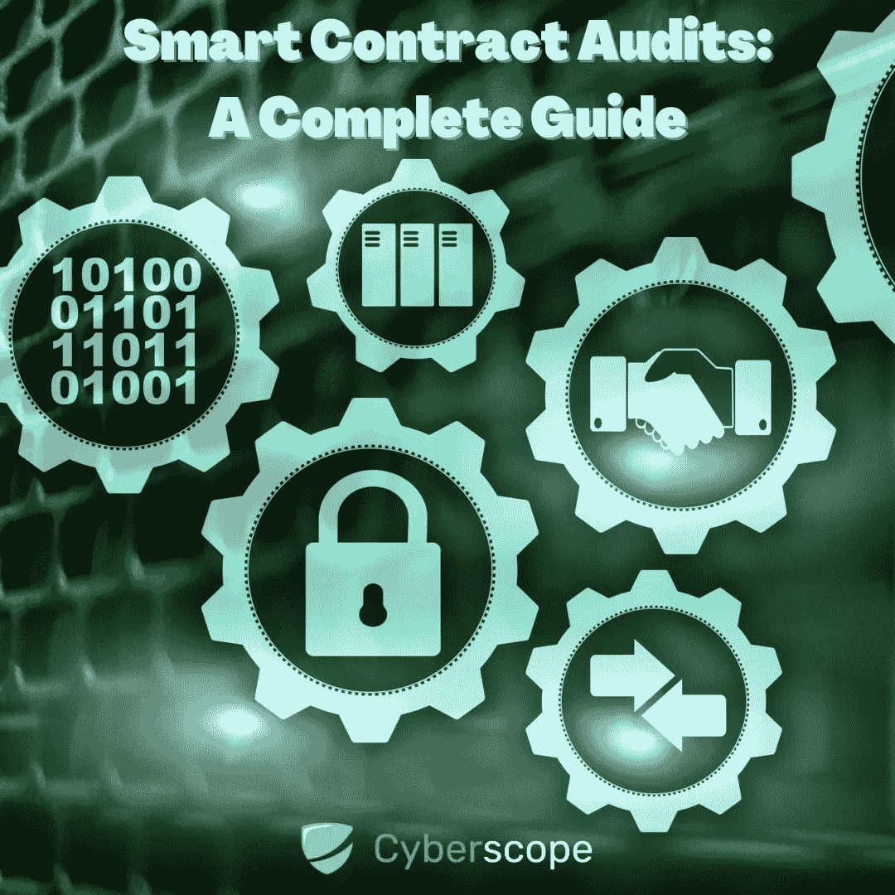
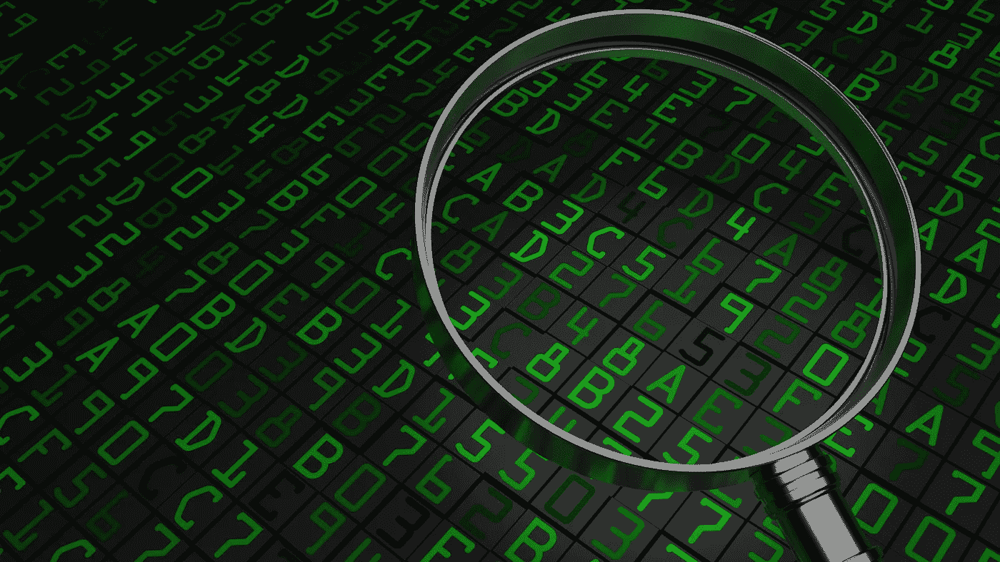
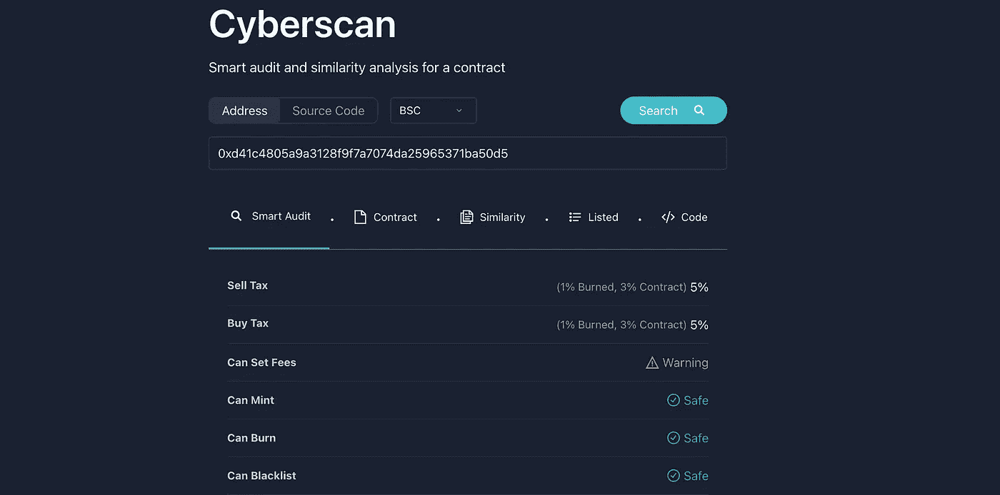
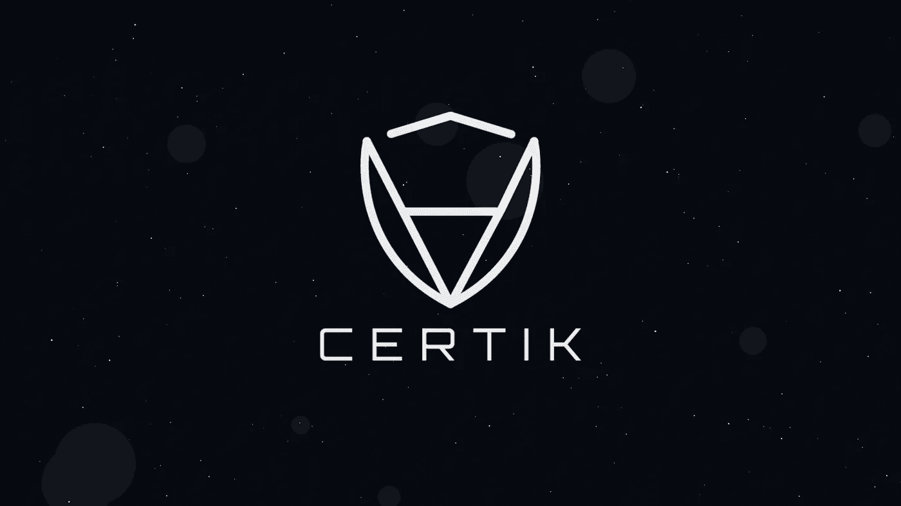
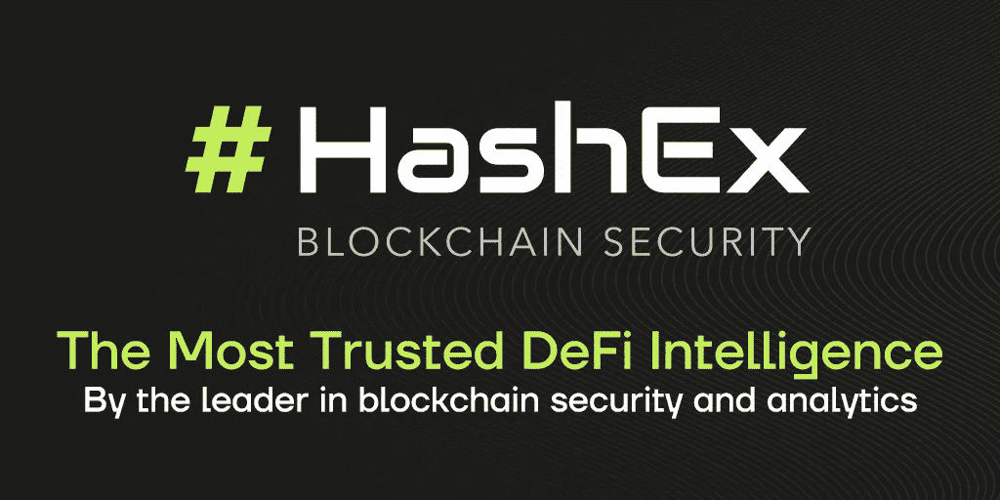
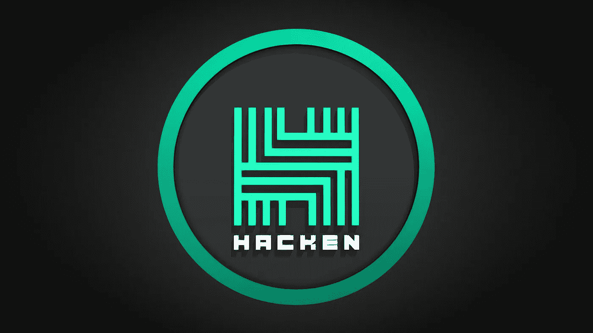
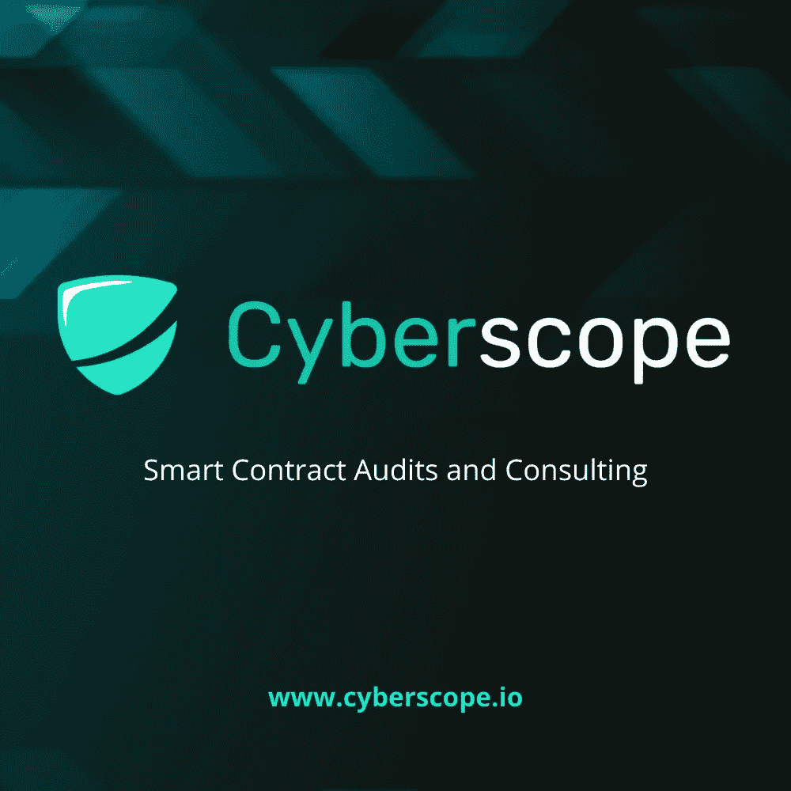
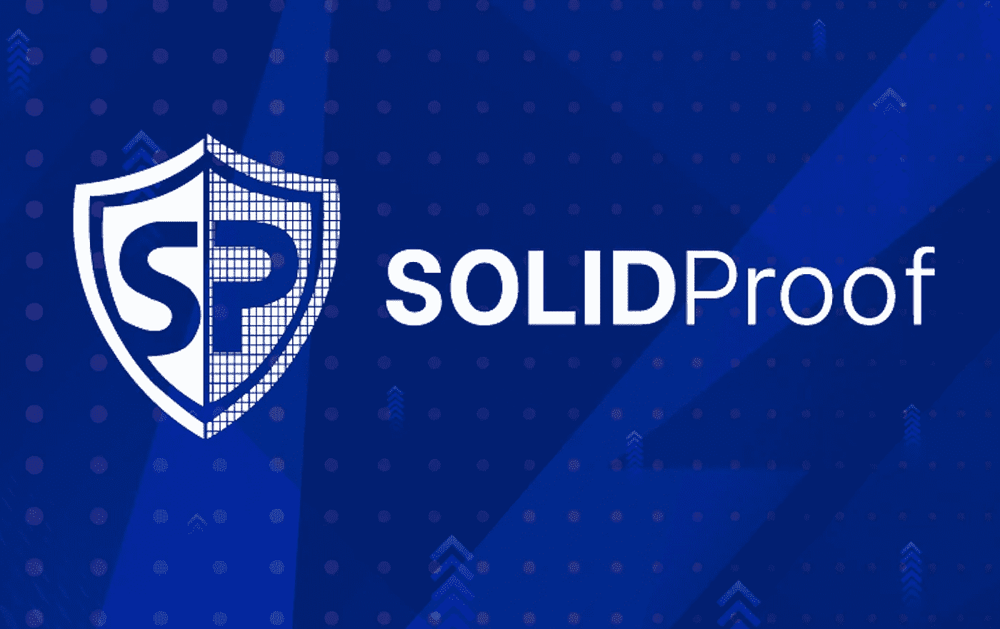
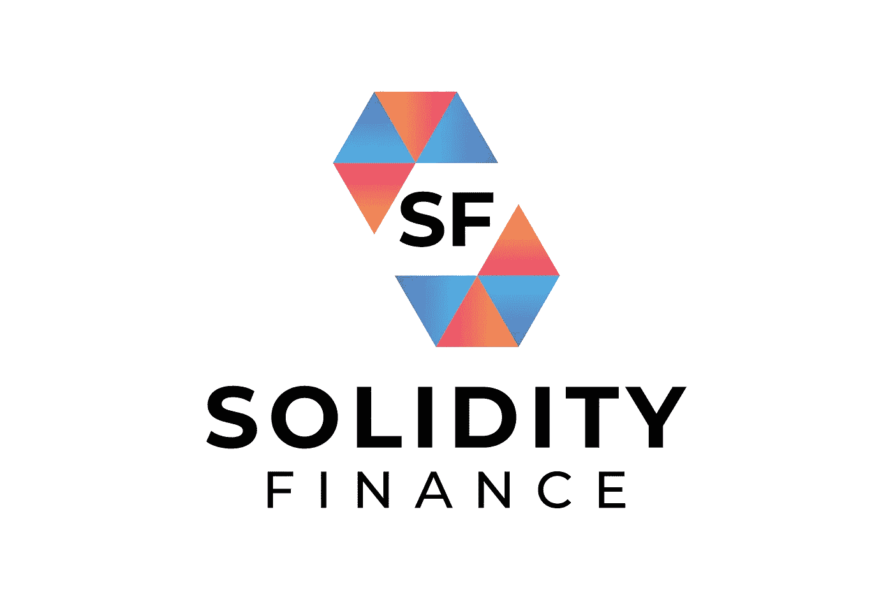

# 智能合同审计:完整指南

> 原文：<https://medium.com/coinmonks/smart-contract-audits-a-complete-guide-39781ef2c972?source=collection_archive---------1----------------------->

## 什么是智能接触审计及其对加密货币项目的好处的最终指南。

加密货币是过去十年中讨论最多、争议最大的创新之一。推动加密货币的区块链技术在过去几年中已经有了许多用途，从支付到供应链管理等等。虽然你可能主要是在阅读类人猿和[岩石被卖到数百万](https://inshorts.com/en/news/nft-of-a-picture-of-a-rock-sells-for-over-$13-million-1629816775091#:~:text=NFT%20of%20a%20picture%20of%20a%20rock%20sells%20for%20over%20%241.3%20million&text=A%20non%2Dfungible%20token%20(NFT,sold%20on%20the%20Ethereum%20blockchain.)的图片，以及市值达到数十亿的狗主题硬币，但通过使用加密货币，已经取得了重大的技术进步。

区块链最重要的一个方面是智能合约。这使得区块链技术超越了简单的虚拟货币，并允许条款作为交易的一部分来执行。不言而喻，确保智能合约中包含的所有条款(或代码)都需要完美无缺，以确保交易不会被恶意参与者利用。这就是智能合同审计的用武之地。

在本帖中，我们将向您全面概述什么是智能合同审计，它们如何工作，为什么需要它们，以及一些将帮助您处理智能合同的免费工具。无论你是投资者、开发者还是仅仅想了解更多关于智能合同审计的知识，这都是你的指南。

# 什么是智能合同？

智能合约只是存储在区块链上的条款(或程序)，当满足特定条件时执行。它们通常用于自动执行合同或协议，无需第三方参与。这是协议的参与者确定某个直接结果的一种方式。

智能合约的概念是在比特币发明的 10 年前提出的(信不信由你)。1994 年，计算机科学家兼密码学家 [Nick Szabo](https://en.wikipedia.org/wiki/Nick_Szabo) 首次提出这一方案，目的是将合同法的实践引入互联网。这也是许多人认为萨博可能就是比特币的创始人中本聪的原因之一。然而，萨博一再否认任何此类传闻。

智能合同最初被定义为执行合同或协议条款的计算机化交易协议。Szabo 的愿景是将 POS(销售点)等电子交易方式的功能扩展到互联网。

在他的论文中，Szabo 还建议执行一项合成资产合同，如衍生品和债券。Szabo 写道:“这些新的证券是通过多种方式将证券(如债券)和衍生品(期权和期货)结合起来形成的。由于对这些复杂的期限结构进行了计算机化分析，非常复杂的支付期限结构现在可以纳入标准化合同，并以低交易成本进行交易。”

简单地说，他是在谈论带有复杂条款的衍生品的买卖。Szabo 在论文中的许多建议和预测在区块链技术之前就已经实现了。例如，衍生品交易现在大多通过计算机网络使用复杂的期限结构进行。

# 什么是智能合同审计？

智能合同审计是一个过程，在此过程中，智能合同将被彻底分析和审查是否存在任何潜在的漏洞。审计员将审查业务逻辑和合同代码，并确保没有任何可被利用的缺陷。

[智能合同审计](https://www.cyberscope.io/#audit)通常包括一份报告，该报告将与相关方(通常是投资者和合同开发商)共享，详细说明所有建议的改进，以解决任何性能和安全问题。

审计员通常与智能合同的开发人员密切合作，以确保所有潜在的漏洞都得到解决。正是在这个阶段，最终报告将向项目投资者公开，以决定他们是否要投资该项目。

# 为什么智能合同审计很重要？

随着加密货币诈骗达到历史新高，最近的一次(在撰写本文时)达到了[高达 6 . 14 亿美元](https://www.cyberscope.io/blog/the-top-10-cryptocurrency-hacks-of-all-time)，与智能合同互动的每个人都必须确保它们得到适当的审计。

通常有两个主要方面对智能合同审计感兴趣，投资者和区块链开发商。对于投资者来说，这是他们研究过程中至关重要的一部分(通常称为 DYOR)。他们希望确保他们将投资的项目没有任何潜在的漏洞，并且开发人员已经采取了审计人员建议的所有措施。开发人员为了利用投资者而故意创建恶意智能合同的情况并不少见。如果你正在考虑投资一种新的加密货币，确保它经过适当的审计，并彻底阅读审计报告，以确保你的投资是安全的。

另一方面，对于开发人员来说，智能契约审计将帮助他们识别代码中他们可能忽略的潜在问题。一个有经验的审计员将快速识别业务逻辑中的潜在缺陷和漏洞，并在项目上线之前帮助他们修复它们。

# 如何进行智能合同审计？

一般来说，智能合同安全审计由专门寻找代码漏洞的网络安全公司执行。也就是说，如果你精通 solidity 或 rust 等编程语言，在咨询专家之前，你可以自己进行一些检查。

在深入研究代码之前，您需要做的第一件事是定义您的审计范围。智能合同审计有许多方面，包括检查业务逻辑、分析交易成本或 gas、绩效审查和检查漏洞。定义您的审计范围将有助于您就如何审计智能合同制定一个测试计划和策略。

> 交易新手？试试[加密交易机器人](/coinmonks/crypto-trading-bot-c2ffce8acb2a)或者[复制交易](/coinmonks/top-10-crypto-copy-trading-platforms-for-beginners-d0c37c7d698c)

一旦你想出了你的测试策略，你将需要开始考虑使用什么工具来使你的生活更容易。一些智能合同可能非常大且动态，需要手动有效监控。在某些情况下，即使在项目上线后，您也需要一个系统来持续监控事务，并在发现可疑情况时立即通知参与者。以下是审计人员在审计过程中使用的一些常用工具:

*   [滑行](https://github.com/crytic/slither)
*   [安全](https://github.com/eth-sri/securify2)
*   [智能检查](https://tool.smartdec.net/)
*   [欧恩特](https://eprint.iacr.org/2016/633.pdf)
*   [Mythril](https://github.com/ConsenSys/mythril)
*   [MythX](http://MythX)
*   [混合](https://remix-project.org/)插件

确定了适合自己的工具后，就该开始工作了。上面的工具将给出一些初步的发现，它们可能能够检测出类似自杀功能或可重入性的漏洞，但是这取决于你，审计员，去逐行检查进一步的漏洞或可以进行的优化。

# 常见智能合约漏洞

如果您不熟悉智能合约中的一些常见漏洞，我们列出了最常见的漏洞。

## 缺乏验证检查

智能合约和泛型编程中最常见的问题之一是缺少对函数参数的验证。某些操作需要进行必要的检查才能有效，大多数时候开发人员会忘记或忽略在代码中添加这些检查。

这种漏洞的常见情况可能包括错过检查，以查看未授权用户是否有足够的余额来执行特定操作。另一个很好的例子是访问控制，只有特定类型的用户才被允许调用特定的函数，但是这种验证从来没有进行过，或者如果您将特定的函数保留为 public 而不是“OnlyOwner”。这是你将在新的智能合约中看到的最简单也是最常见的利用形式。

## 再入攻击

当智能协定中的函数调用不可信协定中的另一个外部函数时，就会发生可重入攻击。然后，被调用的不受信任的契约对原始函数进行递归调用，试图耗尽初始契约的资金。

当契约在发送资金之前未能更新其状态时，攻击者可以不断调用取款函数来耗尽智能契约的资金。在写这篇文章的时候，最近的重入攻击是针对 [Fei 协议](https://halborn.com/explained-the-fei-protocol-hack-april-2022/)。2022 年 4 月，它成为了一次价值 8000 万美元的黑客攻击的受害者，这是因为它使用了包含重入漏洞的第三方代码。

## 气体优化

根据 see，这不是一个漏洞，但是智能合同审核期间的气体分析是该流程的一个重要方面。以太坊等区块链网络需要使用以太形式的‘气体’来覆盖交易的成本。根据智能合同的复杂程度和长度，天然气价格可能会有所不同。因此，不言而喻，你应该总是检查你的代码是否有任何未使用的功能。SafeMath 库就是一个很好的例子。如果您只使用 uint256，那么为您需要的操作添加一个函数，然后从契约中移除其余的。

## 错误的计算

智能合约的另一个常见漏洞是计算不正确。此漏洞也称为算术下溢或上溢，意味着如果某些计算未被检查，则该计算将产生的结果将是存储它们的数据类型范围之外的数字。例如 uint8 变量，只能存储 0 到 255 之间的整数。试图在 uint8 中存储任何大于 255 的值都会导致零。这可能会导致在执行计算时出现问题，从而导致智能合约出现故障。

## 薄荷/黑名单功能

最后，我们不能离开像 mint token 函数和黑名单函数这样的外部公共函数。这些功能可能会被项目所有者恶意使用，将合同变成一个'[蜜罐](https://www.cyberscope.io/blog/what-is-a-honeypot)'，这意味着没有人可以出售任何代币。如果你在你打算投资的代币的智能合约中发现这些功能，要非常谨慎，并确保你理解它们为什么存在。

# **自动化智能合同审计**

如果你不熟悉编程，并且你正在寻找一个没有审计报告的智能合同，有一些[免费工具你可以使用](https://www.cyberscope.io/blog/free-smart-contract-audit-tools-for-investors)。投资者用来进行快速安全分析的最常见的智能合同审计软件之一是 [Cyberscan](https://www.coinscope.co/cyberscan) 。

该软件非常容易使用，你所需要做的就是输入你想要分析的智能合同地址，从下拉列表中选择区块链网络，然后点击“搜索”。然后，您将看到所需智能合同的完整报告，以及一些关键指标，如合同所有权是否被放弃或合同是否包含任何常见漏洞(如黑名单或薄荷功能)。最后，你可以检查你的契约代码与流行的分叉代码的相似性。这将有助于您了解它是否由特定平台铸造，以及它有多独特。

# 顶级智能合同审计公司

对你的合同进行你自己的安全审计或者使用现有的免费软件工具，绝不是雇佣一个有经验的网络安全公司的替代品。这些公司雇佣经验丰富的专业人士，他们有多年的工作经验，可以帮助你确保你不会错过任何东西。

然而，有几十家公司在执行智能合同审计，你如何选择一家？我们整理了一份最佳智能合同审计公司的列表，将它们分为两个层次，优质智能合同审计公司定价较高，并与顶级市值项目合作，标准智能合同审计公司为刚刚起步的加密货币项目提供更实惠的价格。

# 高级层审计

## **1。Certik**

Certik 成立于 2018 年，最近被冠以[两次独角兽](https://techcrunch.com/2022/04/07/goldman-sachs-joins-other-investors-in-88m-round-for-web3-and-blockchain-security-firm-certik/)，是审计领域最大的名字。Certik 的创始团队由来自哥伦比亚大学和耶鲁大学的教授组成，并在区块链安全领域引入了多项创新，利用一流的正式验证和人工智能技术来保护和监控区块链、智能合同和 Web3 应用。

[Certik](https://www.certik.com/) 由币安、红杉和高盛等世界级投资者出资，并声称通过其审计和欺诈调查服务以及其他服务，为 2500 家企业客户保护了价值超过 3000 亿美元的加密资产。

## **2。哈希克斯**

HashEx 成立于 2017 年，自那以来，他们已经进行了 700 多次审计。该公司声称已经防止了价值超过 20 亿美元的资产损失，并为加密投资者开发了许多工具，如 AnalytEx 和 CryptEx。

HashEx 还为需要 360 度解决方案的项目提供咨询服务和智能合同开发。他们的一些著名审计包括 SafeMoon、TraderJoe 和 ApeSwap 等。

## **3。哈肯**

业内另一家值得注意的公司是 [Hacken](https://hacken.io/) 。它于 2017 年由一群安全专家和黑客在基辅成立，旨在为公司提供网络安全解决方案。

Hacken 已经与 300 多家企业合作，并且还提供渗透测试和漏洞奖励服务。他们的一些客户包括 1inch Exchange、VeChain 和 OneLedger。

# 标准层级审计

## **1。电脑示波器**

[Cyberscope](https://www.cyberscope.io/) 是区块链行业领先的审计和反洗钱公司之一。在与 900 多个加密项目合作后，它已经成为 PinkSale、Unicrypt 和 DxSale 等所有主要启动平台上最值得信赖的网络安全公司。

Cyberscope 的团队由世界一流的网络安全专家和反欺诈专家组成，他们精通最新的信息安全最佳实践。该公司还向加密投资者免费提供流行的软件工具，如 Cyberscan 和 Safescan。

[Cyberscan](https://www.coinscope.co/cyberscan) 对任何给定的合同地址执行自动智能审计和相似性分析，而 [Safescan](https://www.coinscope.co/safescan) 对任何给定的钱包执行反洗钱和 KYC 分析。

## **2。坚固耐用**

Solidproof 是一家总部位于德国的审计公司，其审计报告在整个行业得到广泛认可和接受。他们已经与区块链工业中的 400 多个项目合作过。

像 Cyberscope 一样，Solidproof 也向项目所有者和开发者提供 KYC 服务。

## **3。稳健金融**

Solidity Finance 成立于 2020 年，是另一家受欢迎的审计公司。他们雇佣了一支经验丰富的 solidity smart 合同审计团队，可以对代币、NFT、众筹销售、市场、赌博游戏、金融协议等进行审计。他们声称利用静态分析、自动化工具和强大的手动审查流程的组合，为项目团队提供业界领先的安全建议。

与 Cyberscope 和 Solidproof 不同，Solidity Finance 还没有为项目提供 KYC 服务。

# 智能合同审计的成本是多少？

智能合同审计可以根据智能合同的复杂程度，从几百美元到几十万美元不等。审计师通常会根据你的合同复杂程度、代码行数及其背后的商业逻辑，给你一个个性化的报价。

尽管对新的项目所有者来说，智能合同审计可能显得昂贵，但它应被视为一项投资，而不是一项成本。智能合同审计将吸引更多的项目投资者，并确保参与交易的资金是安全的。许多新的加密货币项目意识到了这一点，并将审计作为其营销战略的支柱，帮助他们尽早吸引投资者，因为他们能够向投资者保证合同将是 [SAFU](https://academy.binance.com/en/glossary/secure-asset-fund-for-users) 。

# 结论

在这本(不算太短的)指南中，我们涵盖了您需要了解的关于智能合同安全审计的所有方面。很明显，他们增加了一种新形式的保证，即代码在部署之前将按预期工作，这保护了投资者和其他利益相关者。这项服务提高了人们对智能合同的信任，由于安全漏洞和黑客攻击，智能合同传统上一直被不信任所包围。

智能合同审计服务还可以促进遵守法律法规，保护投资者以及某些行业的用户免受非法活动的影响。不缺少执行智能合同审计的审计员，他们都有不同的范围、专业水平和价格范围。如果您正在考虑为您的 ICO 或未来项目使用智能合同审计员，您将希望确保完全了解他们的审计范围、成本以及对审计流程本身的期望。

[*Cyberscope*](https://www.cyberscope.io/) *是密码行业领先的智能合同审计& KYC 公司之一，已经审计了 900 多个区块链项目和 NFT。所有主要发射台的官方合作伙伴。*

…

*最初发布于*[*https://www . cyber scope . io*](https://www.cyberscope.io/)*。*

> *加入 Coinmonks* [*电报频道*](https://t.me/coincodecap) *和* [*Youtube 频道*](https://www.youtube.com/c/coinmonks/videos) *了解加密交易和投资*

# 另外，阅读

*   [Bookmap 评论](https://coincodecap.com/bookmap-review-2021-best-trading-software) | [美国 5 大最佳加密交易所](https://coincodecap.com/crypto-exchange-usa)
*   [加密交易机器人](/coinmonks/crypto-trading-bot-c2ffce8acb2a) | [造币评论](https://coincodecap.com/coingate-review)
*   最佳加密[硬件钱包](/coinmonks/hardware-wallets-dfa1211730c6) | [Bitbns 评论](/coinmonks/bitbns-review-38256a07e161)
*   [新加坡十大最佳加密交易所](https://coincodecap.com/crypto-exchange-in-singapore) | [购买 AXS](https://coincodecap.com/buy-axs-token)
*   [红狗赌场评论](https://coincodecap.com/red-dog-casino-review) | [Swyftx 评论](https://coincodecap.com/swyftx-review)