# 智能合同自动化:最新技术(黑客视角)

> 原文：<https://medium.com/coinmonks/smart-contract-automation-state-of-the-art-hack-view-c153944b1a02?source=collection_archive---------2----------------------->

从一个 Web3 黑客的角度，概述了使用 Chainlink、意式冰淇淋网络、Open Zeppelin 和 Keep3r 网络实现智能合同自动化的当前解决方案和利弊。

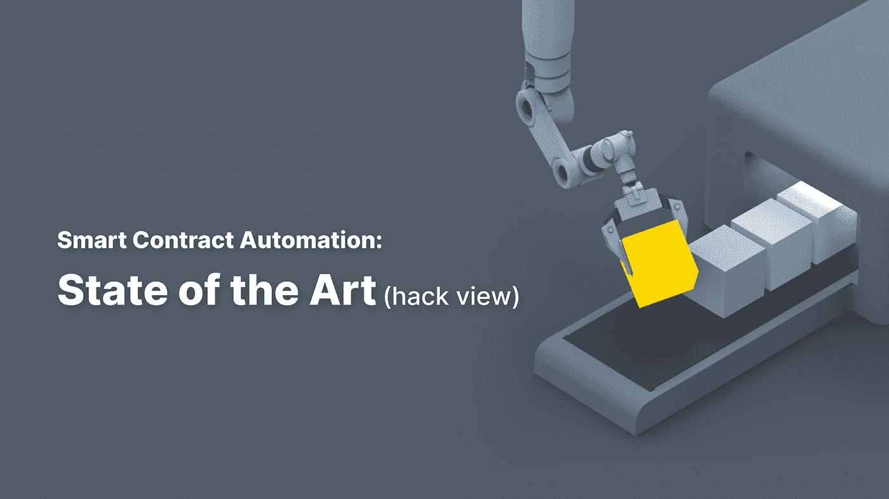

人们很容易忘记，不久前，web3 工具是一项耗时、疯狂的调试工作。随着社区的发展，**新的解决方案出现了**来解决开发者在区块链上开发时面临的问题。其中一个问题是智能合约缺乏自动执行方法调用。

自动化的意识从 2015 年开始不断增强，第一次尝试是以太坊闹钟项目。然而，正是 **Defi 爆炸**清楚地表明了**简化**智能合同自动化**的采用的迫切需要**。

关于智能合同自动化起源的更深入的解释可以在 David Liebowitz 的博客[*【DeFi Future is Automated*](https://thedefiant.io/the-defi-future-is-automated/)中找到。大卫提出了三种主要的解决方案:

*   意式冰淇淋网络的意式冰淇淋 Ops(2020 年 7 月生产就绪)
*   **保持 3r** 网络(自 2020 年 10 月起)
*   由 chain link**保管**(2021 年 6 月公测)

我们将分析这些解决方案，包括 Open Zeppelin 提供的解决方案:

*   **自动任务** &接力者，防御者乘开齐柏林飞艇

**免责声明**:虽然这份分析是意式冰淇淋委托的，但所有研究都是独立进行的，结论是我自己的。

# 设置场景

当你参加一个黑客马拉松(我推荐 [ethglobal](https://ethglobal.com/) ，我发现它是一个非常支持的社区)，并且你想要将一个协议/解决方案集成到你的项目中，你需要四样东西:

资源:文档是你最好的朋友——这包括从好的在线文档到教程的一切，甚至包括当你有技术问题或只是寻求指导时，在 Discord 频道或其他论坛中的响应。

**2)构建&测试-** 要获得最佳体验，需要考虑几件事，例如:

*   是否可以轻松地创建任务，或者是否必须首先使用与任务无关的额外资源
*   如果您能找到有用的模板或代码片段
*   支付信息是否显示清晰，易于理解。
*   如果解决方案部署在不同的测试网上
*   如果需要特定的令牌，水龙头有吗？
*   能否在分叉的 hardhat 节点中测试完整的用例，或者简单地部署到 testnet？

**3)特性**——这里要考虑的主要问题不仅仅是解决方案是否为您的项目提供了您需要的**自动化(有时开发人员认为当它被编码时就已经完成了)，还有其他可能影响**可伸缩性和进入生产时用户采用的方面**:**

*   需要付费吗？如果有，多少？
*   用户可以用不同的代币支付吗？是否有其他支付方式？
*   该解决方案是否能防止前端开箱？
*   当资金不足时，解决方案会通知用户吗？

这些特性的一个重要方面是解决方案能够以分散的方式提供**执行者/管理者。**虽然这与工作本身无关，但在转移到生产时，它会影响可伸缩性(毕竟，在 web3 中，去中心化是神圣的)

**4)仪表板& UI** :

*   有没有一个仪表板可以让你跟踪执行日志
*   如何跟踪智能合同创建的任务/工作？

# 展示项目

我们将在两个不同的用例中测试上述解决方案:

**a)维护任务示例:**增加计数器，这是一个经典的 hello world 智能合约自动化示例，在经过特定时间(或满足条件)时增加计数器。

**b)On the Fly:**One shot and cancel**，**动态创建和取消任务。随着生态系统的发展，我想我们会看到不同用例的激增，在这些用例中，我们需要通过编程来控制我们的任务。我们将只在意式冰淇淋和 chain link maintenance 实现这个用例。

GitHub 回购可以在[这里](https://github.com/donoso-eth/automate-counter)找到。

# 意式冰淇淋网络

## 它是如何工作的

首先，用户通过 [*意式冰淇淋 Ops UI*](https://app.gelato.network/) *完成**注册**。用户界面非常直观，会询问合同地址和您想要自动化的功能，如果合同没有通过验证，您将必须提供 abi。*

我们有三种触发器选择，时间流逝(每 n 次运行一次)、任何可能的时候，以及通过解析器契约中的自定义逻辑条件(它可以与执行契约相同)。

意式冰淇淋提供了(如果需要)**将执行逻辑从条件逻辑中分离出来的能力**。这是通过创建一个解析器契约来完成的**，这对于使用定制逻辑来自动化已经部署的契约的任务来说非常方便。**

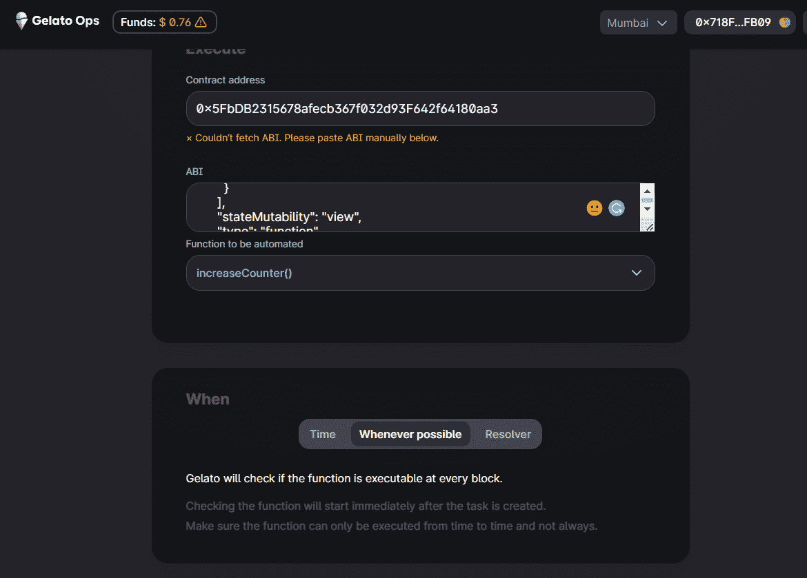

Gelato Ops UI

## 调查的结果

非常清晰和中肯的文件是可用的。然而，更多具有特定功能的“目标学习”资源将加快开发过程。

有可用的测试网，在 hardhat 分叉网络上开发非常容易，你只需要模仿意式冰淇淋的合同地址。

意式冰淇淋的一个非常强大的特性是**能够以编程方式完全控制任务**，这使得用户能够在智能合同中创建/取消任务。

意式冰淇淋网络通过一组列入白名单的节点运营商提供去中心化执行，并计划在 2023 年中期实现**完全的无许可去中心化**

目前意式冰淇淋网**没有在交易成本中增加任何费用**。意式冰淇淋提供存款的可能性(如 ChainLink 或 OZ Defender ),但也提供独立支付每笔交易的能力。

意式冰淇淋通过启用前端运行保护的 flashbots **提交交易来确保隐私。**

意式冰淇淋为用户提供了一个非常简单的界面来设置一个不和谐或电报通知机器人用于当用户运行到低平衡时。

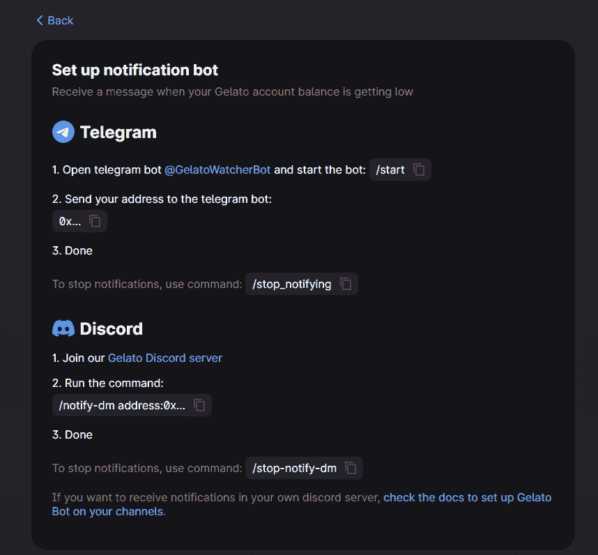

Notifications

意式冰淇淋提供了一个**直观的 UI** **仪表盘**用于注册和控制任务的执行。您可以通过连接的钱包或通过搜索输入的合同地址来查找工作。UI 还提供了**事务日志**来了解事务何时恢复。

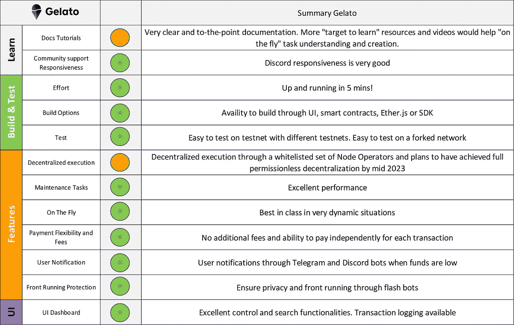

Gelato

## 展示合同增加计数器:

[在孟买](https://mumbai.polygonscan.com/address/0x1a32d2F88d9BfA36F1F0aB99357AB9eD338b8871)
[意式冰淇淋 Ops Ui 上验证合同，并记录日志](https://app.gelato.network/task/0x5fa3d9d8d842540568f6a843e070729ce84de55ea9fc0aa0aff8f84e6b53cb21?chainId=80001)

## Showcase 合同创建和取消任务:

[合同已在孟买](https://mumbai.polygonscan.com/address/0xD1ECbcBe55d356D7678bEd524e777F17B999d464)
[意式冰淇淋运营用户界面通过日志进行验证](https://app.gelato.network/task/0x17266435d1d33843fd856234f461e97855c42efd703ca9e0d0a7da2a1d041882?chainId=80001#/)

该任务是用 createTask()创建的，在执行一次后暂停。

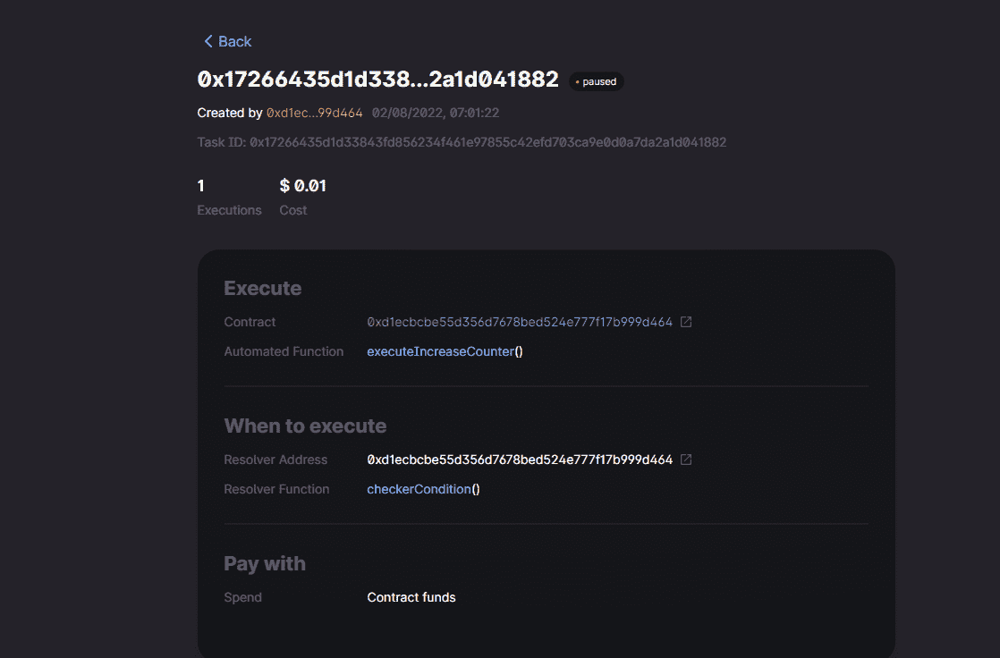

# Keep3r 网络

## 它是如何工作的

乍一看，Keep3r 似乎类似于链节保养或意式冰淇淋。第一步是，在 [Keep3r 网络 UI](https://keep3r.network/) 中注册您的作业，然后在定义**条件并提供执行逻辑**的合同中实现一个特定接口

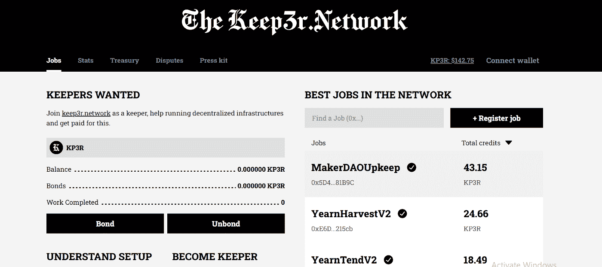

然而，相似之处仅限于此:

1.  向保管人/执行人付款的方式与其他解决方案非常不同，因为用户向保管人支付用户提供流动性的资金池中累积的收益。
2.  为了让 keepers (Keep3r network 提供分散执行)来完成您的工作，用户必须发布一个带有特定脚本的 npm 包(有一个 Keepers-Cli-Boilerplate，您必须派生并合并它)。

## 调查的结果

虽然开发人员的经历确实很艰难，几乎没有关于如何实现工作的详细文档/教程，论坛内的和 discord，**Defi Wonderland 团队提供了出色的支持**(用户 wei3erhase 支持了我的测试)。

该解决方案侧重于维护/预编程任务。**对于非常动态的场景**(虽然可行)我不认为这个解决方案**的实现适合目的**，因为 keep3r 的基础设施需要离线操作。

指导教程和“容易找到”的测试地址将是有益的。

Keep3r 网络的关键特征是通过累积到池中的收益实现支付选项。这允许用户**一次性**提供流动性，并且**在未来**不需要任何资金。

Keep3r **是一个纯去中心化的网络**，鼓励每一个用户加入。虽然一开始可能看起来很复杂，但是在这篇文章的框架中，我已经能够理解它的结构和工作原理，并且用 CLI 模拟了一个任务的执行(我可以作为管理员加入网络)

Keep3r 通过启用前端运行保护的 flash bot**提交交易来确保隐私**。

Keep3r Network **可以通过向“非专业”开发人员提供更多文档来改善用户体验**，从而提高用户采用率。

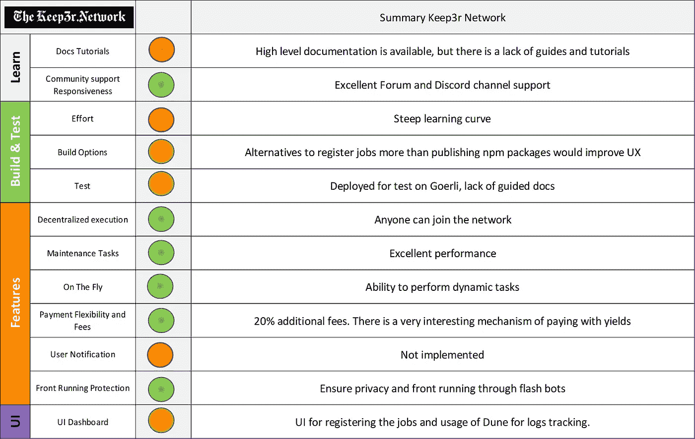

## 增加计数器:

[goerli](https://goerli.etherscan.io/address/0x8d9433C1305F5Ca8499688A15e3815F92ed10230)
[Npm 包与工单](https://www.npmjs.com/package/keep3rtest)的合同验证

# 链节保持器

## 它是如何工作的

首先，用户需要**在 [keepers UI](https://keepers.chain.link/) 中的 Chainlink Keepers 网络内**注册一个“维护”(任务/工作)，然后连接他们的钱包。

我们可以定义时间间隔来触发维护或特定的自定义逻辑，对于后一种情况，我们需要将 KeeperCompatible 接口继承到我们的合同中(这是一个非常简单的接口，有两个函数和所需的地址)。在 UI 中，我们将需要合同地址，如果它没有被验证，我们将被提示输入方法的 abi。

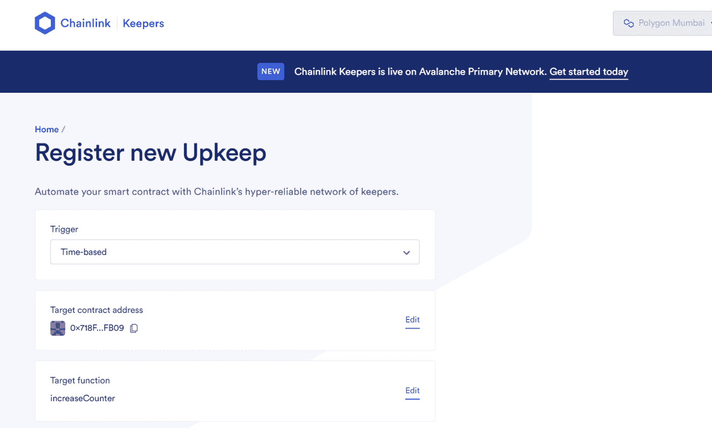

保养登记簿

为了完成注册，您可以输入您的电子邮件通知。资金不足时会通知你。

## 调查的结果

Chainlink 生态系统也有很好的记录，有很多资源、教程和帖子。但是，如果有更多关于“动态”任务的文档和教程，将会很有帮助。

实现循环自动化非常简单易懂。

mainnet 上的费用达 20%。与 Chainlink 中的其他应用一样，**您将需要 link 来操作**。更灵活的支付方式将是有益的。

测试网和水龙头都可用。如果你想使用分叉网络进行本地开发，尽管这个*是*可行的(你将不得不使用 Chainlink 节点在本地部署它)，但如果你以前没有做过，它可能会很麻烦。

链环守护者已经开始提供**能力来通过编程控制任务****。到目前为止，该功能仅允许用户使用特定的自定义逻辑在智能合约中创建任务。如果一个用例需要一个时间间隔或者只运行一次作业，用户将不得不在条件或执行逻辑中对其进行编码。由于 web3 的发展非常迅速，我将不得不在未来几周回顾这篇文章，更新可用的功能。**

**为同一个契约设置多个维护的方法是将自定义的 checkDataparam 传递给 check maintenance(bytes check data)并将 performData 传递给 perform maintenance(bytes perform data)，在非常动态的用例中，这种架构并不能帮助像我这样的开发人员拥有更干净的代码。**

**另一方面，这种架构允许**在链外抵消一些气体密集型计算**，并且只在 performData 内传递 perform maintenance()执行所需的数据。**

**意式冰淇淋网络通过一组列入白名单的节点操作符提供分散式执行。**

**Chainlink 提供了一个**非常直观的仪表板 UI** ，用于注册/控制任务的执行。**

**仪表板显示连接的钱包登记的保养。向前发展，这将有助于开发人员实现搜索功能的合同地址为“在飞行中”创建的任务。**

**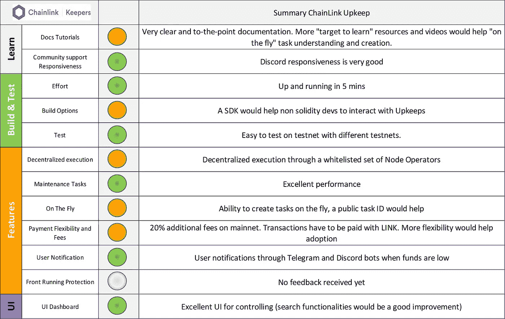**

**ChainLink summary**

**来自 Chainlink 的官方反馈仍然悬而未决，因此我的评论和分析可能会在未来发生变化。**

## **展示合同增加计数器:**

**[合同在](https://mumbai.polygonscan.com/address/0xAb84A3c3480488d508737Cf8F357a1C7c841C5c4)孟买
[维护 UI &日志](https://keepers.chain.link/mumbai/2070)上验证**

## **创建和取消任务:**

**[合同在林克比](https://rinkeby.etherscan.io/address/0xdb4604cdC97c23E3A24949E69A760f4c6b81a541)
[维护 UI &日志](https://keepers.chain.link/rinkeby/3422)上验证**

# **打开齐柏林飞艇**

## **它是如何工作的**

**用户需要**注册**一个负责执行的**继电器**和一个**自动任务**。在自动任务中，定义触发任务的**条件**(通过时间或 webhook)以及定义**执行所需的任何自定义逻辑。****

**中继和自动任务注册(如下所示)通过 defender UI 完成，您需要在其中创建一个帐户(web2 电子邮件/密码)，自动任务也可以通过 POST API 调用来创建、更新或删除。**

**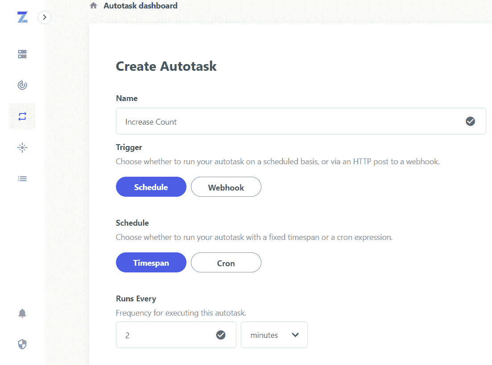**

## **公开齐柏林飞艇的调查结果**

**用 Open Zeppelin 开始学习和构建是非常有益的，因为指南简洁、易于理解并且有很好的文档记录。**

**所提出的解决方案使得创建每 n 次触发的重复任务变得非常容易。**

**Open Zeppelin 提出的一个非常有趣的特性是通过 webhook 触发自动任务的能力，这非常符合 sentinel 在链上事件发生时得到通知的能力。**

**open Zeppelin**不允许**“开箱即用”创建和取消智能合同中的任务。两次触发**之间的**最小时间**为一分钟**，通过无休止的循环可以达到更小的间隔。**

**该解决方案不提供分散的执行。**

**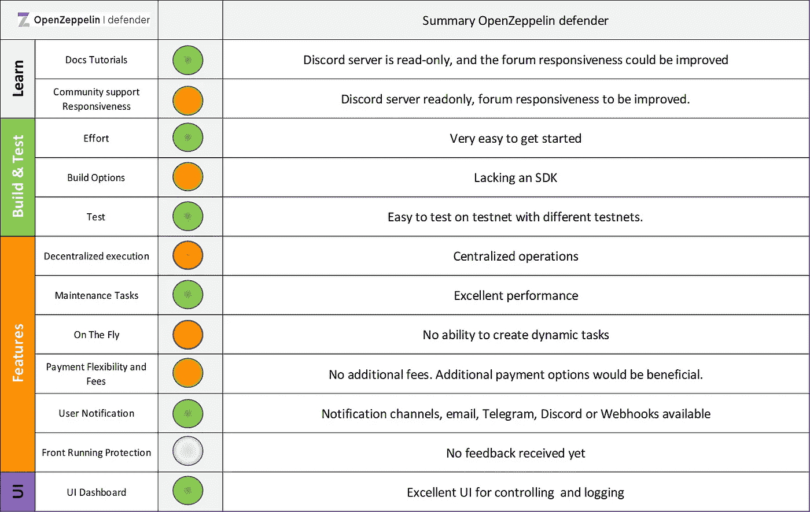**

**Open Zeppelin summary**

**来自 Open Zeppelin 的官方反馈仍然悬而未决，因此评论和标点符号可能会在未来发生变化。**

## **展示合同增加计数器:**

**[在孟买](https://mumbai.polygonscan.com/address/0x0aF075bE4331ec4F926c1ea30571E41B3De2E9aF)
日志上验证的合同截图(需要登录)**

**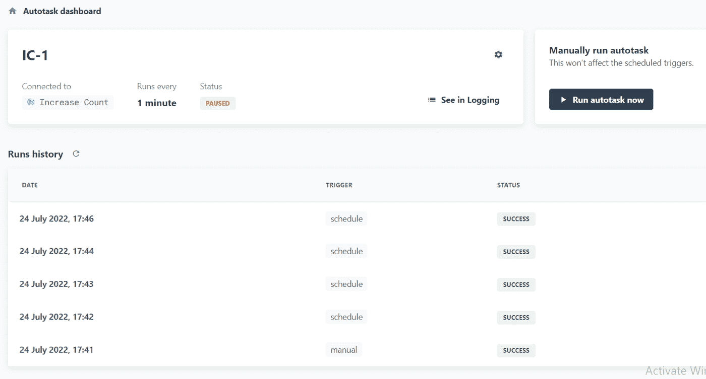**

# **摘要**

**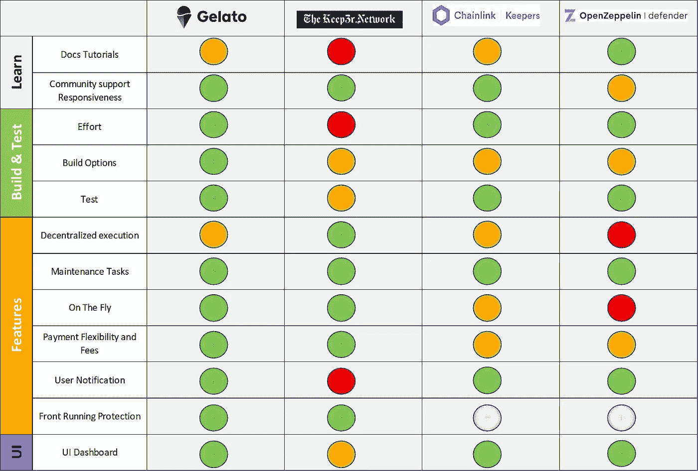**

**平均不同的标点符号，我们可以创建以下表示:**

**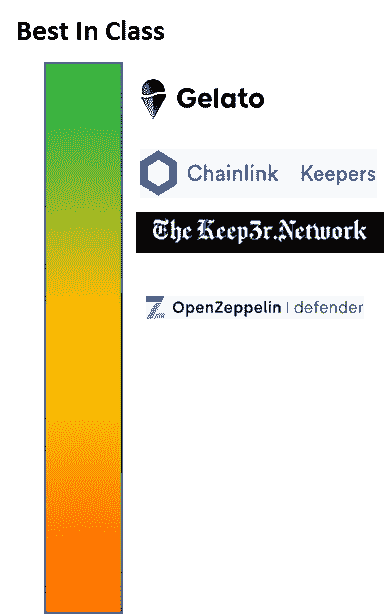**

**Best in Class**

**总之，在 web3 中有一个健康的、高性能的自动化生态系统。**

**所有解决方案都提供了预期的自动化，自动化事务的总数在增加，社区也在快速增长。**

**在我亲自测试了四种解决方案后，上图准确地代表了我对意式冰淇淋网络在 UX 领先一步的看法。**

**值得一提的是，一些解决方案正在大量开发中，因此一些功能和标点符号可能会在未来几周或几个月内发生变化**

**感谢您的阅读！！**

**如果您有任何问题或意见，请通过 twitter @donoso_eth 与我联系**

# **资源**

**[意式冰淇淋 UI](https://app.gelato.network/)
[意式冰淇淋文档](https://docs.gelato.network/introduction/what-is-gelato)
[意式冰淇淋 web](https://www.gelato.network/)**

**[Keep3r 网络前端](https://keep3r.network/)
[Keep3r 文档](https://docs.keep3r.network/)
[Keep3r 作业状态](https://dune.com/wei3erHase/DRAFT-Keep3rV2-Analytics)**

**[链扣用户界面](https://keepers.chain.link/)
[链扣文档](https://docs.chain.link/docs/chainlink-keepers/introduction/)
[链扣网页](https://chain.link/keepers)**

**[打开齐柏林后卫 UI](https://defender.openzeppelin.com/)
[打开齐柏林后卫文档](https://docs.openzeppelin.com/defender/)
[打开齐柏林后卫网页](https://www.openzeppelin.com/defender)**

## **展示合同**

****增加计数器:** 意式冰淇淋:[合同在孟买验证](https://mumbai.polygonscan.com/address/0x1a32d2F88d9BfA36F1F0aB99357AB9eD338b8871)
Keep3r 网络:[合同在歌尔里验证](https://goerli.etherscan.io/address/0x8d9433C1305F5Ca8499688A15e3815F92ed10230)
链环守护者:[合同在](https://mumbai.polygonscan.com/address/0xAb84A3c3480488d508737Cf8F357a1C7c841C5c4)孟买验证
开启齐柏林后卫:[合同在孟买验证](https://mumbai.polygonscan.com/address/0x0aF075bE4331ec4F926c1ea30571E41B3De2E9aF)**

****创建和取消任务:** 意式冰淇淋:[合同在孟买验证](https://mumbai.polygonscan.com/address/0xD1ECbcBe55d356D7678bEd524e777F17B999d464)
链环保管人:[合同在林克比验证](https://rinkeby.etherscan.io/address/0xdb4604cdC97c23E3A24949E69A760f4c6b81a541)**

****Github 回购:** [链接](https://github.com/donoso-eth/automate-counter)**

> **交易新手？试试[密码交易机器人](/coinmonks/crypto-trading-bot-c2ffce8acb2a)或[复制交易](/coinmonks/top-10-crypto-copy-trading-platforms-for-beginners-d0c37c7d698c)**