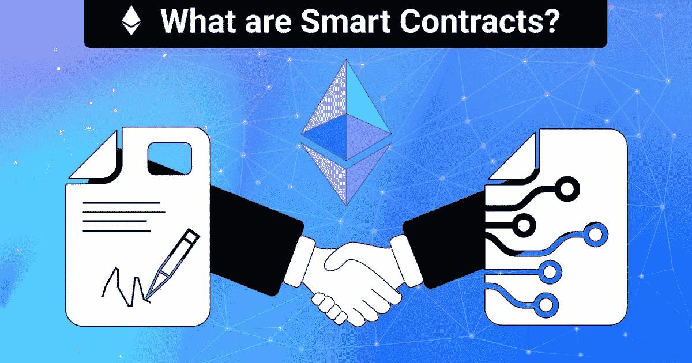

# 智能合同-您需要知道的一切

> 原文：<https://medium.com/coinmonks/smart-contract-everything-you-need-to-know-8fdaee59afd?source=collection_archive---------27----------------------->

区块链的一个关键方面是，它能够作为一个分散的网络运行，由所有对等方共享，不需要中间人或其他第三方中介。区块链的这一特性有助于节省时间和降低事务冲突的风险。

智能合约支持区块链的这一独特方面，包括交易必须遵守才能完成的明确且不变的条件。因此，智能合约被称为区块链技术最近最常用的应用。

如果你对智能合约很好奇，这里绝对是充实你知识的“智能”读物。到本文结束时，你不需要谷歌“什么是智能合同？”又来了。您将了解什么是智能合约，它的特殊功能，它是如何应用的，以及它使用的代码。在深入研究其他细节之前，让我们了解一下智能合同的一般含义。

# 什么是智能合同？

智能合约是一组在区块链上运行的计算机代码，构成了一组被交易中的相关方接受的规则。一旦满足了预先设定的规则集，智能合同就会自动执行，以交付商定的输出。

智能合同促进、确认和执行基础协议的条款，从而实现分散自动化。智能合约使得转移任何有价值的东西成为可能，比如钱、股票、财产等等。公开透明，不需要中间人，维护公正的体系。

智能合同最初是由密码学家、法律学者和计算机科学家 Nick Szabo 在 1993 年创建的，他将合同的功能与自动售货机的功能进行了比较，即可以翻译成代码并在区块链上执行的数字合同。

# 智能合同的功能

# 1.信任和透明度

透明性是区块链技术的基本属性之一，智能合约也具有这一点。智能合同充满了一套被参与协议的各方所接受的详细规则。这些规则经过仔细审查，只有在所有各方都同意的情况下才能实施，从而减少以后发生冲突和问题的可能性。智能合约的这一特性保证了交易过程中相关方的信任和透明度。

# 2.快速交易过程

智能合约只是在互联网上运行。由于不涉及中间人，因此避免了过程中不必要的步骤，从而改进了交易过程。使用智能代码完成交易比任何传统的业务流程都要快。

# 3.准确度和精确度

合同中省略的任何条件都可能导致执行错误，因此在设计智能合同时，所有条件都包含在详细的表单中。这使得智能合同成为一个全面的协议，当执行时，自动完成所有事情。手动创建的合同有出错的风险，因为负责创建合同的人可能会忽略一个或多个条件。当谈到准确性和精确性时，智能合约是必不可少的。

# 4.安全

由于自动编码功能，智能合约被认为是目前可用的数据加密技术中最安全的解决方案。由于它们符合最高的安全标准并具有高水平的保护，因此可以安全地用于基本交易。

# 5.数据存储

任何交易的重要信息都存储在合同中，参与方的任何人都可以随时查阅。这些交易被记录为区块链的未来分录。如果将来对合同条款有分歧，这是很有帮助的。

# 6.无纸传输信息的

智能合同是计算机编码的文件；因此，在整个交易过程中不需要纸质文件。一方面，这节省了资金，另一方面，它使全球的企业受益，因为它们可以节省合同所需的纸张数量，从而培养它们的社会责任感。

# 智能合同是如何工作的？

为了说明智能合同是如何工作的，让我们举一个真实世界的例子；假设你同意把你的房产卖给一个朋友。出售财产的过程涉及一些书面文件和第三方，如土地的房地产经纪人。这些第三方代理在整个过程中充当中间人，处理记录并监督交易。

由于你不会完全信任你的朋友，该机构提供代管服务，监督交易过程，释放和支付。一旦交易成功，你必须按照约定的百分比向代理和托管服务支付佣金。对于这种传统的交易方式，买卖双方因为支付给第三方而损失了额外的钱。

然而，对于基于智能合同的交易，没有涉及中介的机会。所有由房地产代理完成的功能都可以编码到智能合同中，从而为买方和卖方节省大量资金。

智能合同由两个不同的部分组成:代码和数据，两者都在区块链有地址。当数据指定契约的状态时，代码指示它如何工作。智能合约基于基于条件的原则(如果是这样，那么是那样- IFTTT)，它将通过仅在满足财务和其他条款后将资产交付给买方来解决所有权问题。智能合同可以取代托管服务，因为双方之间的信任不再是一个问题。

此外，交易存储在区块链系统中，相关方可以随时查看。

# 智能合同的应用

# 1.保险

由于保险行业缺乏自动化，索赔处理可能需要几周甚至几个月的时间。这对客户和保险公司来说都是一个问题，因为客户的资金受到时间限制。另一方面，公司必须处理不必要的开支、不满意的顾客和低效率。

在保险业中使用智能合同可以根据客户和公司的协议，在满足特定条件时自动触发索赔付款，从而简化流程。

# 2.卫生系统

智能合同在医疗系统中用于安全地存储和传输患者数据。例如，EncrypGen 等医疗行业采用智能合同来安全传输患者数据，不允许外部访问。

患者拥有他们的数据，如果研究人员想要使用患者的数据，他们将不得不为此付费。患者决定他们是否要出售它。

# 3.抵押贷款

抵押协议是复杂的，因为它们包含许多信息，包括抵押权人的收入，信用评分和支出。在办理抵押贷款之前，反复核对这些细节是必要的。这一过程通常由中介机构和第三方处理，这对于贷款人和贷款申请人来说既费时又困难。

在这种情况下，使用智能合约是有益的，因为它消除了对中介的需求，减少了冗长的过程和混乱。此外，所有细节都将存储在一个位置，双方都可以随时访问。

# 4.物联网技术

物联网用于将日常小工具连接到互联网。它借助传感器增强了系统的互连性。这些小工具可以连接到自动区块链，以跟踪所有涉及的产品和程序。全自动系统将保证正确的产品供应给正确的接收者。

系统上的传感器在区块链上建立它们的节点，智能合同允许随时跟踪产品的位置和拥有情况。智能合同会不断更新位置状态，直到货物交付。这保证了货物从最初装运到交付都是有序的。

# 5.以太网

目前，以太坊网络是构建和部署智能合约的最大平台。以太坊中的智能合约在以太坊区块链上的特定地址建立和分配。这使得该合同的代码是公开的，因为它是在公共区块链上登记的。代码是透明的，并且在许多用例中消除了对中间人的需要，使得它对组织和企业来说是高效的。

# 6.众筹

众筹是智能合约的另一个流行应用。如果一个人正在寻求众筹或向客户出售硬币，以太坊网络上存在的 ERC20 令牌等智能合约是一个不错的选择。

# 结论

智能合同可以让世界变得更好，一个没有不必要的指控和欺诈的地方。它可以减少洗钱、延误和许多事情的费用。智能合同有无限的潜力，随着技术的发展，一些工作变得不再需要，因为智能合同代码可以接管。

[封面-图像-来源](https://blockgeeks.com/guides/smart-contracts/)

*原发布于*[*https://gloriaokeke . hashnode . dev*](https://gloriaokeke.hashnode.dev/smart-contract-everything-you-need-to-know)*。*

> 交易新手？尝试[加密交易机器人](/coinmonks/crypto-trading-bot-c2ffce8acb2a)或[复制交易](/coinmonks/top-10-crypto-copy-trading-platforms-for-beginners-d0c37c7d698c)