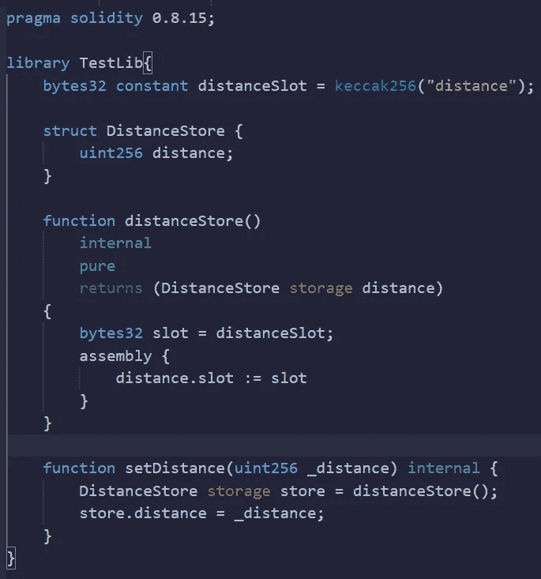

# 智能合同黑客—图书馆

> 原文：<https://medium.com/coinmonks/smart-contract-hacking-libraries-ab6e340c8882?source=collection_archive---------6----------------------->

好的，使用库的一个核心问题是，你不能在其中存储变量…通常情况下。

我不确定这是否会导致漏洞，学习:D 只是一种乐趣

不管怎样，通过使用汇编，我们可以绕过这个限制。

所以首先我们定义一个“常量”变量，我们只是把这个小小的善意谎言传递给编译器，这样它就不会对我们大喊大叫了。

接下来，我们定义一个结构来存储我们的变量。

为了检索我们的信息存储，我们需要定义一个用存储指针返回的结构的实例，然后我们给一个槽变量赋一个我们前面定义的“常量”变量。

在我们的汇编函数中，我们在这里做的是将存储指针分配给返回的结构，在这种情况下，存储数据的存储槽是槽 0。

为了设置距离，我们通过调用 distanceStore 函数来初始化指向结构体的存储指针，并将变量赋给 storage。

我没有弄清楚这个，特别感谢学习小组的托罗夫教我这个 xD

觉得这个有趣吗？看看这个！[https://medium.com/p/a069b267c6e0](/p/a069b267c6e0)

想多学点扎实？
加入学习小组！【https://discord.gg/KzbcGmrnfN 

-多边形联盟—[https://www.polygonalliance.com/](https://www.polygonalliance.com/)

——多边形联盟不和—[https://discord.gg/kJKPCGQu66](https://discord.gg/kJKPCGQu66)

你喜欢这篇文章吗？想请我喝杯咖啡吗？
Polygon/Eth/Bsc—0x4a 581 E0 EAF 6b 71d 05905 e8e 6014 DC 0277 a1 b 10 ad

> *交易新手？试试* [*密码交易机器人*](/coinmonks/crypto-trading-bot-c2ffce8acb2a) *或* [*复制交易*](/coinmonks/top-10-crypto-copy-trading-platforms-for-beginners-d0c37c7d698c) *上* [*最好的密码交易*](/coinmonks/crypto-exchange-dd2f9d6f3769)

> 加入 Coinmonks [电报频道](https://t.me/coincodecap)和 [Youtube 频道](https://www.youtube.com/c/coinmonks/videos)获取每日[加密新闻](http://coincodecap.com/)

# 另外，阅读

*   [免费加密信号](/coinmonks/free-crypto-signals-48b25e61a8da) | [加密交易机器人](/coinmonks/crypto-trading-bot-c2ffce8acb2a)
*   杠杆代币的终极指南
*   [16 款最佳折叠电动自行车](/coinmonks/top-17-folding-electric-bikes-5e296f0918cb)
*   [28 款最佳电动自行车评选](/coinmonks/the-28-best-electric-bikes-review-and-buying-guide-in-2023-7bb3146cb403)
*   前三名[币安期货交易机器人](/coinmonks/top-3-binance-futures-trading-bots-e6031f84b3f9)