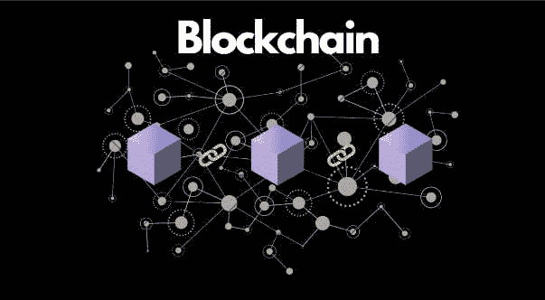
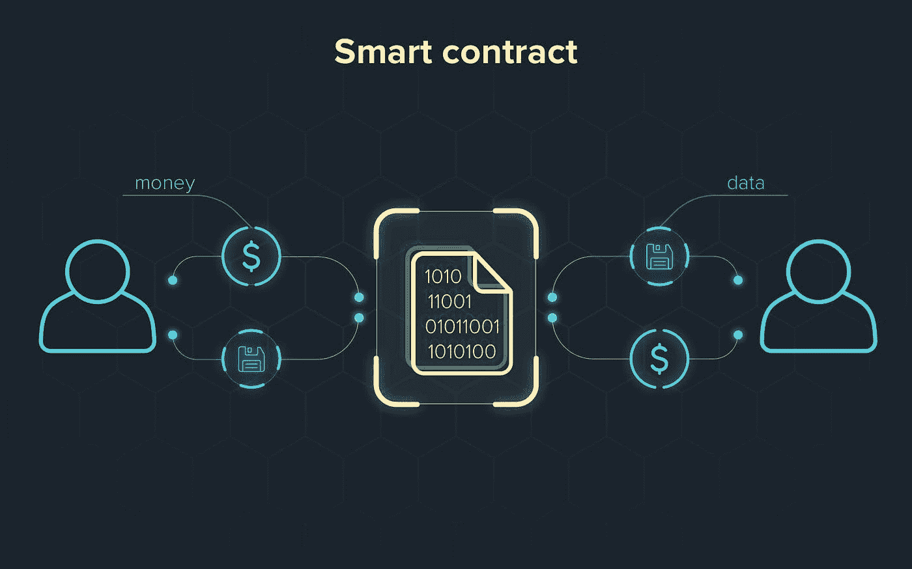
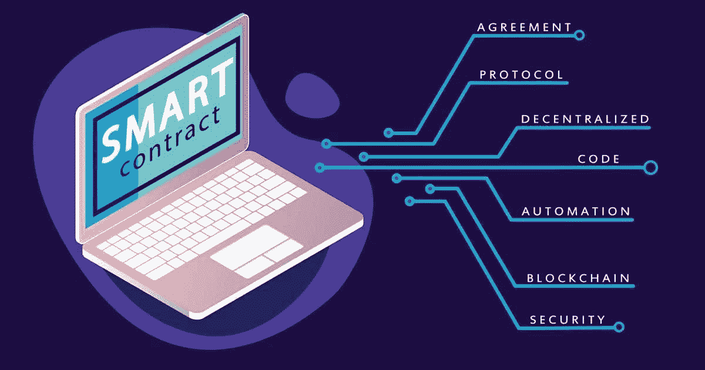
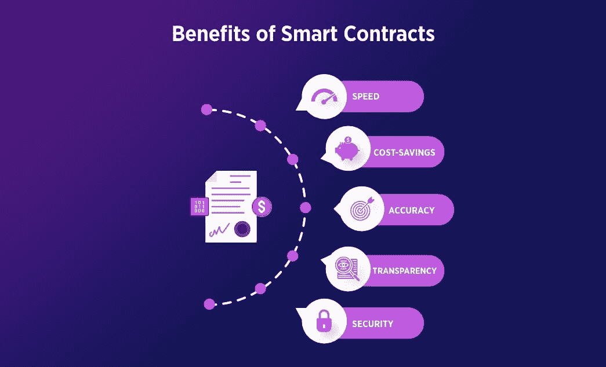
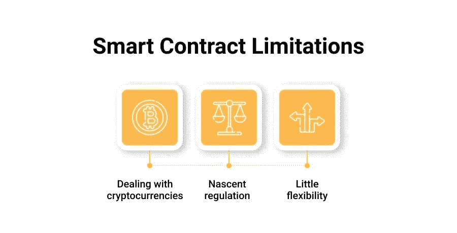

# 智能合约！🔗

> 原文：<https://medium.com/coinmonks/smart-contracts-3d9318c4682d?source=collection_archive---------25----------------------->

# 智能合同

“智能合约”一词在互联网上传播度很高，它是什么？我们为什么需要它？它提供了什么？如此等等。在这篇博客中，我将尝试回答每一个问题，并且更加详细。本博客的目的是向读者提供关于*【智能合同】*的所有可能的细节。

“智能合同是部署在去中心化区块链上的协议、合同或指令集”。部署智能合同后:

*   它不能被改变。
*   自动执行。
*   每个人都可以看到并访问协议条款。

简而言之，我们可以说“智能合约”是一段用某种特定语言编写的代码，如 Solidity 或 Vyper，部署在区块链，以提高不信任度或牢不可破的承诺等。

# 为什么我们需要智能合同？

让我们看看现实世界中违背承诺的例子。早在 20 世纪 80 年代和 90 年代，麦当劳开展了一项促销活动，让人们通过收集麦当劳的大富翁游戏卡来赢钱。*想法很简单“你必须购买麦当劳的食物，作为回报，你有机会赢得 100 万美元。*但他们最终打破了这个承诺，没有赢得奖金的公平机会，任何人赢得数百万的机会为零。

这 2400 万美元不是进了玩游戏的人的口袋，而是进了操纵游戏的腐败内幕人士的口袋。所以人们玩了麦当劳的垄断游戏，他们被一套谎言和承诺所收买。但是，如果这是部署在一个有智能合同的区块链上，所有者不能违背他们的承诺，必须向获胜者支付 2400 万美元，因为智能合同是不可改变的，会产生牢不可破的承诺。

如此简单，我们可以说，我们需要“智能合约”来确保不信任。

# 智能合同将解决社会的关键信任问题:

交易对手风险:参与交易的一方可能违反其合同义务的可能性或概率。

# 纸质担保(基于品牌)

*   交易对手风险高且不透明。
*   透明度被故意去除。
*   利率很低，而且越来越低。

# 加密保证(基于数学)

*   风险低且透明。
*   透明度是固有的。
*   利息收益率一直很高。

# 智能合约的优势！

1.  透明度:智能合约带来了透明度，这意味着区块链上发生的每一笔交易都可以被区块链上的每一个用户看到。*此外，由于智能合约基于区块链，它们保证了数据的不变性。*智能合约还会产生不信任或不可违背的承诺，这意味着你不必相信区块链的任何人，就好像区块链上的某人承诺你提供某种服务，该人或该方不能拒绝你在交易后提供该服务，因为智能合约确保了链上的不变性。

1.  速度:没有第三方或中介减少了经济成本和时间成本，因此与人工完成合同相比，投入的时间减少了。
2.  降低成本:消除中介也使成本效益，因为人们在区块链与智能合同不必支付任何第三方的任何服务。

1.  备份:区块链上的所有交易和数据都在多个节点或系统上复制，因此只要一个节点正常工作，就可以恢复原始数据。
2.  安全:智能合同是加密的，加密技术可以防止所有交易和数据被渗透。

除了好处和好处，也有一些缺点或限制。

# 智能合同的局限性

1.  难以改变
2.  含糊的术语
3.  漏洞的可能性
4.  法律分歧
5.  延迟交易

有了这么多关于智能合约的信息，你就可以开始了，如果你想了解更多关于区块链技术和更多，那么请关注我的 [Hashnode](https://hashnode.com/@KvofficialX) 和 [Medium](/@Kartikey_verma) 。

希望你喜欢这个博客，如果你喜欢，请务必联系我😁 [LinkedIn](https://www.linkedin.com/in/kartikey-verma-7a372b20b/) ， [Twitter](https://twitter.com/kvofficialx)

> 交易新手？尝试[加密交易机器人](/coinmonks/crypto-trading-bot-c2ffce8acb2a)或[复制交易](/coinmonks/top-10-crypto-copy-trading-platforms-for-beginners-d0c37c7d698c)