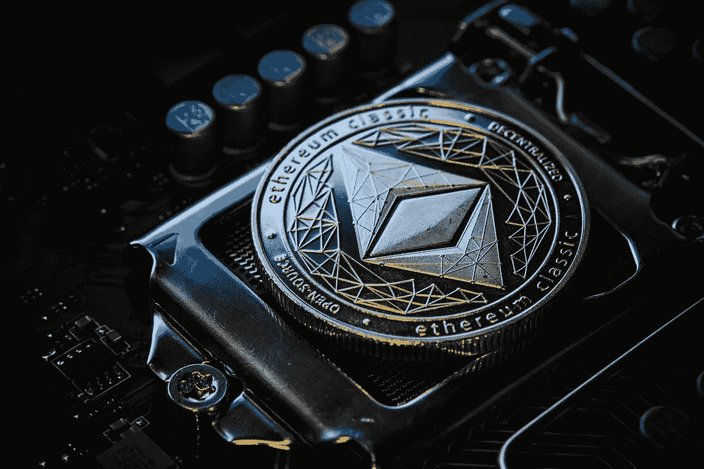

# 智能合同——走向权力下放

> 原文：<https://medium.com/coinmonks/smart-contracts-moving-towards-decentralization-8f1d079f6755?source=collection_archive---------30----------------------->

***阅读我的权力下放之旅***

或者 [*跳到智能合约*](#9914)

我更倾向于在媒体上写文章。我可能无法把它归结为一个原因；想成为一个更有创造力的人，一个更好的作家，最重要的是，一个更好的 DeFi 作家。沿着这些路线的一切。

DeFi 的潜力激起了我的兴趣，我打算创造尽可能多的相关内容。

根据我的经验，人们经常忽略关于区块链、加密货币、DeFi 和相关概念的讨论，因为他们发现这些讨论势不可挡，并且无法理解它们。

> 交易新手？尝试[加密交易机器人](/coinmonks/crypto-trading-bot-c2ffce8acb2a)或[复制交易](/coinmonks/top-10-crypto-copy-trading-platforms-for-beginners-d0c37c7d698c)

加密货币和区块链技术不是为少数人制造的；它们是每个人都应该了解和理解的概念。为了鼓励更多的人接受区块链技术，我打算用简单的词语和类比来写。

duh!

**智能合约**

例如，考虑自动柜员机(ATM)。自动取款机被设计用来分发现金，最先进的型号也可以处理现金存款。然而，在 ATM 能够成功分发现金之前，必须检查几个盒子；它的目的不是把钱交给每一个接近它的人。这些要求包括拥有一个合法的银行账户，在愿意提取现金的人的银行账户中有一定的金额，拥有一张使用自动取款机所需的借记卡，等等。如果一个人符合这些标准，他们的退出将被批准。如果不这样做，他们就无法退出。这正是区块链科技智能合约在这种情况下的作用。

smart contracts are immutable

智能合同绑定了区块链上各方之间的活动。它是使用“If-then，else”操作性创建的。简单来说就是“如果交易正确，那么进行操作；否则，取消它。”根据 Livio 的英语词典，合同是“双方或多方之间的协议，以承担某项工作或工作订单，有时是临时的或有限的期限，通常受书面协议的约束。”如果合同的条款没有得到履行，那就是违反了合同，通常会受到处罚。

对于智能合约，无法遵守条件会导致区块链上的交易失败。

区块链的智能合约包括一套代码，给出预期的指令。类似于文字如何总结和解释常规合同中包含的内容。

区块链网络必须允许创建智能合约，以便在该区块链网络上创建智能合约。以太坊连锁是最聪明的合同。虽然其他区块链网络可以用来创建智能合同，但其中一些可以；以太坊链是最好的，适应性最强。虽然比特币支持智能合约，但它不能像以太坊那样处理那么多。

一种被称为 solidity 的编程语言被用来创建代码，这些代码构成以太坊网络上的智能合同。智能合约比传统合约更有可能是真实的，因为它们受代码约束并存储在区块链上。

Ethereum is smart contract compatible

**为什么选择智能合约？**

1)智能合约具有不可变的性质，并且在智能合约必须被部署之后，不可能改变它的细节。

2)智能合约是透明的，因为它们建立在区块链之上。默认情况下，使用区块链技术创建的事物通常会获得区块链属性。出于这个原因，智能合同的细节总是对公众开放的，这使得确定它是否可以被修改甚至写得很差变得很容易。

3)智能合约消除了集中化。通常，传统合同需要一个中央机构来验证参与方之间的合同细节，但智能合同不需要第三方。所有各方都与合同进行交互，如果他们满足了合同的要求，每个人都会经历一次成功的交易；否则，交易失败。

**智能合同的使用**

1.众筹:众筹是智能合约最突出的应用之一。按照惯例，找到一个支持社区融资的平台需要寻求资金来支持一个项目或一个想法。该平台然后在达到筹资目标后向项目支付资金，并收取处理费；如果融资要求没有得到满足，资金将退还给缴款人。

使用智能合同时，赞助项目非常简单。不需要第三方平台就能做出贡献。项目的规格、目标资金和接受所有资金的钱包地址都可以在智能合同中陈述。然后，贡献者可以用加密货币为智能合同地址提供资金，加密货币被接受为合同状态。满足条件时，资金会自动发送到指定的地址。如果目标没有实现，缴款将立即公平地退还给缴款人。

在智能合同中，存入地址的资金是透明的，每个人都可以跟踪它。此外，除非满足所有条件，否则由于区块链的不变性，从地址中移除这些资金是困难的；精明的合同锁定了资金。这类似于[加密货币发射台](https://www.google.com/amp/s/www.cnbctv18.com/cryptocurrency/explained-crypto-launchpads-and-how-they-benefit-investors-13330982.htm/amp)，用户可以在那里找到并资助新的加密货币项目。只是不一定会有一个管理基金的发射台(中央系统)。

2.DeFi:在没有提到 DEFI 的情况下，围绕智能合约的讨论是什么？“不完整”是一个可以接受的答案。通过智能合约，许多 DeFi 活动，如借贷以及代币交换和交换都变得可行。智能合约用于编写代码，以确认或拒绝 DeFi 平台上的交易。这使得在 USDC 互换等价的 ETH 成为可能；合约的书写方式允许它记录市场价格，并以市场显示的等价形式完成交易。它还确保在完成交易之前，贷款有足够的担保。你能想到的大多数 DeFi 操作都是使用智能合约执行的。

3.供应链:企业可以使用智能合同来简化供应链。因此，举例来说，智能合同将能够识别商店何时缺货，并及时向供应商下订单。可以这样写，这样它就可以在产品在商店售完之前完成订单。它需要连接到一个能够提供链外/真实世界数据的 [oracle](https://www.coindesk.com/tech/2020/12/22/what-is-an-oracle/) 。区块链并不自然地显示企业库存产品数量的信息，但 oracle 使其变得可行。

4.保险:智能合约也适用于保险行业。保险公司可以部署智能合同来涵盖所有这些活动，而不是要求律师起草协议或保险公司实际验证事情的状态。合同将包含协议的细节和双方之间的标准。

智能合同可以自动补偿为其农场投保过量降雨引发的洪水的人，而无需保险提供商核实情况。智能合同将需要与 oracle 交互，就像供应链中的情况一样，以确认在农田所在的地区是否有足以引发洪水的大量降雨。一旦神谕能够确保这种情况，所有相关的程序都要执行。

在某些行业，如保险业，律师可能仍然是必要的，但这可能是一次性的需求。为了确保智能合同拥有相关信息，开发人员在编写代码时可能需要律师的帮助。

**未来展望**

未来，随着去中心化继续被接受，我们预计智能合同可以做得更多。

虽然智能合约仍将建立在区块链上，以保持其[的不变性、透明性和去中心化](https://www.google.com/amp/s/101blockchains.com/introduction-to-blockchain-features/amp/)，但它不会总是与加密货币有关。在更强大的用例中，智能合约可以应用于现实生活中的事件。

比方说，在拥有一处房产的情况下，房产契约的细节可以保留在智能合同上。在购买或出售的情况下，可以利用智能合同来识别和记录财产的新所有者，从而方便地转移所有权。这与 [NFTs](https://en.m.wikipedia.org/wiki/Non-fungible_token) 密切相关，拥有一项数字资产可以代表一个实物的所有权。通过区块链技术，智能合约可以记录这种资产向新所有者的转移。在需要确认真正财产所有人的纠纷中，如果已经为财产转让创建了智能合同，智能合同可以快速确定谁在法律上有权拥有所有权。

需要维护分类帐并在其数据库中存储数据文件的不同行业可以使用智能合同。智能合同支持以加密方式收集和存储客户和顾客数据。就像医疗保健行业一样，人们自然不希望自己的健康信息被公开。

智能合约是否能完全证实现实生活中的事件仍有争议。Smart contracts 的 oracle 提供实时数据，但能力有限，因为它依赖于可量化的因素。例如，像神谕如何测量车祸这样的问题？还是火灾爆发？依赖 oracle 难道不会否定分散化的理念，并产生单点故障吗？是需要答案的问题。

区块链技术仍处于起步阶段，基于它开发的任何东西也是如此，但好消息是还有很大的改进空间。越来越多的人，甚至大公司正在进入区块链工业，每天都在利用它的技术。

区块链不是也永远不会只是加密货币——请保持警惕！

riiiight?