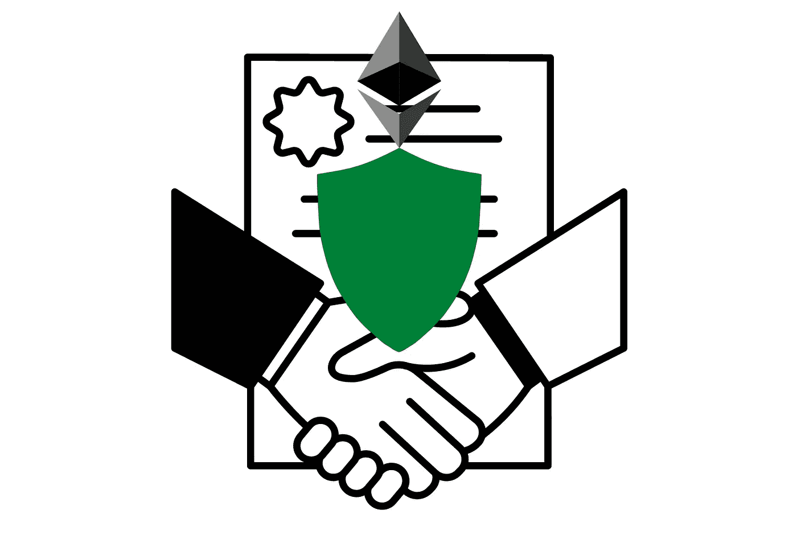
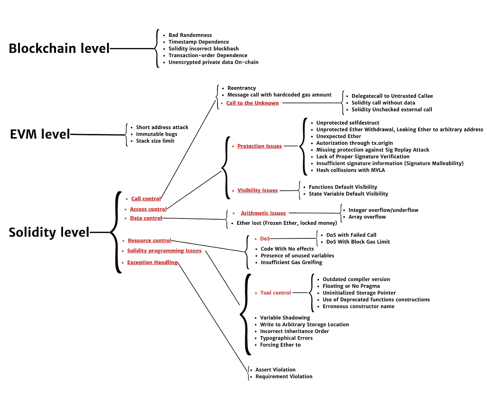
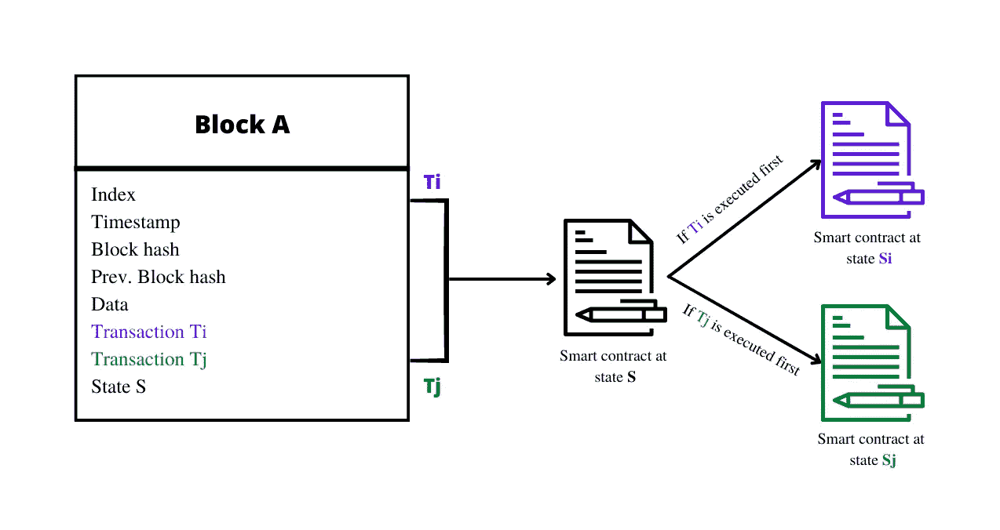
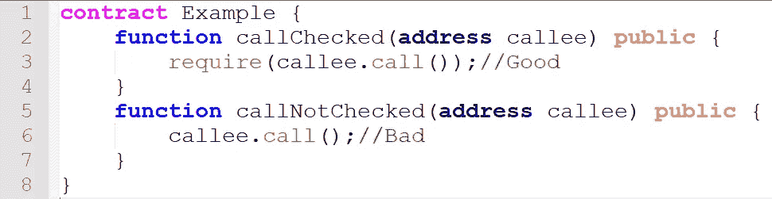
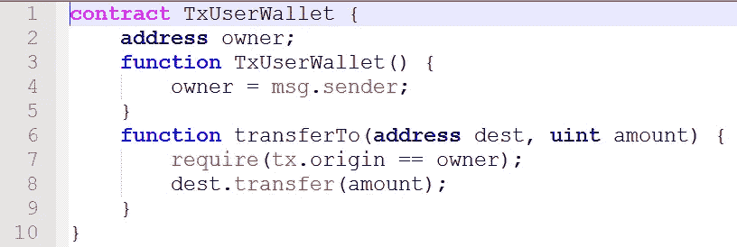
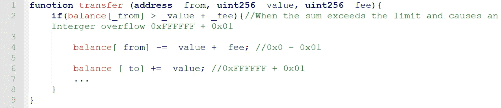
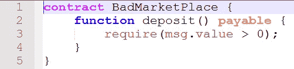
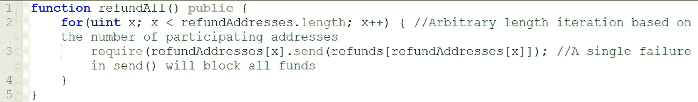

# 智能合同漏洞

> 原文：<https://medium.com/coinmonks/smart-contracts-vulnerabilities-abbd6185252a?source=collection_archive---------3----------------------->

正如我们在之前的文章[中介绍的以太坊智能合约](/coinmonks/ethereum-smart-contracts-1d92dd8e7f83)以及以太坊区块链的一些基本概念。现在是我们提出安全问题的时候了，因为智能合约处理和转移大量资产，所以除了正确执行之外，在实现后仍然受到保护以防攻击也是至关重要的，不要忘记它不可改变的本质。

**在本文**中，我将讲述智能合约中的一系列漏洞。然后，**在接下来的几篇文章**中，我将尝试浏览近年来一些著名的攻击，这些攻击利用这些漏洞，允许黑客窃取金钱或造成其他损害，我们将看到如何使用两种攻击检测方法来预防和保护。



# 文章的大纲

> ***1。区块链级别***
> 
> ***2。EVM 等级***
> 
> ***3。坚固程度*和**

以太坊智能合约中存在多个漏洞，可能导致严重的安全问题，并且可能发生在不同的级别区块链级别、以太坊虚拟机(EVM)级别或可靠性级别。

```
**Blockchain level** Bad Randomness
    Timestamp Dependence
    Solidity incorrect blockhash
    Transaction-order Dependence
    Unencrypted private data On-chain**EVM level** Short address attack
    Immutable bugs
    Stack size limit**Solidity level
    Call control** - Reentrancy
           - Message call with hardcoded gas amount
           - **Call to the Unknown
                -** Delegatecall to Untrusted Callee
                - Solidity call without data
                - Solidity Unchecked external call **Access control
          - Protection Issues
                -** Unprotected selfdestruct
                - Unprotected Ether Withdrawal, Leaking Ether to arbitrary address
                - Unexpected Ether
                - Authorization through tx.origin
                - Missing protection against Sig Replay Attack
                - Lack of Proper Signature Verification
                - Insufficient signature information (Signature Malleability) 
                - Hash collisions with MVLA
          **-** **Visibility Issues
                -** Functions Default Visibility
                - State Variable Default Visibility **Data control
          - Arithmetic Issues
                -** Integer overflow/underflow
                - Array overflow
          - Ether lost (Frozen Ether, locked money) **Resource control
          - DoS
                -** DoS with Failed Call
                - DoS With Block Gas Limit
          - Code With No effects
          - Presence of unused variables
          - Insufficient Gas Greifing **Solidity Programming Issues
          - Tool control
                 -** Outdated compiler version
                 - Floating or No Pragma
                 - Uninitialized Storage Pointer
                 - Use of Deprecated functions constructions
                 - Erroneous constructor name
          - Variable Shadowing
          - Write to Arbitrary Storage Location
          - Incorrect Inheritance Order
          - Typographical Errors
          - Forcing Ether to**Exception Handling
          -** Assert Violation
          - Requirement Violation
```

嗯，我已经尽力画出来了，这样你可以看得更清楚。



Smart contracts Vulnerabilities

让我们来看看其中的一些漏洞，更准确地说，这些漏洞是最著名的。

# 1.区块链层面

## **1。1 交易订单依赖性**

每个块包含一组交易，而区块链的状态会更新几次，智能合约的状态由其字段的值和当前余额决定。此外，当用户通过事务调用智能合约时，智能合约的实际状态对于任何用户来说都是不可预测的。因此，**无法保证**事务在初始化时会处于与契约相同的状态。

如果一个块包含两个同时调用同一个契约的事务，那么用户将无法知道在他们的单个事务被执行/将要被执行时契约处于哪个状态。

如上图所示，如果用户 1 和用户 2 分别在同一时间 **t** 向智能合约 t 发送交易 **Ti** 和 **Tj** ，两个用户都不知道第一个交易执行时合约处于什么状态。此外，这些事务的顺序仅由 th 块的矿工决定。即使用户 1 在用户 2 发送 **Tj** 之前发送事务 **Ti** 。绝对不能保证 **Ti** 会在 **Tj** 之前执行。如果先执行 Ti，合同的状态将从状态 **S** 变为状态**Si**；但是，如果先执行 **Tj** ，合同的状态将从状态 **S** 变为状态 **Sj** 。因此，合同的最终状态取决于事务的执行顺序，而事务的执行顺序是由块挖掘的顺序决定的。

利用这一漏洞在现实世界中至关重要，在现实世界中，买方和卖方使用智能合同进行金融交易。这是因为卖家经常更新他们出售的物品的价格，而买家在发送交易时会将他们观察到的价格发送到他们的购买请求中。因此，在利用交易订单依赖性的攻击的情况下，买家可能不得不花费比预期多得多的钱。

然而，这个问题可以通过使用交易计数器来“锁定”商定的初始价格来避免。



**Transaction-order Dependence**

## 1.2 **时间戳相关性**

要在以太坊区块链上执行任何操作，如以太转移，智能合约会接收一个时间戳，指定该区块生成的时间。该时间戳由矿工根据他们本地系统的时间设置。因此，他们可以很容易地操纵和修改它。

当智能协定使用块时间戳作为执行关键操作的触发条件的一部分或作为随机生成器的来源时，会出现此漏洞。恶意的挖掘者可以将提供的时间戳调整几秒钟，从而改变联系人的输出以对自己有利。

时间戳依赖性是由于以太坊只要求时间戳必须大于其前一个块的时间戳，并且在当前时钟未来的 900 秒内。因此，如果合同使用基于时间戳的条件来确定是否转移资金，恶意矿工可以稍微改变时间戳以满足条件，从而有利于攻击者。为了避免这种漏洞，作者建议使用块索引，因为它是增量的，可以防止被操纵。

# 2.以太坊虚拟机(EVM)级别

## **2.1 不可变的 bug**

智能合约的一个特点是它们是不可变的。部署到区块链后，不能修改或删除它们。这也意味着他们的行为将是用户所期望的，因为这是由共识协议保证的。然而，如果合同包含一个错误，就没有办法修复它，因此，教育程序员和开发人员设计更安全的合同并提供在实现过程中修改或终止(或者更准确地说是销毁)它们的方法是很重要的。

## 2.2 **堆栈大小限制**

每当一个协定调用另一个协定或其自身时，与该事务相关联的调用堆栈就增加一帧。由于调用堆栈被限制在 **1024** 帧，超过这个限制的新调用将导致异常。以太坊区块链的辛勤工作解决了这一漏洞，并产生了一个“分叉”,重新定义了呼叫气体消耗的计算方式。因此，一个调用者最多可以分配 **64** 中的 **63** 个单元:由于目前每个块的 gas 限制是 **4.7M** 个单元，这意味着调用栈的最大可达深度总是小于 **1024** 。

# 3.坚固程度

## **3.1 重入**

重入是在 2016 年攻击 DAO 期间首次观察到的。当在初始执行完成之前允许外部协定调用对调用协定进行新的调用时，就会发生这种情况。

当契约在发送资金之前没有更新其状态时，攻击者可以递归调用目标的资金提取函数。因此，这允许攻击者绕过有效性检查，直到调用方的契约耗尽所有乙醚或事务耗尽汽油。

此漏洞是由于回退函数的结构允许攻击者在将控制流转移到另一个协定时重复调用调用者的函数，这也是因为缺少 gas 限制。

但是，这可以通过确保在调用另一个协定之前更新协定的状态变量来避免。这是通过在契约的状态上引入一个“互斥”锁来确保只有锁的所有者才能更改状态，并使用 transfer 方法向其他契约发送资金来实现的，因为该方法只向被调用的契约传输 2300 gas。

注意，重入主要有两种类型:单函数重入和跨函数重入。

***单功能*** 。更简单，更容易防止跨功能重入。当易受攻击的函数是攻击者每次试图调用的唯一函数时，就会发生这种情况。

***跨职能*** 。更难以察觉。当易受攻击的函数与另一个对攻击者有利的函数共享一个状态时，就会发生这种情况。

## 3.2 **误处理异常**

在以太坊中，一个契约调用另一个契约有几种方式，例如，通过发送指令或直接调用契约本身的函数。

当异常处理不当时，会出现此漏洞。实际上，根据调用方式的不同，被调用契约中的异常可能会传播到调用者。异常传播中的这些不一致为新的漏洞打开了大门，恶意用户可以利用这些漏洞通过导致发送函数失败来调用调用协定。此外，异常可能由多种情况引起，如气体耗尽、超出调用堆栈限制、被调用节点中的意外系统错误。因此，解决这个问题的一种方法是对通话中的用气量设置上限。

## 3.3 **无气送**

如果没有为特定呼叫提供足够的气体，无气体发送会导致交易失败。由于网络上的最大燃气限制会随着交易费用的变化而变化，因此根据燃气消耗量提供断电例外是很重要的。开发不需要太多气体的功能也很重要。

## 3.4 **未检查的外部呼叫**

Solidity 中的一些外部调用，如“ **send** ()”、“ **call** ()”、“ **delegatecall** ()”和“ **staticcall()** ”从不抛出异常，它们只返回一个布尔值“ **false** ”。因此，即使调用遇到问题、意外失败或攻击者强制失败，契约的执行也将继续。

为了解决这个问题，建议返回值必须由开发人员手工检查，他也可以使用" **transfer()** "函数。



Vulnerable and not vulnerable code to Unchecked external call

## 3.5 **通过 tx.origin 授权**

**tx.origin** 是一个可靠性变量，返回发送交易的账户地址。如果授权帐户调用易受攻击的协定，使用此变量进行授权可能会使协定易受攻击。可以对通过授权检查的易受攻击的契约进行调用，因为 **tx.origin** 返回交易的原始发送者，在这种情况下是授权账户。为了避免这个问题，建议使用“ **msg.sender** ”代替“ **tx.origin** ”授权。



Vulnerable code using “tx.origin”

## 3.6 **无保护自毁**

“**自毁**”指令销毁区块链上的合约，并将合约余额发送到指定地址。它对于销毁不再使用合同或易受攻击的合同(错误、漏洞，..).然而，如果它没有适当的访问控制，恶意方可以利用它来**自毁**合同。

## 3.7 **函数和变量默认可见性**

默认情况下，没有特定可见性类型的函数被认为是“公共的”。如果开发人员忘记设置可见性，那么恶意用户就会设法进行未经授权或意外的状态更改，这会导致漏洞。为了避免这个问题，建议必须根据函数指定适当的可见性。注意，函数可以指定为:“**外部**”、“**公共**”、“**内部**”和“**私有**”。

## 3.8 **整数溢出和下溢**

这发生在接受未经授权的数据或值(例如，超过 256 位限制的数据)的事务中。这是因为由于 Solidity 只能处理 256 位以内的数字，增加(或减少)一个高于(或低于)最大(或最小)值的数字会导致**溢出**(或**下溢**)。此外，此漏洞是由于 Solidity 源代码没有对数字输入执行正确的验证，并且 Solidity 编译器和 EVM 都没有实施整数下溢或溢出检测。

因此，建议使用[**openzeplin safe math**](https://github.com/OpenZeppelin/openzeppelin-contracts/blob/master/contracts/utils/math/SafeMath.sol)**库来减轻此类攻击。**

****

**Vulnerable source code example : Integer overflow and underflow**

## **3.9 **乙醚丢失(冻结乙醚，锁钱)****

**被编程为接收以太网的合同必须实现诸如“**转移**”、“**发送**”或“**调用值**”的方法，以便提取以太网。所以，如果契约没有实现这些方法，就会造成钱堵！**

**下面的源代码展示了一个契约的例子，它被编程为接收以太，但不撤销以太。**

****

**Vulnerable source code example : Ether lost (Frozen Ether, locked money)**

## **3.10 **拒绝服务(DoS)****

**这种类型的攻击使得用户无法访问智能合约。这可能是由于高成本循环、无限循环、定价过低的操作、呼叫失败或气体限制。**

## **代价高昂的循环**

**这些包含高成本操作的循环会耗尽合约的所有能量。**

## **无限循环**

**可能导致无限循环的错误或编程错误。**

## **低价运营**

**一般来说，天然气的价值与作业消耗的资源成正比。然而，一些被称为“IO 密集型操作”的操作低估了这个值，导致它们在单个事务中被大量执行。这样，攻击者就可以对合同或以太网区块链发起 DOS 攻击。这个问题已经通过改变不同操作的值得到了解决。**

## **呼叫失败的 DoS**

**外部调用可能会意外或故意失败，从而导致允许 DOS 攻击的漏洞。**

**为了最大限度地减少此类故障造成的损失，建议将每个外部调用隔离到它自己的事务中，该事务可以由调用接收方发起。**

****

**Vulnerable source code example : DOS with failed call**

## **3.10.5 带阻塞气体限制的 DoS**

**当部署智能合约或调用其内部函数时，这些动作的执行需要一定量的 gas。根据所需的计算能力，以太坊规定了每个块的 gas 限制，一个块中包含的所有事务的总和不能超过某个阈值。**

**编程模式在集中式应用程序中是无害的，但当执行一个函数的成本超过每个块的 gas 限制时，它会导致智能合约中的拒绝服务。此外，修改随时间增长的数组会导致拒绝服务。**

**建议考虑随时间增长的数组，并避免需要在整个数据结构上循环的操作。**

***【梅丽莎的功劳】***

**如果你喜欢，请留下你的评论，关注我，当我写新文章时你会得到通知，你也可以在[推特](https://twitter.com/reotmani):)上关注我**

# **资源**

**【https://arxiv.org/abs/1908.04507 **

**[https://medium . com/coin monks/protect-your-solidity-smart-contracts-from-reentrancy-attacks-9972 C3 af 7c 21](/coinmonks/protect-your-solidity-smart-contracts-from-reentrancy-attacks-9972c3af7c21)**

**[https://arxiv.org/abs/1908.08605](https://arxiv.org/abs/1908.08605)**

**[https://eprint.iacr.org/2016/1007.pdf](https://eprint.iacr.org/2016/1007.pdf)**

**[https://ntnuopen . ntnu . no/ntnu-XM lui/bitstream/handle/11250/2479191/18400 _ full text . pdf](https://ntnuopen.ntnu.no/ntnu-xmlui/bitstream/handle/11250/2479191/18400_FULLTEXT.pdf)**

**https://swcregistry.io/**

> **交易新手？试试[加密交易机器人](/coinmonks/crypto-trading-bot-c2ffce8acb2a)或者[复制交易](/coinmonks/top-10-crypto-copy-trading-platforms-for-beginners-d0c37c7d698c)**