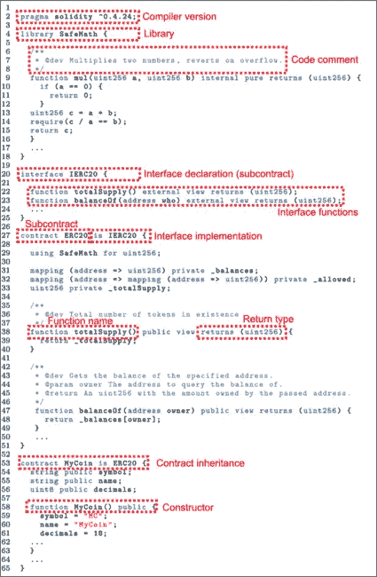

# 智能合约:它们是什么，如何工作？

> 原文：<https://medium.com/coinmonks/smart-contracts-what-are-they-and-how-do-they-work-a8972fc983a1?source=collection_archive---------10----------------------->

我们相信您已经听说过智能合同和区块链技术，以及将它们融入您的商业模式的所有方法。在过去的两年里，区块链技术以极快的速度被采用，2021 年的支出为 66 亿美元，而对 t 2 的预期几乎是 2022 年底的两倍。

但是，在许多现有和潜在用例的中心，坐落着一个经常被误解的区块链技术的支柱:智能合同。

# 什么是智能合同，为什么它们是最新的时尚？

智能合约是链上代码的一部分，用于在满足特定条件时自动执行一组指令。本规范和其中包含的协议存在于一个分布式、分散的网络中。

*听起来很酷。但这意味着什么呢？*

理解智能合约功能的一个简单明了的方法是将其与自动售货机进行比较。你很可能知道自动售货机是如何工作的，但让我们一步一步地分解它，以便更容易解释。

当你使用自动售货机时，你看着选项，决定你想要一块糖。为了这个例子，让我们说你想买一个价格为$1.00 的士力架。你将 1 美元插入机器，按下相应的数字到士力架上，美味的食物就会被机器释放给你。

用户看不到自动售货机的内部工作原理。在机器内部，有一个电脑芯片，通过编程可以知道每件商品的价格。当用户插入钱并选择一个项目时，机器知道它是否满足该项目的要求(插入足够的钱)——在本例中是士力架。如果条件满足，机器会继续插入钱，并分发士力架。综上所述，这个功能是预建在自动售货机中的，当满足某些标准时会自动执行——在这种情况下，支付 1 美元。

智能合约的工作方式非常相似。智能合同本身类似于自动售货机内部的计算机芯片的编程。除此之外，在这种情况下，程序(智能合约)被编码到区块链上。一分钟后将详细介绍区块链的优势。

# 如今，智能合约最常见的用途是用于 NFT 采购。

这与自动售货机的例子完全一样。在像 OpenSea 这样的 NFT 市场上，用户可以列出他们的 NFT 以某个价格出售。这是通过[海港智能合同](https://opensea.io/blog/announcements/introducing-seaport-protocol/)完成的。然后，当买家决定购买列出的 NFT 时，他们将指定数量的密码发送到智能合同，NFT 将自动交付到他们的钱包。就像从自动售货机购买糖果一样，整个交易过程无需任何人干预。

智能合约的最终产品非常简单，用户可以很容易地与区块链交互，尤其是如果它编写得很好的话。您可以选择在任何支持智能合约的区块链上构建智能合约。每个区块链都有不同的优势，但这里列出了最受欢迎的优势，并链接到如何利用每个优势的资源:

*   [以太坊](https://ethereum.org/en/smart-contracts/)
*   [多边形](https://docs.polygon.technology/docs/develop/alchemy/)
*   [恒星](https://stellar.org/blog/smart-contracts-on-stellar?locale=en)
*   [算法和](https://www.algorand.com/smart-contracts-defi)
*   [雪崩](https://docs.avax.network/dapps/smart-contracts)
*   [Loopring](https://docs.loopring.io/en/basics/contracts.html)
*   [流程](https://docs.onflow.org/dapp-development/smart-contracts/)
*   索拉纳

# 区块链智能合约的优势

所以，现在你知道什么是智能合约的要点，但你可能想知道智能合约背后的 ***为什么*** 。嗯，生活在区块链的智能合约带来了几个好处。

*   **自动化:**一旦部署了智能合约，它就会自动运行。就像自动售货机一样，它将独立生活，按照编程运行，不受任何干扰。自动化流程和事务在许多业务用例中都有很大的好处。
*   成本:由于不需要第三方中介，智能合同的交易成本比传统支付方式低得多。
*   去中心化:区块链由大型计算机网络维护(更多关于它们如何工作[这里](https://www.youtube.com/watch?v=SSo_EIwHSd4))。这意味着编码到区块链上的智能合同独立于 AWS 或 Google Cloud 等集中式数据库而存在。这意味着没有一个集中的实体可以调整、删除或阻止合同的执行。就像建筑物中独立运作的自动售货机一样，智能合约一旦被编码到区块链上，就会在其给定的参数内自由运作。
*   **无权限:**这意味着任何人都可以在不受监控的情况下与智能合同进行交互。如果用户履行了必要的规则(投入正确数量的钱)，那么智能合约将执行(分发糖果条)。一旦智能合同启动并运行，就没有“监督者”可以审查它或阻止某人访问它。
*   **可组合性:**可以在自己的智能合约中调用其他智能合约。就像一套令人敬畏的数字乐高积木，你可以把不同智能合约的功能放在一起。这允许在 d [应用](https://www.coindesk.com/learn/what-is-a-dapp-decentralized-apps-explained/)或平台的后端发生几个智能合约调用。这意味着最终用户可能只需与一个用户界面进行交互，就能从多个智能合同中获益。把这想象成一个大型杂货店。这家杂货店既卖新鲜农产品，也卖鲜肉。你可以去一家杂货店买所有的东西，而不是去蔬菜摊买你的产品，然后去肉店买你的肉。可组合性！

# 我如何建立我的智能合同？

网上有大量的资源可以帮助各种水平和经验的开发人员了解智能合约，并开始创建他们自己的智能合约。甚至有新兴的创业公司能够实现无代码智能契约构建，从而更容易利用区块链的好处。

来自 [ResearchGate](https://www.researchgate.net/figure/An-example-of-a-smart-contract-written-in-Solidity_fig1_337603517) 的智能合同代码示例

以下是一些有用的资源列表:

*   [部署您的首个智能合同](https://www.web3.university/tracks/create-a-smart-contract/deploy-your-first-smart-contract)
*   [智能合同开发的最佳实践—您准备好软件工匠](https://yos.io/2019/11/10/smart-contract-development-best-practices/)
*   [在 16 小时的免费课程中学习可靠性、区块链和智能合约](https://www.freecodecamp.org/news/learn-solidity-blockchain-and-smart-contracts-in-a-free/)

# 将人们与智能合同联系起来

智能合约具有很大的价值，但它们也存在于区块链上，有时从传统的金融系统访问它们会有点困难。智能合约已经存在，只会继续成为更具创新性的久而久之。我们只是触及了他们潜力的表面，所以现在是开始构建你自己的完美时机。

> *加入 Coinmonks* [*电报频道*](https://t.me/coincodecap) *和* [*Youtube 频道*](https://www.youtube.com/c/coinmonks/videos) *了解加密交易和投资*

# 另外，阅读

*   [Bookmap 评论](https://coincodecap.com/bookmap-review-2021-best-trading-software) | [美国 5 大最佳加密交易所](https://coincodecap.com/crypto-exchange-usa)
*   [密码交易机器人](/coinmonks/crypto-trading-bot-c2ffce8acb2a) | [硬币门评论](https://coincodecap.com/coingate-review)
*   最佳加密[硬件钱包](/coinmonks/hardware-wallets-dfa1211730c6) | [Bitbns 评论](/coinmonks/bitbns-review-38256a07e161)
*   [新加坡十大最佳加密交易所](https://coincodecap.com/crypto-exchange-in-singapore) | [购买 AXS](https://coincodecap.com/buy-axs-token)
*   [红狗赌场评论](https://coincodecap.com/red-dog-casino-review) | [Swyftx 评论](https://coincodecap.com/swyftx-review)