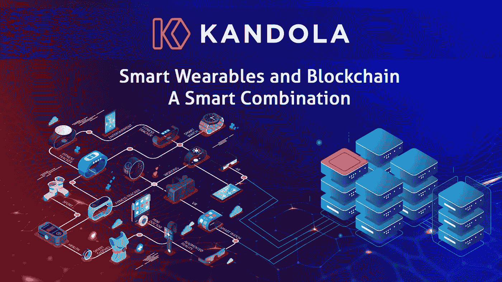

# 智能可穿戴设备和区块链——一个聪明的组合

> 原文：<https://medium.com/coinmonks/smart-wearables-and-blockchain-a-smart-combination-b2fee195554e?source=collection_archive---------20----------------------->

~ Smita Selot，坎多拉网络

消费市场充斥着智能可穿戴设备——智能手表、手环、眼镜、衣服等等。智能可穿戴设备的人工智能(AI)为睡眠模式、健身程序、卡路里摄入和先进的医学研究提供了前所未有的见解。人工智能算法分析海量数据来提供这些见解。然而，典型的用户应用程序在没有足够隐私的情况下收集用户数据。即使应用程序在同意的情况下收集数据，随着时间的推移，当它遍历不同的系统时，它也可能会损坏或失去相关性。区块链可以加强这些人工智能可穿戴设备的所有权、隐私、安全和安全交易等方面。

## 数据隐私和安全问题

一个基本的健身跟踪器跟踪受保护的健康信息(PHI)，如心跳、步数和睡眠模式。但是，HIPAA 法规不认为这些信息是 PHI，除非消费者与医生共享数据。在没有严格遵守的情况下，健身带制造商不仅可以访问消费者的 PHI，还可以在许可接受中提到的模糊条款下变相共享或出售它。一旦用户接受了许可条款，他们可能会不知不觉地同意让商家使用他们的数据。

将来，来自健身带的信息可能被归类为 PHI，并被输入电子健康记录(EHR)。然而，另一个问题是医疗机构如何从 EHR 系统中访问这些数据。大型医疗机构使用[批量数据访问 API](https://www.ignitedata.co.uk/news/what-is-smart-on-fhir/) 在庞大的数据集中检索患者级别的数据。对庞大数据集的访问引发了隐私问题。根据来自 Knight Ink，LLC 的网络安全专家 Alissa Knight 的[白皮书](https://twitter.com/alissaknight/status/1448356002722504705)，在 API 标准本身中没有发现漏洞。然而，根据作者的说法，这些应用程序和第三方 API 聚合器在其实现中存在安全漏洞。

类似地，典型的智能手表不仅仅跟踪健康信息，如位置、日常身体运动和日常日程安排，归类为 un-PHI 数据。无法保证智能可穿戴设备制造商将保持 un-PHI 数据的安全，并防止这些信息因集中服务器上的任何网络安全攻击而泄露。如果 un-PHI 数据包括银行账户和借记卡/信用卡的详细信息，那么金融安全也会面临风险。黑客可以使用 un-PHI 数据来勒索、绑架、骚扰、恐吓或掠夺受害者的钱财。

最后但同样重要的是，大多数智能可穿戴设备都允许社交媒体互动和网络浏览。每当消费者登录或浏览互联网时，都会在后台收集个人身份信息(PII)。这些数据可能包括姓名、电子邮件 id、电话号码、地址、位置、性别、个人偏好，有时甚至包括录音。问题是，谁是这些数据的实际所有者——收集数据的企业还是消费者。当公司将数据用于分析或研究时，消费者会受益吗？如果消费者想要付费分享数据怎么办？

> 交易新手？试试[加密交易机器人](/coinmonks/crypto-trading-bot-c2ffce8acb2a)或者[复制交易](/coinmonks/top-10-crypto-copy-trading-platforms-for-beginners-d0c37c7d698c)

## 智能可穿戴设备的区块链

数据隐私和安全是区块链的核心目标。区块链钱包对所有交易进行加密，这些交易由多个节点使用共识机制进行验证。区块链有一个分散的架构，因此，没有一个集中的服务器容易受到网络攻击。此外，区块链支持点对点交易，无需第三方中介来建立信任。区块链的这些特性可以让智能可穿戴设备对用户数据进行安全保护。让智能可穿戴设备通过区块链变得安全，可以为消费者带来许多新的好处，如本文所述。

## 激励

激励是一种行之有效的方法，可以让顾客养成良好的习惯和纪律。保险公司、健身俱乐部、体育中心和健身房可以根据从智能可穿戴设备收集的数据，激励客户过上健康的生活。由于激励降低了个人的成本，更多的个人将被激励加入这些服务提供商提供的平台。另一个优势是，更健康的人更不容易受伤，因此减少了支付费用。事实上，医疗保健公司 Kaiser Permanente (KP)会奖励满足 KP 健康计划的每位会员及其受保配偶。区块链可以在智能合约的帮助下对这些激励措施进行授权和自动化。智能合约是区块链上的代码片段，在满足条件时自动确定地执行。

## 社交媒体互动和聊天

Fancurve 等品牌为粉丝设计了与他们的体育英雄相关的服装。另一家科技初创公司 Loomia 开发了一种在织物上放置电子元件的技术。服装制造商可以将这种面料缝制成多层服装。这些品牌通过启用保护消费者隐私的安全交互平台，使用区块链来增强这种体验。同样，区块链可以通过聊天保护社交媒体互动和客户支持参与。

## **节约成本**

如今的货币交易需要一个可信任的第三方作为中介。受信任的第三方通常是银行或此类金融机构。第三方作为交易双方身份的担保人。因此，就交易征收交易费以促进担保。第三方验证过程缓慢且受假期影响。最后，第三方不允许交换租赁、艺术品和收藏品等无形资产。区块链交易直接在相关方之间进行，因此不需要第三方或中介。因此，区块链交易更便宜、更快、更可信、更可靠。区块链还允许通过分配不可替代代币(NFTs)来交换无形资产。

## **跟踪和 SOS**

智能可穿戴设备内置 GPS 跟踪装置，可以方便地追踪个人信息，但如果位置信息落入坏人之手，就会给个人带来风险。然而，大多数情况下，追踪老人和孩子的确切位置是必不可少的。实际上，在 LinkedIn 上分享的最近的一个 T2 事件 T3 中，一只智能手表通过及时提醒最近的医院注意紧急情况挽救了一位老人的生命。区块链可以增加共享这些信息的安全性，因为它可以安全地、私下地使用这些信息。在紧急情况下，只有急救中心、医院或应征入伍的相关人员才能访问位置信息。

## 【Kandola Network 如何提供帮助？

Kandola Network 是一个第 1 层分散消息传递平台。它采用“按设计保护隐私”原则构建，可确保平台上构建的所有设备和解决方案的完整数据隐私性和设备安全性。我们的本地快速共识机制将处理社交媒体、聊天和健康相关数据输入所需的大量交易。一致性机制在将事务添加到 Blockchain 之前多次验证这些事务，因此保证了终结性。该平台不含气体(价格便宜)，并且比其他一致性机制使用更少的计算资源。Blockchain 通过快速检测和隔离运行不良的节点，防范 DDoS 攻击、消息重放和系统故障。Kandola 生态系统有一个本地令牌 EKAH，用于实现网络治理。

如果您在此期间还有其他问题，请随时发电子邮件至 hello@kandola.network。

> 加入 Coinmonks [电报频道](https://t.me/coincodecap)和 [Youtube 频道](https://www.youtube.com/c/coinmonks/videos)了解加密交易和投资

# 另外，阅读

*   [CoinFLEX 评论](https://coincodecap.com/coinflex-review) | [AEX 交易所评论](https://coincodecap.com/aex-exchange-review) | [UPbit 评论](https://coincodecap.com/upbit-review)
*   [AscendEx 保证金交易](https://coincodecap.com/ascendex-margin-trading) | [Bitfinex 赌注](https://coincodecap.com/bitfinex-staking) | [bitFlyer 审核](https://coincodecap.com/bitflyer-review)
*   [Bitget 回顾](https://coincodecap.com/bitget-review)|[Gemini vs block fi](https://coincodecap.com/gemini-vs-blockfi)cmd |[OKEx 期货交易](https://coincodecap.com/okex-futures-trading)
*   [AscendEx Staking](https://coincodecap.com/ascendex-staking)|[Bot Ocean Review](https://coincodecap.com/bot-ocean-review)|[最佳比特币钱包](https://coincodecap.com/bitcoin-wallets-india)
*   [霍比评论](https://coincodecap.com/huobi-review) | [OKEx 保证金交易](https://coincodecap.com/okex-margin-trading) | [期货交易](https://coincodecap.com/futures-trading)