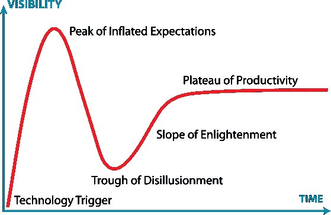

# 那么，Crypto，Web3 死了吗？

> 原文：<https://medium.com/coinmonks/so-is-crypto-web3-dead-724a9eb3c71c?source=collection_archive---------7----------------------->

这是无银行作家群体的第四篇文章。

*RIP, Bitcoin?*

上周星期二，我和一个朋友谈论 Web3。让我们称这个朋友为弗雷德里克。Frederick 从来都不是 crypto、Web3、NFTs 和其他相关技术的粉丝。我相信原因是因为他不明白它们是如何工作的，加上他从朋友那里听到的无数负面经验。然而，虽然提到 crypto 会让他感到苦涩，但他并没有完全离开这个主题，因为他通过社交媒体和我们的讨论来了解 crypto 新闻。

在我们平常的谈话中，在讲述最近的一些宕机时，他问了一个让我措手不及的问题:**那么，crypto 现在死了吗？**我当场回答了这个问题，但后来，在思考这个问题的时候，我被提示写下我的想法来决定性地回答这个问题，希望如此。这篇文章是我回答这个问题的勇敢尝试。让我们开始吧。

# Crypto 和 Web3 现在都结束了吗？

2021 年的牛市令人惊讶，但也很受欢迎。NFT 项目的底价超出了预期，而比特币、以太坊和其他替代硬币[的价格达到了历史新高](https://forkast.news/bitcoin-ethereum-prices-all-time-highs-crypto-rally/)，使整个加密市场在当年晚些时候达到了创纪录的 3 万亿美元。不幸的是，这轮牛市目前就在我们的后视镜里，市场正经历着今年最困难的时期。NFT 的交易量从几十亿、几亿下降到几百万。卢纳和 UST 总共从市场上抹去了超过 600 亿美元的财富。我们也看到了一些大的加密玩家，像 3AC，Celcius，BlockFi 等。，变得资不抵债，破产，导致更多的下跌趋势。

回答弗雷德里克的问题，我坚信 crypto 没有死。是的，上面的段落描绘了一幅厄运和黑暗的画面，但是我认为并且敢说最糟糕的日子已经过去了。当然，整个行业已经放缓，但一些因素表明，另一个牛市肯定会到来。其中一个因素是贪婪和恐惧这一不变的人性，这一直是炒作和萧条周期背后的驱动力，我们通过这一周期实现了以前的技术突破和大规模采用。为了更好地理解贪婪和恐惧现象，让我们回顾历史，看看像加密这样的技术是如何通过循环被采用的。

# 周期如何形成

[Gartner 炒作周期](https://www.gartner.com/en/documents/3887767)显示“技术引发炒作”

创新技术往往伴随着在周期中被接受的大胆承诺。上图显示了技术的成熟度和采用情况，以及它们在解决问题和创造新机会方面的相关性。让我们分别来看。

*   **技术触发:**在这里，技术突破、概念验证和媒体兴趣触发一些宣传。但是，一个可用的产品和产品市场仍然很遥远。
*   **膨胀预期的顶峰:**早期的宣传促使公司和个人采取行动，进行投资，创造成功和失败的故事。
*   **幻灭的低谷:**在这里，随着现有的实验和实现开始越来越失败，人们对这项技术的兴趣也随之下降。
*   开悟的斜坡:这紧接在失望之后。幸存下来的公司继续改进产品，创造技术仍然可以造福人类的例子。更多的资金进入这个行业，而观察者和参与者仍然保持谨慎。
*   **生产力的稳定期:**最后，大规模采用发生了。随着该技术广阔市场的持续增长，产品和可用性参数的定义更加清晰。

Jean-Paul Rodrigue 的《科技泡沫的四个阶段》展示了精明的资金是如何先动起来的。

除了炒作周期的技术方面，不同类型的投资者在每个阶段扮演不同的角色。例如，下图分四个阶段描述了泡沫和投资者之间的关系。

自从比特币白皮书于 2008 年公开发布以来，Crypto 和 Web3 已经经历了几个类似的周期。然而，与其他随时间消逝的趋势不同，加密技术总是在每一次炒作和萧条周期之后出现，甚至出现更大的周期。每次看起来 crypto 已死的时候，某些幕后的技术突破就会实现，导致下一个炒作周期和更多技术进步的发展。下面是来自 [Trinito](https://trinito.co/) 的 crypto 历史树，详细描述了 crypto 过去几年的技术周期和突破。

# **2008 年至 2013 年:**

比特币白皮书、网络分叉、加密交换的出现。

比特币的白皮书是(依我拙见)第一个创造了我们今天所熟悉的密码行业的突破。白皮书描绘了比特币的蓝图，比特币是世界上最古老、最大的数字货币和区块链。自 2008 年以来，许多[网络分叉](https://en.wikipedia.org/wiki/List_of_bitcoin_forks)接踵而至；Litecoin 就是这样的一个分支，是一种替代硬币，用作支付系统，市值约为[数十亿美元](https://coinmarketcap.com/currencies/litecoin/#:~:text=The%20live%20Litecoin%20price%20today,market%20cap%20of%20%243%2C706%2C435%2C290%20USD.)。第一批密码交易所也是在这一时期形成的，如 Mt. Gox、Bitstamp、BitFinex、比特币基地等交易所。Mt. Gox 最终崩溃，而其他公司仍然存在，帮助了数亿用户，并为遵守监管机构和政府的规定奠定了基础。

# **2013–2017:**

以太坊区块链、智能合约、ico 和 NFTs 开始

Vitalik 和以太坊的联合创始人建立了以太坊，因为几乎不可能将比特币的区块链用于货币以外的其他用例。以太坊在其 2013 年白皮书中公布后，通过比特币支付了 1600 万美元的 ICO 和 1.5 亿美元的“道”资金。这两起事件被视为当时历史上最大的两起资助案。以太坊的受欢迎程度得益于其协议基础设施——开发者可以构建和部署他们的去中心化应用(dapps)、智能合约和令牌。这种基础设施为成千上万的项目、dapps、一些 NFT 以及最终的 ICO 铺平了道路——因此出现了 2017-18 年的 ICO 热潮。据报道，在 ICO 日期间，约有 3，250 个项目筹集了 214 亿美元。不幸的是，这些项目中有许多未能兑现承诺。然而，我可以说，ico 催化了下一轮牛市，同时为开发商提供了更快的项目融资方式。

NFT 也在这一时期出现，但只是被用作收藏品和贵重物品所有权的数字证明。直到 CryptoKitties 在 2017 年 11 月首次亮相并获得即时成功，这一现象才获得了更多的宣传和使用。

# **2017–2021**

第 1 层和第 2 层，DeFi Summer，NFTs 作为标准，Tokenomics 标准

在这一时期，L1 和 L2 签订了类似索拉纳、波利贡、纳尔诺、卡尔达诺等协议。，是为了应对加密市场的可扩展性和高交易费用困境而推出的。他们通过更快、更便宜的区块链交易为加密用户提供了更多选择，允许他们建立自己的 dapps，进行项目研究和拨款。2020 年引发了 DeFi 的增长，因为像 Compound、Uniswap 和 Aave 这样的项目在 2020 年 DeFi 夏季吸引了大量用户和资本。而从 2020 年末到 2021 年底，NFTs 获得了更多的文化和品牌意义。除了 DeFi、NFTs 和分层协议之外，其他现象如“玩到赚”游戏、移动到赚项目如雨后春笋般涌现，吸引了数百万用户。较新的概念利用了 crypto 现有的技术基础设施，如区块链、可替换和不可替换令牌以及基本令牌组学。这些项目证明了 crypto 不仅与金融和支付有关，还可以改善互联网的使用，因此诞生了 Web3。

# **2022 年及以后:**

虽然我们在短短 12 年里从零到一走过了漫长的道路，但我相信仍有很大的发展空间来释放我们的全部潜力。因此，在以下领域的研究和实验

*   扩展性和互操作性
*   分散式数字身份
*   高级令牌工程

必须便于所有相关人员的参与。

# 结论:每个周期的意义

通过上面的图表，商业周期反复经历繁荣和萧条，而当创新技术被开发或采用时，就会出现高峰和泡沫破裂。毫无疑问，加密是一项创新技术，因此有很多可能性。正因为如此，我相信未来几年将会有更多的牛市和熊市。人性的贪婪和恐惧永远不会改变。开发商仍在开发将在熊市期间繁荣发展的项目。其中一些正在建设的项目将在净牛市中实现新高和飞跃(无论何时发生)。最后，现在建立的东西，将为牛市提供基础，希望它将持续到我们建立更好的产品。

> 交易新手？试试[密码交易机器人](/coinmonks/crypto-trading-bot-c2ffce8acb2a)或者[复制交易](/coinmonks/top-10-crypto-copy-trading-platforms-for-beginners-d0c37c7d698c)